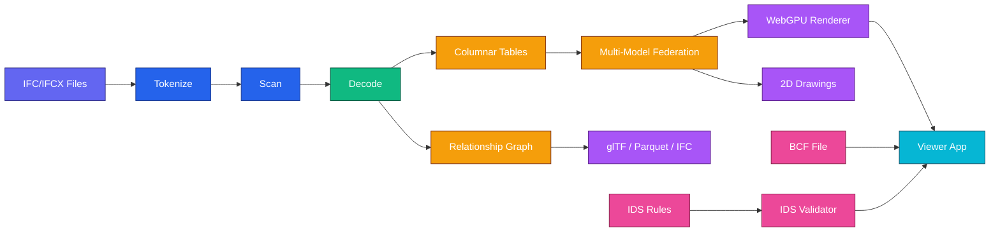
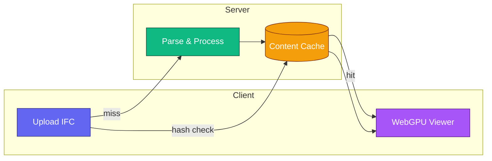

<table align="center">
<tr>
<td valign="top">
<h1>

</h1>
<code>Fast</code> · <code>Lightweight</code> · <code>Columnar</code> · <code>Browser-native</code>
</td>
<td width="120" align="center" valign="middle">

</td>
</tr>
</table>

<p align="center">
  <a href="https://www.ifclite.com/"></a>
</p>

<p align="center">
  <a href="https://github.com/louistrue/ifc-lite/actions"></a>
  <a href="https://github.com/louistrue/ifc-lite/blob/main/LICENSE"></a>
  <a href="https://www.npmjs.com/package/@ifc-lite/parser"></a>
  <a href="https://crates.io/crates/ifc-lite-core"></a>
</p>

<p align="center">
  <a href="#features">Features</a> ·
  <a href="#quick-start">Quick Start</a> ·
  <a href="#desktop-app-tauri">Desktop App</a> ·
  <a href="#architecture">Architecture</a> ·
  <a href="#server-paradigm">Server</a> ·
  <a href="#performance">Performance</a> ·
  <a href="#contributing">Contributing</a>
</p>

---

## Overview

**IFClite** parses, processes, and renders IFC files in the browser using **Rust + WebAssembly** and **WebGPU**. Smaller and faster than the alternatives. Supports both IFC4 (STEP) and IFC5 (IFCX/JSON).

<p align="center">
  <strong>~650 KB WASM (~260 KB gzipped)</strong> &nbsp;•&nbsp; <strong>2.6x faster</strong> &nbsp;•&nbsp; <strong>IFC4X3 + IFC5 support</strong>
</p>

## Features

| Feature | Description |
|---------|-------------|
| **Clean DX** | Columnar data structures, TypedArrays, consistent API. Built from scratch for clarity |
| **STEP/IFC Parsing** | Zero-copy tokenization with full IFC4X3 schema support (876 entities) |
| **IFC5 (IFCX) Support** | Native parsing of JSON-based IFC5 format with ECS composition and USD geometry |
| **Streaming Pipeline** | See geometry fast, not after a long wait: first render in ~202ms to ~5.43s, depending on model size |
| **WebGPU Rendering** | Modern GPU-accelerated 3D with depth testing and frustum culling |
| **Zero-Copy GPU** | Direct WASM memory to GPU buffers, 60-70% less RAM |
| **Multi-Model Federation** | Load multiple IFC files with unified selection, visibility, and ID management |
| **Basket Isolation** | Incremental isolation set with `=` set / `+` add / `-` remove, Cmd+Click multi-select |
| **BCF Collaboration** | BIM Collaboration Format support with topics, viewpoints, and comments |
| **IDS Validation** | Information Delivery Specification checking against IFC data |
| **2D Drawings** | Section cuts, floor plans, and elevations with interactive annotations (measure, area, text, clouds) |
| **Property Editing** | Edit IFC properties in-place with bidirectional change tracking |
| **IFC Export** | Visible-only and merged multi-model export with full IFC4/IFC4X3 schema coverage |

## Quick Start

### Option 1: Create a New Project (Recommended)

Get started instantly without cloning the repo:

```bash
npx create-ifc-lite my-ifc-app
cd my-ifc-app
npm install && npm run parse
```

Or create a React viewer:

```bash
npx create-ifc-lite my-viewer --template react
cd my-viewer
npm install && npm run dev
```

### Option 2: Install Packages Directly

Add IFClite to your existing project:

```bash
npm install @ifc-lite/parser
```

```typescript
import { IfcParser } from '@ifc-lite/parser';

const parser = new IfcParser();
const result = await parser.parse(ifcBuffer);

console.log(`Found ${result.entityCount} entities`);
```

For full 3D rendering, add geometry and renderer packages:

```bash
npm install @ifc-lite/parser @ifc-lite/geometry @ifc-lite/renderer
```

### Option 3: Rust/Cargo

For Rust projects:

```bash
cargo add ifc-lite-core
```

```rust
use ifc_lite_core::parse_ifc;

let result = parse_ifc(&ifc_bytes)?;
println!("Parsed {} entities", result.entities.len());
```

### Option 4: Clone the Repo (Contributors)

For contributing or running the full demo app:

```bash
git clone https://github.com/louistrue/ifc-lite.git
cd ifc-lite
pnpm install
pnpm build    # Build all packages first
pnpm dev      # Start the viewer
```

Open http://localhost:5173 and load an IFC file.

> **Note:** Requires Node.js 18+ and pnpm 8+. No Rust toolchain needed - WASM is pre-built.
>
> **Git LFS:** Test IFC fixtures are stored with Git LFS. Run `git lfs install && git lfs pull` after cloning.
>
> **Important:** The `pnpm build` step is required before running `pnpm dev` because the viewer depends on local packages that need to be compiled first.
>
> **📖 Full Guide**: See [Installation](docs/guide/installation.md) for detailed setup options including troubleshooting.

### Option 5: Desktop App (Tauri)

Run IFClite as a native desktop application with enhanced performance:

```bash
cd apps/desktop
pnpm install
pnpm dev          # Development mode
pnpm build        # Build for current platform
```

Build for specific platforms:

```bash
pnpm build:windows   # Windows (.exe, .msi)
pnpm build:macos     # macOS (.app, .dmg)
pnpm build:linux     # Linux (.deb, .AppImage)
```

> **Note:** Requires Rust toolchain for building. See [Tauri Prerequisites](https://v2.tauri.app/start/prerequisites/).

### Basic Usage

```typescript
import { IfcParser } from '@ifc-lite/parser';
import { Renderer } from '@ifc-lite/renderer';

// Parse IFC file
const parser = new IfcParser();
const result = await parser.parse(ifcArrayBuffer);

// Access entities (Map<expressId, IfcEntity>)
const walls = [...result.entities.values()].filter(e => e.type === 'IFCWALL');
console.log(`Found ${walls.length} walls`);

// Render geometry (requires @ifc-lite/renderer + @ifc-lite/geometry)
const renderer = new Renderer(canvas);
await renderer.init();
renderer.loadGeometry(meshData); // MeshData[] from geometry processing
renderer.render();
```

## Documentation

| Resource | Description |
|----------|-------------|
| [**Quick Start**](docs/guide/quickstart.md) | Parse your first IFC file in 5 minutes |
| [**Installation**](docs/guide/installation.md) | Detailed setup for npm, Cargo, Docker, and from source |
| [**User Guide**](https://louistrue.github.io/ifc-lite/) | Parsing, geometry, rendering, querying, BCF, IDS, 2D drawings |
| [**Federation**](docs/guide/federation.md) | Multi-model loading with unified selection and visibility |
| [**Desktop App**](docs/guide/desktop.md) | Native Tauri app with multi-threading and filesystem access |
| [**Tutorials**](docs/tutorials/building-viewer.md) | Build a viewer, custom queries, extend the parser |
| [**Architecture**](docs/architecture/overview.md) | System design with detailed diagrams |
| [**API Reference**](docs/api/typescript.md) | TypeScript (25 packages), Rust, and WASM API docs |
| [**Contributing**](docs/contributing/setup.md) | Development setup, testing, and release process |

## Architecture



IFC files flow through parsing, data storage, and rendering layers. Multiple models can be loaded simultaneously via federation. BCF and IDS provide collaboration and validation capabilities. See the [Architecture Documentation](docs/architecture/overview.md) for detailed diagrams.

> **Deep Dive**: [Data Flow](docs/architecture/data-flow.md) ·
> [Parsing Pipeline](docs/architecture/parsing-pipeline.md) ·
> [Geometry Pipeline](docs/architecture/geometry-pipeline.md) ·
> [Rendering Pipeline](docs/architecture/rendering-pipeline.md) ·
> [Federation](docs/architecture/federation.md)

## Server Paradigm

For production deployments, IFClite provides a **Rust server** that processes geometry and data model **fully upfront**, enabling instant loading for repeat visits. Unlike the client-side parser (which uses on-demand property extraction for responsiveness), the server computes everything in parallel and caches the complete result.



### Key Features

| Feature | Description |
|---------|-------------|
| **Content-Addressable Cache** | SHA-256 hash of file content as cache key. Client checks cache before upload |
| **Parallel Processing** | Geometry and data model processed concurrently with Rayon thread pool |
| **Columnar Formats** | Apache Parquet for geometry (15-50x smaller than JSON) |
| **Progressive Streaming** | SSE batches enable rendering while server processes |
| **Full Data Model** | Properties, relationships, and spatial hierarchy computed upfront and cached |

### Data Flow

1. **Cache-First**: Client computes SHA-256 hash locally, checks server cache
2. **Cache Hit**: Geometry served directly from cache (skips upload entirely)
3. **Cache Miss**: File uploaded, processed in parallel, cached, then served
4. **Streaming**: Geometry batches streamed via SSE for progressive rendering

### When to Use

| Scenario | Recommendation |
|----------|----------------|
| Single file, one-time view | Client-only (`@ifc-lite/parser`) |
| Repeat access, team sharing | Server with caching |
| Large models (100+ MB) | Server with streaming |
| Offline/embedded apps | Client-only with local cache |

```bash
# Run the server locally
cd apps/server && cargo run --release

# Or with Docker
docker run -p 3001:3001 ghcr.io/louistrue/ifc-lite-server
```

## Project Structure

```
ifc-lite/
├── rust/                      # Rust/WASM backend
│   ├── core/                  # IFC/STEP parsing
│   ├── geometry/              # Geometry processing
│   └── wasm-bindings/         # JavaScript API
│
├── packages/                  # TypeScript packages (25)
│   ├── parser/                # High-level IFC parser
│   ├── ifcx/                  # IFC5 (IFCX) JSON parser
│   ├── geometry/              # Geometry bridge (WASM)
│   ├── renderer/              # WebGPU rendering
│   ├── data/                  # Columnar data structures
│   ├── spatial/               # Spatial indexing
│   ├── query/                 # Query system
│   ├── sdk/                   # Scripting SDK (bim.* automation API)
│   ├── lens/                  # Rule-based filtering and colorization
│   ├── lists/                 # Configurable property tables and schedules
│   ├── cache/                 # Binary cache format
│   ├── export/                # Export formats (glTF, Parquet)
│   ├── encoding/              # IFC string/value encoding helpers
│   ├── bcf/                   # BIM Collaboration Format
│   ├── ids/                   # IDS validation
│   ├── mutations/             # Property editing & change tracking
│   ├── drawing-2d/            # 2D drawings (sections, plans)
│   ├── codegen/               # EXPRESS schema generator
│   ├── wasm/                  # WASM bindings package
│   ├── server-client/         # Server SDK (caching, streaming)
│   ├── server-bin/            # Pre-built server binary
│   ├── embed-sdk/             # iframe embedding SDK
│   ├── embed-protocol/        # Shared embed protocol types
│   ├── sandbox/               # QuickJS-in-WASM sandbox runtime
│   └── create-ifc-lite/       # Project scaffolding CLI
│
├── apps/
│   ├── viewer/                # React web application
│   ├── server/                # Rust HTTP server (Axum)
│   └── desktop/               # Tauri desktop application
│
└── docs/                      # Documentation (MkDocs)
```

## Performance

### Bundle Size Comparison

| Library | WASM Size | Gzipped |
|---------|-----------|---------|
| **IFClite** | **0.65 MB** | **0.26 MB** |
| web-ifc | 1.1 MB | 0.4 MB |
| IfcOpenShell | 15 MB | - |

### Viewer Benchmark Baseline (2026-02-21)

| Model | Size | First Geometry | Total Time | Meshes |
|-------|------|----------------|------------|--------|
| FZK-Haus | 2.4MB | ~202ms | ~0.25s | 244 |
| Snowdon Towers | 8.3MB | ~217ms | ~0.59s | 1,556 |
| BWK-BIM | 326.8MB | ~5.43s | ~11.89s | 39,146 |
| Holter Tower | 169.2MB | ~3.05s | ~11.04s | 108,551 |

*Source: local `pnpm test:benchmark:viewer` run with results stored in `tests/benchmark/benchmark-results/`.*
*For benchmark workflow and regression checks, see `tests/benchmark/README.md`.*

### Zero-Copy GPU Pipeline

- **Zero-copy WASM to WebGPU**: Direct memory access from WASM linear memory to GPU buffers
- **60-70% reduction** in peak RAM usage
- **74% faster** parse time with optimized data flow
- **40-50% faster** geometry-to-GPU pipeline

### Geometry Processing

- **Up to 5x faster** overall than web-ifc (median 2.18x, up to 104x on some files)
- Streaming pipeline with batched processing (100 meshes/batch)
- First geometry appears in **~202ms to ~5.43s** on current baseline models

### On-Demand Property Extraction (Client-Side)

When using `@ifc-lite/parser` directly in the browser:
- Properties and quantities are extracted lazily when accessed
- Initial parse skips expensive property table building
- Large files (100+ MB) stream geometry instantly while data loads in background
- CPU raycasting for picking in models with 500+ elements (no GPU buffer overhead)

*See [full benchmark data](tests/benchmark/benchmark-results.json) for per-file comparisons.*

### Viewer Loading Performance

End-to-end loading times measured with Playwright in headed Chrome (M1 MacBook Pro):

| Model | Size | Entities | Total Load | First Batch | Geometry (WASM Wait) | Data Model Parse |
|-------|------|----------|------------|-------------|-----------------------|------------------|
| Large architectural | 327 MB | 4.4M | **11.9s** | 5.43s | 2.98s | 3.16s |
| Tower complex | 169 MB | 2.8M | **11.0s** | 3.05s | 5.60s | 2.07s |
| Small model | 8.3 MB | 147K | **0.59s** | 217ms | 292ms | 110ms |

**Architecture:**
- **Dedicated geometry worker**: Large files (>50MB) use a Web Worker for geometry processing
- **True parallelism**: Geometry streams from worker while data model parses on main thread
- **Model-dependent first batch**: Small files can render in ~200ms; very large files can take several seconds
- **Zero-copy transfer**: ArrayBuffers transferred (not copied) between worker and main thread

Run benchmarks on your hardware:

```bash
pnpm --filter viewer build && pnpm test:benchmark:viewer
```

Results saved to `tests/benchmark/benchmark-results/` with automatic regression detection.

## Browser Requirements

| Browser | Minimum Version | WebGPU |
|---------|----------------|--------|
| Chrome | 113+ | ✅ |
| Edge | 113+ | ✅ |
| Firefox | 127+ | ✅ |
| Safari | 18+ | ✅ |

> **More Info**: See [Browser Requirements](docs/guide/browser-requirements.md) for WebGPU feature detection and fallbacks.

## Desktop App (Tauri)

IFClite includes a native desktop application built with [Tauri v2](https://v2.tauri.app/), providing enhanced performance over the web version.

### Why Desktop?

| Feature | Web (WASM) | Desktop (Native) |
|---------|-----------|------------------|
| **Parsing** | Single-threaded | Multi-threaded (Rayon) |
| **Memory** | WASM 4GB limit | System RAM |
| **File Access** | User upload only | Direct filesystem |
| **Startup** | Download WASM | Instant |
| **Large Files** | ~100MB practical limit | 500MB+ supported |

### Architecture

The desktop app reuses the same Rust crates (`ifc-lite-core`, `ifc-lite-geometry`) as the WASM build, but compiled natively:

```
apps/desktop/
├── src/                    # React frontend (shared with web)
├── src-tauri/
│   ├── src/
│   │   ├── commands/       # Tauri IPC commands
│   │   │   ├── ifc.rs      # parse_ifc_buffer, get_geometry
│   │   │   ├── cache.rs    # Binary caching system
│   │   │   └── file_dialog.rs
│   │   └── lib.rs          # Tauri app setup
│   └── Cargo.toml          # Native dependencies
└── package.json
```

### Native Commands

The desktop app exposes these Tauri commands to the frontend:

| Command | Description |
|---------|-------------|
| `parse_ifc_buffer` | Parse IFC with native multi-threading |
| `get_geometry` | Process geometry in parallel batches |
| `get_geometry_streaming` | Stream geometry progressively |
| `open_ifc_file` | Native file dialog integration |
| `get_cached` / `set_cached` | Binary cache for instant reload |

### Building Releases

```bash
cd apps/desktop

# Development
pnpm dev

# Production builds
pnpm build              # Current platform
pnpm build:windows      # x86_64-pc-windows-msvc
pnpm build:macos        # universal-apple-darwin (Intel + Apple Silicon)
pnpm build:linux        # x86_64-unknown-linux-gnu
```

Output binaries are placed in `apps/desktop/src-tauri/target/release/bundle/`.

## Development (Contributors)

For contributing to IFClite itself:

```bash
git clone https://github.com/louistrue/ifc-lite.git
cd ifc-lite
pnpm install
git lfs install && git lfs pull

pnpm dev          # Start viewer in dev mode
pnpm build        # Build all packages
pnpm test         # Run tests

# Add a changeset when making changes
pnpm changeset    # Describe your changes (required for releases)

# Rust/WASM development (optional - WASM is pre-built)
cd rust && cargo build --release --target wasm32-unknown-unknown
bash scripts/build-wasm.sh  # Rebuild WASM after Rust changes
```

## Packages

Status indicators are updated against the current workspace package set and recent commit activity.

| Package | Description | Status | Docs |
|---------|-------------|--------|------|
| `create-ifc-lite` | Project scaffolding CLI | ✅ Stable | [API](docs/api/typescript.md#create-ifc-lite) |
| `@ifc-lite/parser` | STEP tokenizer & entity extraction | ✅ Stable | [API](docs/api/typescript.md#parser) |
| `@ifc-lite/ifcx` | IFC5 (IFCX) parser with ECS composition | 🚧 Beta | [API](docs/api/typescript.md#ifcx) |
| `@ifc-lite/geometry` | Geometry processing bridge | ✅ Stable | [API](docs/api/typescript.md#geometry) |
| `@ifc-lite/renderer` | WebGPU rendering pipeline | ✅ Stable | [API](docs/api/typescript.md#renderer) |
| `@ifc-lite/data` | Columnar data structures | ✅ Stable | [API](docs/api/typescript.md#data) |
| `@ifc-lite/spatial` | Spatial indexing & culling | ✅ Stable | [API](docs/api/typescript.md#spatial) |
| `@ifc-lite/query` | Fluent & SQL query system | ✅ Stable | [API](docs/api/typescript.md#query) |
| `@ifc-lite/sdk` | Scripting SDK (`bim.*` automation API) | 🚧 Beta | [API](docs/api/typescript.md) |
| `@ifc-lite/lens` | Rule-based 3D filtering and colorization | ✅ Stable | [API](docs/api/typescript.md) |
| `@ifc-lite/lists` | Configurable property tables and schedules | ✅ Stable | [API](docs/api/typescript.md) |
| `@ifc-lite/cache` | Binary cache for instant loading | ✅ Stable | [API](docs/api/typescript.md#cache) |
| `@ifc-lite/export` | Export (glTF, Parquet, IFC) with visible-only filtering | ✅ Stable | [API](docs/api/typescript.md#export) |
| `@ifc-lite/encoding` | IFC string encoding/decoding and value parsing | ✅ Stable | [API](docs/api/typescript.md) |
| `@ifc-lite/bcf` | BIM Collaboration Format (topics, viewpoints) | ✅ Stable | [Guide](docs/guide/bcf.md) |
| `@ifc-lite/ids` | IDS validation against IFC data | ✅ Stable | [Guide](docs/guide/ids.md) |
| `@ifc-lite/mutations` | Property editing & change tracking | ✅ Stable | [Guide](docs/guide/mutations.md) |
| `@ifc-lite/drawing-2d` | 2D section cuts, floor plans, elevations | ✅ Stable | [Guide](docs/guide/drawing-2d.md) |
| `@ifc-lite/embed-sdk` | iframe embedding SDK for web integration | ✅ Stable | [API](docs/api/typescript.md) |
| `@ifc-lite/embed-protocol` | Shared postMessage protocol for embedding | ✅ Stable | [API](docs/api/typescript.md) |
| `@ifc-lite/server-client` | Server SDK with caching & streaming | ✅ Stable | [API](docs/api/typescript.md#server-client) |
| `@ifc-lite/server-bin` | Pre-built server binary distribution | ✅ Stable | [Guide](docs/guide/server.md) |
| `@ifc-lite/wasm` | WASM bindings for Rust core | ✅ Stable | [API](docs/api/wasm.md) |
| `@ifc-lite/codegen` | Code generation from EXPRESS schemas | ✅ Stable | [API](docs/api/typescript.md#codegen) |
| `@ifc-lite/sandbox` | QuickJS-in-WASM sandboxed script execution | 🧪 Experimental | [API](docs/api/typescript.md) |
| `@ifc-lite/viewer` | Viewer application package | ✅ Stable | [Guide](docs/guide/quickstart.md) |

## Rust Crates

| Crate | Description | Status | Docs |
|-------|-------------|--------|------|
| `ifc-lite-core` | STEP/IFC parsing | ✅ Stable | [docs.rs](https://docs.rs/ifc-lite-core) |
| `ifc-lite-geometry` | Mesh triangulation | ✅ Stable | [docs.rs](https://docs.rs/ifc-lite-geometry) |
| `ifc-lite-wasm` | WASM bindings | ✅ Stable | [docs.rs](https://docs.rs/ifc-lite-wasm) |
| `ifc-lite-server` | HTTP server with parallel processing | ✅ Stable | [API](#server-paradigm) |

## Community Projects

Projects built by the community using IFClite (not officially maintained):

| Project | Author | Description |
|---------|--------|-------------|
| [bimifc.de](https://bimifc.de/) | [@holg](https://github.com/holg) | Pure Rust/Bevy IFC viewer, no TypeScript needed |

*Built something with IFClite? Open a PR to add it here!*

## Contributing

We welcome contributions!

| Resource | Description |
|----------|-------------|
| [**Development Setup**](docs/contributing/setup.md) | Prerequisites, installation, and project structure |
| [**Testing Guide**](docs/contributing/testing.md) | Running tests, writing tests, CI |
| [**Release Process**](RELEASE.md) | Versioning and publishing workflow |

```bash
# Fork and clone
git clone https://github.com/YOUR_USERNAME/ifc-lite.git

# Create a branch
git checkout -b feature/my-feature

# Make changes and test
pnpm test

# Add a changeset to describe your changes
pnpm changeset

# Submit a pull request (include the changeset file)
```

## License

This project is licensed under the [Mozilla Public License 2.0](LICENSE).

## Acknowledgments

- Built with [nom](https://github.com/rust-bakery/nom) for parsing
- [earcutr](https://github.com/nickel-org/earcutr) for polygon triangulation
- [nalgebra](https://nalgebra.org/) for linear algebra
- [wasm-bindgen](https://rustwasm.github.io/wasm-bindgen/) for Rust/JS interop

---

<p align="center">
  Made with ❤️ for the AEC industry
</p>
