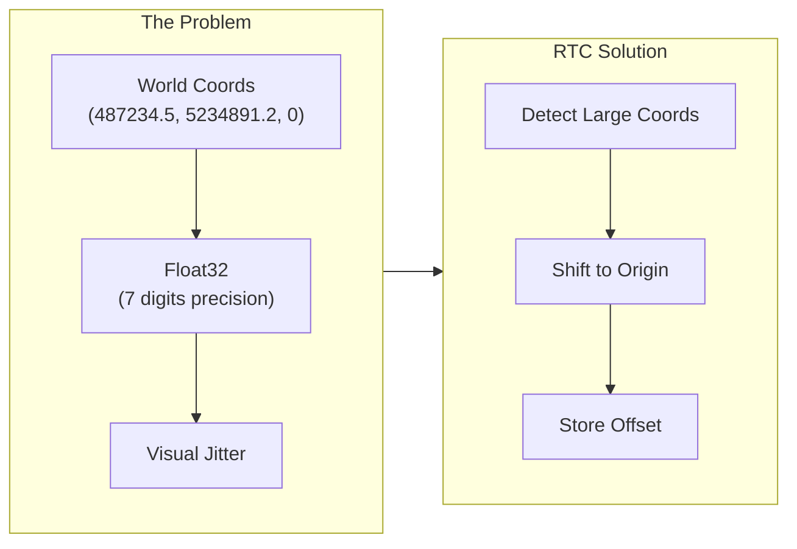
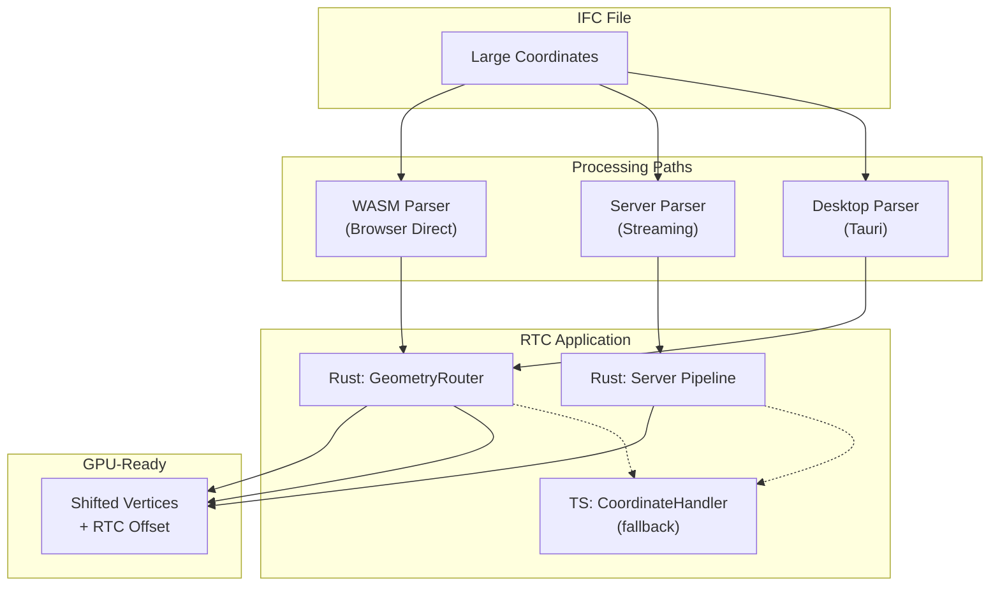

# Coordinate Handling & RTC (Relative To Center)

This document explains how IFClite handles large world coordinates to prevent floating-point precision issues during rendering.

## The Problem

Some IFC models incorrectly embed large world coordinates directly in geometry:

```
Building corner at: (487234.567, 5234891.234, 0.0)
```

**Important**: Large coordinates do NOT mean a model is georeferenced! Proper georeferencing in IFC is done via `IfcMapConversion` and `IfcProjectedCRS`, which store transformation parameters separately while keeping geometry in a local coordinate system with small values.

Large coordinates in geometry are a **bad practice** that has unfortunately become common. They cause rendering issues:

| Issue | Description |
|-------|-------------|
| **Float32 Precision** | GPU uses 32-bit floats with ~7 significant digits. Coordinates like `5234891.234` lose precision in the fractional part |
| **Visual Jitter** | Small movements in camera cause vertices to "snap" between representable values, creating flickering |
| **Z-fighting** | Near/far plane calculations break down at large distances from origin |
| **Picking Errors** | Ray-triangle intersection fails due to precision loss |



## RTC (Relative To Center) Solution

RTC shifts all geometry to be centered near the origin, storing the offset for later reconstruction:

```
Original:  (487234.567, 5234891.234, 0.0)
RTC Offset: (487000.000, 5235000.000, 0.0)
Shifted:   (234.567, -108.766, 0.0)  ← GPU-friendly!
```

### Thresholds

| Constant | Value | Purpose |
|----------|-------|---------|
| `LARGE_COORD_THRESHOLD` | 10,000m (10km) | Triggers RTC shift detection |
| `NORMAL_COORD_THRESHOLD` | 10,000m | Max expected coordinate after RTC |
| `MAX_REASONABLE_COORD` | 10,000,000m | Reject obviously corrupt values |

## Architecture Overview

RTC is applied at different layers depending on the parsing path:



## Rust Layer (WASM & Server)

### GeometryRouter

The `GeometryRouter` in `rust/geometry/src/router.rs` handles RTC:

```rust
impl GeometryRouter {
    /// Detect RTC offset from first building element's placement
    pub fn detect_rtc_offset_from_first_element(
        &mut self,
        content: &str,
        decoder: &mut EntityDecoder,
    ) -> (f64, f64, f64);

    /// Set RTC offset - all subsequent transforms will apply this
    pub fn set_rtc_offset(&mut self, offset: (f64, f64, f64));

    /// Check if RTC offset is active
    pub fn has_rtc_offset(&self) -> bool;
}
```

### RTC Detection Logic

```rust
// In detect_rtc_offset_from_first_element:
// 1. Find first IfcBuildingElement with geometry
// 2. Compute its full placement transform
// 3. Check translation component magnitude
let tx = transform[(0, 3)];
let ty = transform[(1, 3)];
let tz = transform[(2, 3)];

if tx.abs() > 10000.0 || ty.abs() > 10000.0 || tz.abs() > 10000.0 {
    // Large coordinates detected - use translation as RTC offset
    return (tx, ty, tz);
}
```

### Consistent Per-Mesh Application

**Critical**: RTC must be applied consistently to ALL vertices in a mesh:

```rust
fn transform_mesh(&self, mesh: &mut Mesh, transform: &Matrix4<f64>) {
    // Decide ONCE for the whole mesh based on transform translation
    let tx = transform[(0, 3)];
    let ty = transform[(1, 3)];
    let tz = transform[(2, 3)];

    let needs_rtc = self.has_rtc_offset() &&
        (tx.abs() > 1000.0 || ty.abs() > 1000.0 || tz.abs() > 1000.0);

    if needs_rtc {
        // Apply RTC to ALL vertices uniformly
        for vertex in mesh.positions.chunks_exact_mut(3) {
            let t = transform.transform_point(&point);
            vertex[0] = (t.x - rtc.0) as f32;
            vertex[1] = (t.y - rtc.1) as f32;
            vertex[2] = (t.z - rtc.2) as f32;
        }
    } else {
        // No RTC - just transform
        for vertex in mesh.positions.chunks_exact_mut(3) {
            // ... standard transform
        }
    }
}
```

**Why per-mesh, not per-vertex?** If some vertices in a mesh get RTC applied and others don't, the mesh becomes corrupted with vertices at wildly different scales.

## TypeScript Layer (Fallback)

### CoordinateHandler

`packages/geometry/src/coordinate-handler.ts` provides TypeScript-side coordinate handling as a fallback when WASM doesn't apply RTC:

```typescript
class CoordinateHandler {
    // Thresholds
    private readonly NORMAL_COORD_THRESHOLD = 10_000;   // 10km
    private readonly MAX_REASONABLE_COORD = 10_000_000; // 10,000km

    // State
    private wasmRtcDetected: boolean = false;
    private activeThreshold: number;
    private originShift: Vec3 = { x: 0, y: 0, z: 0 };

    /**
     * Process meshes incrementally for streaming.
     * Detects if WASM already applied RTC by checking coordinate ranges.
     */
    processMeshesIncremental(batch: MeshData[]): void;

    /**
     * Get coordinate info after processing
     */
    getCoordinateInfo(): CoordinateInfo | null;
}
```

### WASM RTC Detection

The TypeScript layer detects if WASM already applied RTC:

```typescript
processMeshesIncremental(batch: MeshData[]): void {
    // Check first batch for WASM RTC
    if (!this.wasmRtcDetected) {
        let smallCoordCount = 0;
        let totalVertices = 0;

        for (const mesh of batch) {
            for (let i = 0; i < mesh.positions.length; i += 3) {
                if (Math.abs(mesh.positions[i]) < this.NORMAL_COORD_THRESHOLD) {
                    smallCoordCount++;
                }
                totalVertices++;
            }
        }

        // If >80% vertices are within threshold, WASM applied RTC
        if (smallCoordCount / totalVertices > 0.8) {
            this.wasmRtcDetected = true;
            // Use stricter threshold for bounds calculation
            this.activeThreshold = this.NORMAL_COORD_THRESHOLD;
        }
    }
}
```

### Threshold Consistency

**Critical**: The same threshold must be used for bounds calculation AND vertex cleanup:

```typescript
processMeshesIncremental(batch: MeshData[]): void {
    // Set threshold based on WASM RTC detection
    this.activeThreshold = this.wasmRtcDetected
        ? this.NORMAL_COORD_THRESHOLD
        : this.MAX_REASONABLE_COORD;

    // Use same threshold for bounds...
    const batchBounds = this.calculateBounds(batch, this.activeThreshold);

    // ...and for vertex cleanup
    for (const mesh of batch) {
        this.shiftPositions(mesh.positions, this.originShift, this.activeThreshold);
    }
}
```

## API Reference

### WASM APIs

#### parseMeshesAsync

```typescript
interface ParseMeshesOptions {
    batchSize?: number;
    onProgress?: (percent: number) => void;
    onBatch?: (meshes: MeshData[], progress: Progress) => void;
    onRtcOffset?: (offset: { x: number; y: number; z: number }) => void;
    onComplete?: (stats: CompletionStats) => void;
}

interface CompletionStats {
    totalMeshes: number;
    totalVertices: number;
    totalTriangles: number;
    rtcOffset?: { x: number; y: number; z: number };
}
```

#### parseToGpuGeometry (Sync)

```typescript
const gpuGeom = api.parseToGpuGeometry(ifcContent);

// Check for RTC offset
if (gpuGeom.hasRtcOffset) {
    console.log('RTC applied:', {
        x: gpuGeom.rtcOffsetX,
        y: gpuGeom.rtcOffsetY,
        z: gpuGeom.rtcOffsetZ
    });
}
```

#### parseToGpuGeometryAsync (Streaming)

```typescript
await api.parseToGpuGeometryAsync(ifcContent, {
    batchSize: 25,
    onBatch: (gpuGeom, progress) => {
        // Each batch includes RTC offset
        if (gpuGeom.hasRtcOffset) {
            console.log('Batch RTC:', gpuGeom.rtcOffsetX, gpuGeom.rtcOffsetY, gpuGeom.rtcOffsetZ);
        }
        // Upload to GPU...
        gpuGeom.free();
    },
    onComplete: (stats) => {
        // Final stats include RTC
        if (stats.rtcOffset) {
            console.log('Final RTC:', stats.rtcOffset);
        }
    }
});
```

### TypeScript APIs

#### CoordinateHandler

```typescript
import { CoordinateHandler } from '@ifc-lite/geometry';

const handler = new CoordinateHandler();

// Process streaming batches
for (const batch of batches) {
    handler.processMeshesIncremental(batch);
}

// Get final coordinate info
const info = handler.getCoordinateInfo();
if (info) {
    console.log('Origin shift:', info.originShift);
    console.log('Original bounds:', info.originalBounds);
    console.log('Shifted bounds:', info.shiftedBounds);
}

// Reset for new file
handler.reset();
```

#### CoordinateInfo Structure

```typescript
interface CoordinateInfo {
    originShift: Vec3;        // Shift applied to vertices
    originalBounds: AABB;     // Bounds in original coordinates
    shiftedBounds: AABB;      // Bounds after shift (GPU coordinates)
    hasLargeCoordinates: boolean; // True if RTC shift was needed
}
```

**Note**: `hasLargeCoordinates` indicates the model had coordinates requiring RTC shift. This is NOT the same as being georeferenced - proper georeferencing uses `IfcMapConversion`.

## Usage Patterns

### Pattern 1: Full WASM Processing

When loading directly via WASM parser:

```typescript
const api = new IfcAPI();
const result = await api.parseMeshesAsync(content, {
    onRtcOffset: (offset) => {
        // Store for coordinate conversion
        setRtcOffset(offset);
    },
    onBatch: (meshes, progress) => {
        // Meshes already have RTC applied
        renderer.addMeshes(meshes);
    }
});
```

### Pattern 2: Server Streaming

When using server-side parsing:

```typescript
const response = await fetch('/api/parse', { body: file });

// Server applies RTC and returns shifted meshes + offset
const { meshes, coordinateInfo } = await response.json();

// coordinateInfo.origin_shift contains RTC offset
const rtcOffset = {
    x: coordinateInfo.origin_shift[0],
    y: coordinateInfo.origin_shift[1],
    z: coordinateInfo.origin_shift[2]
};

// Original bounds = shifted bounds + offset
const originalBounds = {
    min: {
        x: meshes.bounds.min.x + rtcOffset.x,
        y: meshes.bounds.min.y + rtcOffset.y,
        z: meshes.bounds.min.z + rtcOffset.z
    },
    max: {
        x: meshes.bounds.max.x + rtcOffset.x,
        y: meshes.bounds.max.y + rtcOffset.y,
        z: meshes.bounds.max.z + rtcOffset.z
    }
};
```

### Pattern 3: Converting Back to World Coordinates

For measurements, export, or display:

```typescript
function toWorldCoordinates(localPoint: Vec3, rtcOffset: Vec3): Vec3 {
    return {
        x: localPoint.x + rtcOffset.x,
        y: localPoint.y + rtcOffset.y,
        z: localPoint.z + rtcOffset.z
    };
}

// Example: Display measurement in world coordinates
const localStart = getMeasurementStart();
const localEnd = getMeasurementEnd();

const worldStart = toWorldCoordinates(localStart, rtcOffset);
const worldEnd = toWorldCoordinates(localEnd, rtcOffset);

const distance = Math.sqrt(
    Math.pow(worldEnd.x - worldStart.x, 2) +
    Math.pow(worldEnd.y - worldStart.y, 2) +
    Math.pow(worldEnd.z - worldStart.z, 2)
);
```

## Debugging

### Common Issues

| Symptom | Likely Cause | Solution |
|---------|--------------|----------|
| Meshes at wrong position | RTC offset not applied consistently | Ensure all paths use same RTC offset |
| Vertices scattered wildly | Per-vertex RTC decision | Fix to per-mesh decision |
| Some meshes at origin | Threshold mismatch | Use consistent threshold for bounds and cleanup |
| Jittery rendering | RTC not applied | Check if `hasRtcOffset` returns true |

### Logging RTC Status

```typescript
// In WASM path
api.parseMeshesAsync(content, {
    onRtcOffset: (offset) => {
        console.log('[RTC] WASM detected offset:', offset);
    }
});

// In TypeScript path
const info = handler.getCoordinateInfo();
console.log('[RTC] Handler info:', {
    wasmDetected: handler.wasmRtcDetected,
    originShift: info?.originShift,
    hasLargeCoordinates: info?.hasLargeCoordinates
});
```

## Implementation Checklist

When adding a new geometry processing path:

- [ ] Detect large coordinates using `detect_rtc_offset_from_first_element` or equivalent
- [ ] Apply RTC uniformly to entire mesh (not per-vertex decisions)
- [ ] Use consistent thresholds (10km normal, 10M max)
- [ ] Surface RTC offset to callers via callbacks/return values
- [ ] Include RTC offset in completion stats
- [ ] Document which layer applies RTC (Rust vs TypeScript)
- [ ] Handle originalBounds reconstruction if only shifted bounds available

## Related Documentation

- [Geometry Pipeline](geometry-pipeline.md) - Overall geometry processing
- [Data Flow](data-flow.md) - How data moves through the system
- [API Reference: WASM](../api/wasm.md) - WASM API details
