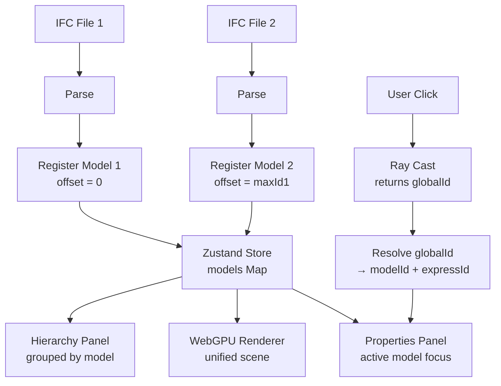

# Federation Architecture

This document describes the architecture of IFClite's multi-model federation system, which enables loading and interacting with multiple IFC files simultaneously.

## Overview

Federation solves the real-world problem of BIM projects that span multiple files (architectural, structural, MEP, etc.). IFClite's federation system provides:

- **Collision-free ID space** across all loaded models
- **Unified selection and visibility** regardless of source model
- **Per-model lifecycle management** (add/remove/toggle)
- **O(1) ID resolution** between global and local IDs

## ID Management

### The Problem

Each IFC file uses express IDs starting from 1. When loading two files, entity `#42` in Model A and entity `#42` in Model B would collide.

### The Solution: FederationRegistry

The `FederationRegistry` (singleton in `@ifc-lite/renderer`) assigns each model a unique **ID offset** at load time:

```
┌─────────────────────────────────────────────────────────────┐
│ Global ID Space                                             │
│                                                             │
│  Model A (offset=0)     Model B (offset=5000)    Model C   │
│  ┌──────────────────┐  ┌──────────────────┐  ┌────────────┐│
│  │  IDs 1 - 5000    │  │  IDs 5001 - 8000 │  │ 8001-10000 ││
│  │  (maxExpressId:   │  │  (maxExpressId:  │  │            ││
│  │   5000)           │  │   3000)          │  │            ││
│  └──────────────────┘  └──────────────────┘  └────────────┘│
└─────────────────────────────────────────────────────────────┘
```

```typescript
// Registration (maxExpressId = highest expressId in the model)
const offset = federationRegistry.registerModel('arch', maxExpressId);

// To-global: O(1)
const globalId = federationRegistry.toGlobalId('arch', localExpressId);

// From-global: O(log N) binary search
const lookup = federationRegistry.fromGlobalId(globalId);
if (lookup) {
  const { modelId, expressId } = lookup;
}
```

### EntityRef Pattern

For unambiguous entity references across the codebase, the `EntityRef` pattern is used:

```typescript
interface EntityRef {
  modelId: string;    // Which model
  expressId: number;  // Local express ID within that model
}
```

This avoids any confusion about whether an ID is local or global.

## State Architecture

### ModelSlice (Zustand)

The `modelSlice` manages all loaded models:

```typescript
interface ModelSlice {
  models: Map<string, FederatedModel>;  // All loaded models
  activeModelId: string | null;          // Focus for properties panel

  // Actions
  addModel(model: FederatedModel): void;
  removeModel(modelId: string): void;
  setModelVisibility(modelId: string, visible: boolean): void;

  // ID resolution
  toGlobalId(modelId: string, expressId: number): number;
  fromGlobalId(globalId: number): { modelId: string; expressId: number } | null;
  resolveGlobalIdFromModels(globalId: number): { modelId: string; expressId: number } | null;
}
```

### FederatedModel

```typescript
interface FederatedModel {
  id: string;
  name: string;
  idOffset: number;
  maxExpressId: number;
  visible: boolean;
  collapsed: boolean;
}
```

## Data Flow



## Interaction Model

### Selection

When a user clicks an entity:

1. Ray casting returns a **globalId** from the GPU pick buffer
2. `resolveGlobalIdFromModels(globalId)` converts to `{ modelId, expressId }`
3. The selection store is updated with the `EntityRef`
4. Properties panel loads data from the correct model's data store
5. Hierarchy panel highlights the entity within its model group

### Visibility

Visibility operates at two levels:

- **Model-level**: `setModelVisibility(modelId, false)` hides all entities in a model
- **Entity-level**: `hiddenEntities` set contains global IDs of individually hidden entities

The renderer combines both levels: an entity is visible only if its model is visible AND it is not in the hidden set.

### Section Planes

Section planes cut through **all visible models** simultaneously. The section plane position and orientation are stored in `sectionSlice` and applied uniformly across the federated scene.

## Performance Characteristics

| Operation | Complexity | Notes |
|-----------|------------|-------|
| Register model | O(1) | Compute offset from max existing |
| toGlobalId | O(1) | Simple addition |
| fromGlobalId | O(n) where n = model count | Iterate sorted offsets (typically 2-5 models) |
| resolveGlobalIdFromModels | O(n) | Uses Zustand state for reliability |
| Model visibility toggle | O(1) | GPU-level filtering |
| Entity selection | O(1) | Direct lookup after ID resolution |

## IFC5 Federated Layers

For IFC5 (IFCX) format, federation uses a **layer stack** model instead of ID offsets:

```typescript
// Layer-based composition (IFC5)
const result = await parseFederatedIfcx([
  { buffer: base, name: 'base.ifcx' },       // Weakest layer
  { buffer: overlay, name: 'overlay.ifcx' },  // Stronger layer
]);
// Properties from overlay override base
```

This is fundamentally different from IFC4 federation:

| Aspect | IFC4 Federation | IFC5 Federated Layers |
|--------|----------------|----------------------|
| **Mechanism** | ID offset ranges | Layer stack with priority |
| **Conflict resolution** | No conflicts (separate ID spaces) | Higher layer wins |
| **Use case** | Multiple distinct models | Overlay/amendment to base |
| **Property merging** | No merging (per-model) | Properties merged across layers |
