# Architecture Overview

This document describes the high-level architecture of IFC-Lite.

## System Architecture

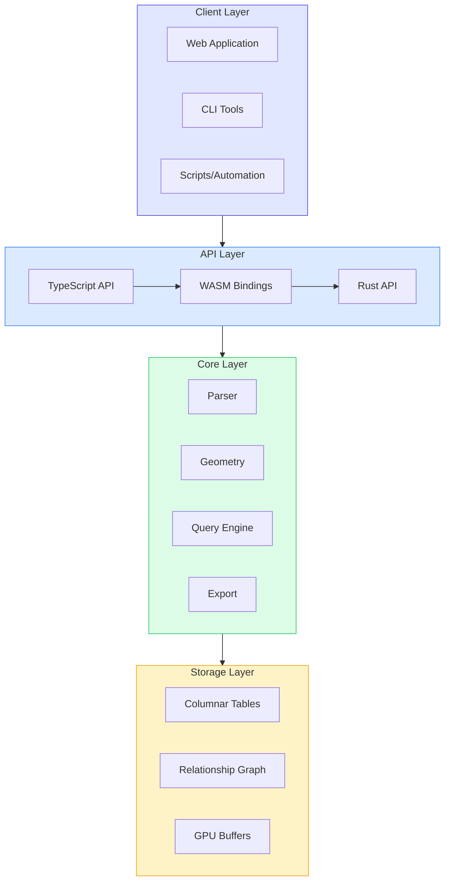

## Design Principles

### 1. Zero-Copy Where Possible

Data flows through the system with minimal copying:

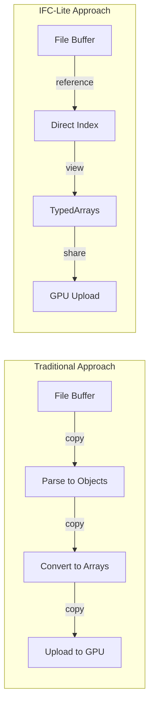

### 2. Streaming First

Process data incrementally:

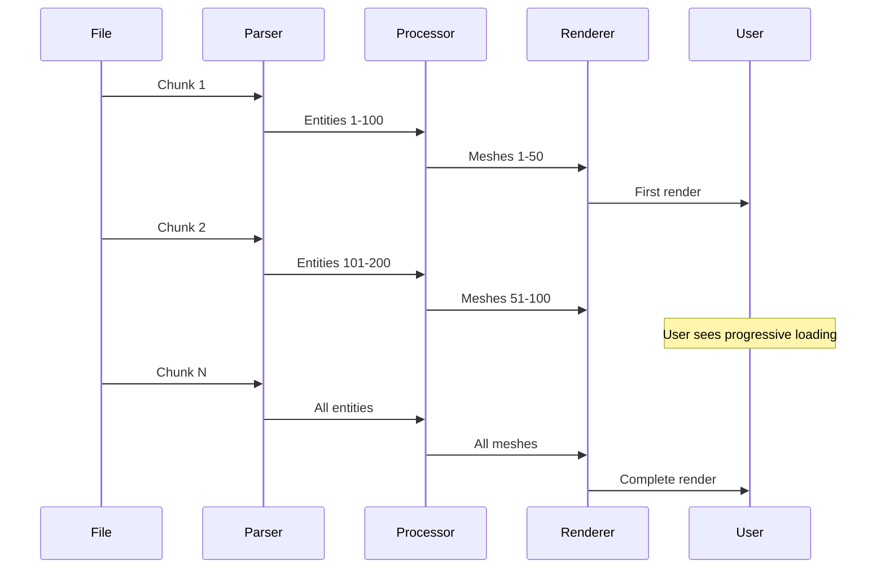

### 3. Columnar Storage

Store data in columnar format for cache-efficient access:

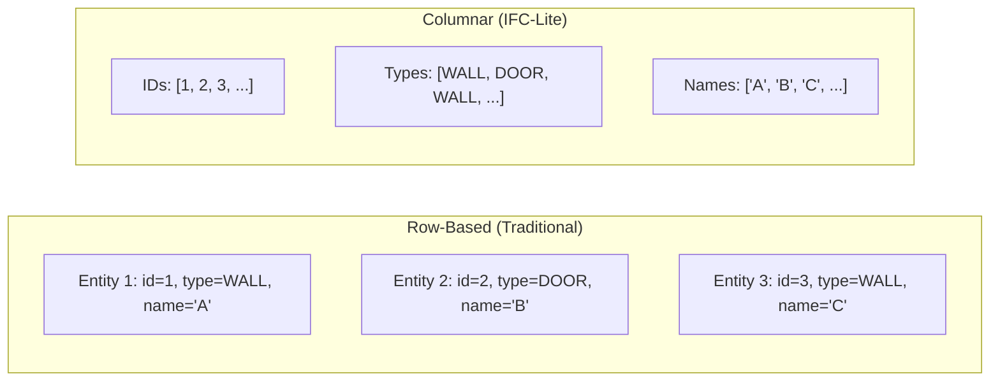

### 4. Hybrid Data Model

Combine the best of different data structures:

| Data Structure | Use Case | Access Pattern |
|----------------|----------|----------------|
| Columnar Tables | Bulk queries, filtering | Sequential scan |
| CSR Graph | Relationship traversal | Adjacency lookup |
| Lazy Parsing | On-demand attribute access | Random access |

## Package Architecture

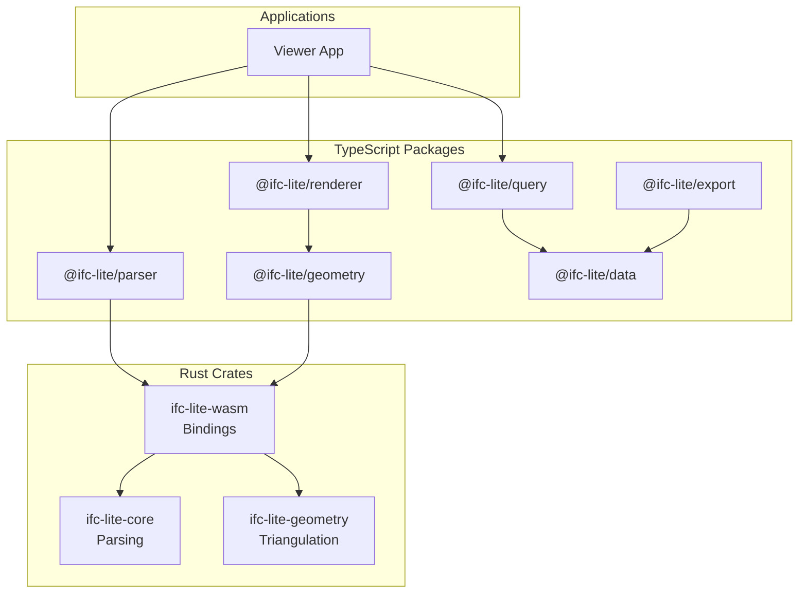

## Data Flow

### Parse Flow

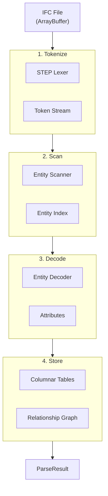

### Render Flow

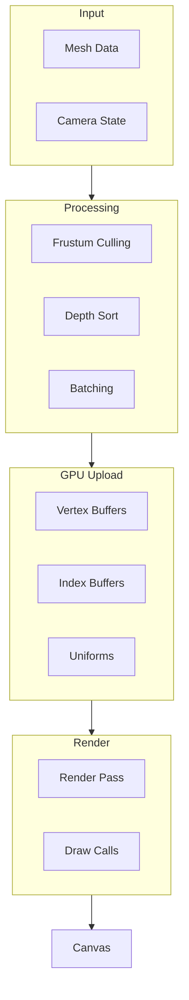

## Memory Architecture

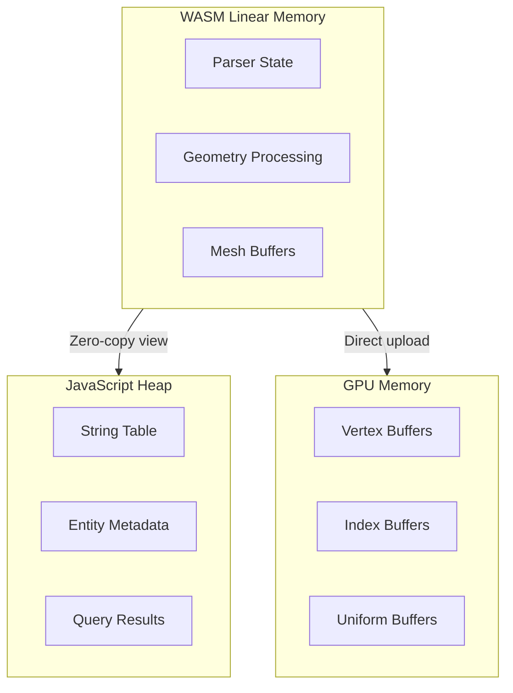

### Memory Efficiency

| Component | Memory Strategy |
|-----------|-----------------|
| Strings | Deduplicated string table (30% reduction) |
| Entity IDs | Uint32Array (fixed-size) |
| Types | Uint16Array enum (2 bytes vs ~20 for string) |
| Properties | Lazy parsing (on-demand) |
| Geometry | Streaming + dispose after upload |

## Threading Model

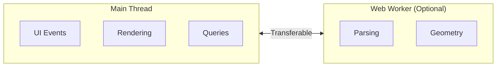

### Current Implementation

- **Parsing**: Main thread (streaming reduces blocking)
- **Geometry**: Main thread (batched processing)
- **Rendering**: Main thread (WebGPU)

### Planned

- **Parsing**: Web Worker with streaming
- **Geometry**: Worker pool for parallel processing
- **Rendering**: Main thread (required for WebGPU)

## Extension Points

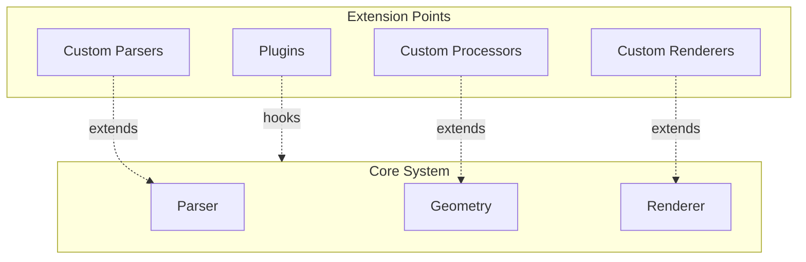

### Adding Custom Geometry Processor

```typescript
import { GeometryProcessor, ProcessorRegistry } from '@ifc-lite/geometry';

class CustomProcessor extends GeometryProcessor {
  canProcess(entity: Entity): boolean {
    return entity.type === 'IFCMYCUSTOMTYPE';
  }

  process(entity: Entity): Mesh {
    // Custom processing logic
    return mesh;
  }
}

ProcessorRegistry.register(new CustomProcessor());
```

## Technology Stack

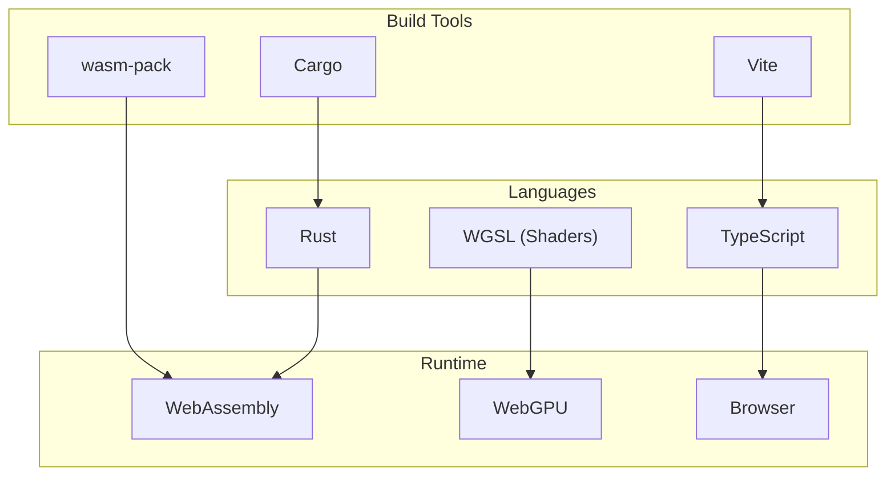

## Next Steps

- [Data Flow](data-flow.md) - Detailed data flow diagrams
- [Parsing Pipeline](parsing-pipeline.md) - Parser architecture
- [Geometry Pipeline](geometry-pipeline.md) - Geometry processing
- [Rendering Pipeline](rendering-pipeline.md) - WebGPU rendering
