# Architecture Overview

This document describes the high-level architecture of IFClite, including both client-side and server-side processing paradigms.

## System Architecture

IFClite supports two processing paradigms: **client-side** (WASM in browser) and **server-side** (native Rust). It provides **multi-model federation** for loading and managing multiple IFC models simultaneously with unified selection, visibility control, and coordinated ID spaces.

### Layer Overview


### Processing Paradigms

The system offers two processing paths depending on your needs:


## Client vs Server Paradigm

| Aspect | Client-Side (WASM) | Server-Side (Rust) |
|--------|-------------------|-------------------|
| **Processing** | Single-threaded | Multi-threaded (Rayon) |
| **Memory** | 4GB WASM limit | System RAM |
| **Caching** | Browser storage | Content-addressable disk |
| **Format** | Raw geometry | Parquet (15-50x smaller) |
| **Best For** | Privacy, offline | Teams, large files |

## Design Principles

### 1. Zero-Copy Where Possible

Data flows through the system with minimal copying:


### 2. Streaming First

Process data incrementally for responsive UIs:


### 3. On-Demand Property Extraction

Properties parsed lazily for faster initial load:

```mermaid
flowchart LR
    subgraph TraditionalParsing["Traditional"]
        T1["Parse All Entities"]
        T2["Parse All Properties"]
        T3["Build All Tables"]
        T1 --> T2 --> T3
    end

    subgraph OnDemand["IFClite On-Demand"]
        O1["Parse Entities"]
        O2["Build Index"]
        O3["Map: entityId → psetIds"]
        O4["Parse on Access"]
        O1 --> O2 --> O3
        O3 -.->|"lazy"| O4
    end

    style TraditionalParsing fill:#dc2626,stroke:#7f1d1d,color:#fff
    style OnDemand fill:#16a34a,stroke:#14532d,color:#fff
```



### 4. Columnar Storage

Store data in columnar format for cache-efficient access:


### 5. Hybrid Data Model

Combine the best of different data structures:

| Data Structure | Use Case | Access Pattern |
|----------------|----------|----------------|
| Columnar Tables | Bulk queries, filtering | Sequential scan |
| CSR Graph | Relationship traversal | Adjacency lookup |
| On-Demand Maps | Property access | Hash lookup |
| BVH | Raycasting | Tree traversal |

## Package Architecture

The monorepo contains 18 TypeScript packages, 4 Rust crates, and multiple application targets.


## Server Architecture


### Server Cache Strategy


## Data Flow

### Client-Side Parse Flow

Each model is parsed independently and then registered with the **FederationRegistry**, which assigns non-overlapping ID ranges (`idOffset`) so that multiple models can coexist with unique global IDs (`globalId = localExpressId + model.idOffset`).


### Server-Side Parse Flow


### Render Flow


## Memory Architecture

In a multi-model federation scenario, each loaded model maintains its own data store in the JS heap. The **FederationRegistry** tracks ID ranges per model to enable O(1) global-to-local ID resolution without duplicating entity data across models.


### Memory Efficiency

| Component | Memory Strategy |
|-----------|-----------------|
| Strings | Deduplicated string table (30% reduction) |
| Entity IDs | Uint32Array (fixed-size) |
| Types | Uint16Array enum (2 bytes vs ~20 for string) |
| Properties | On-demand parsing (not pre-loaded) |
| Geometry | Streaming + dispose after upload |
| Server | Parquet (15-50x smaller transfer) |

## Threading Model

### Client-Side


### Server-Side


## IFC5 (IFCX) Architecture


## Extension Points


### Adding Custom Geometry Processor

```typescript
import { GeometryProcessor, ProcessorRegistry } from '@ifc-lite/geometry';

class CustomProcessor extends GeometryProcessor {
  canProcess(entity: Entity): boolean {
    return entity.type === 'IFCMYCUSTOMTYPE';
  }

  process(entity: Entity): Mesh {
    // Custom processing logic
    return mesh;
  }
}

ProcessorRegistry.register(new CustomProcessor());
```

## Technology Stack


## Next Steps

- [Data Flow](data-flow.md) - Detailed data flow diagrams
- [Parsing Pipeline](parsing-pipeline.md) - Parser architecture
- [Geometry Pipeline](geometry-pipeline.md) - Geometry processing
- [Rendering Pipeline](rendering-pipeline.md) - WebGPU rendering
