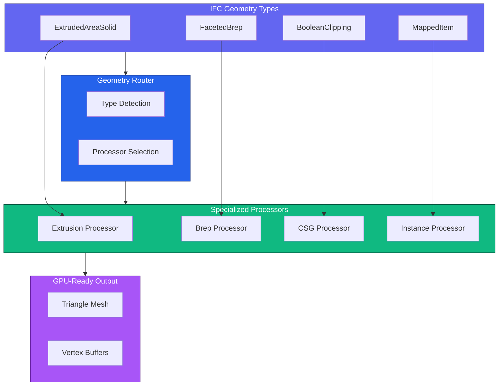
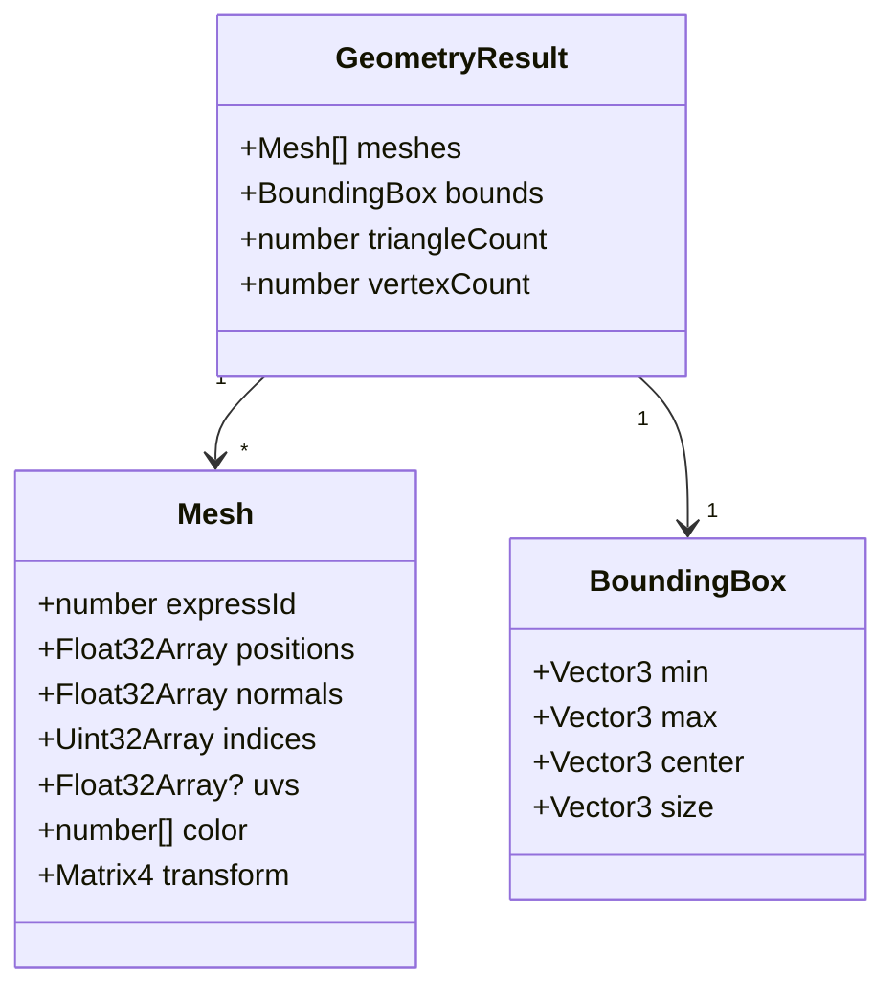
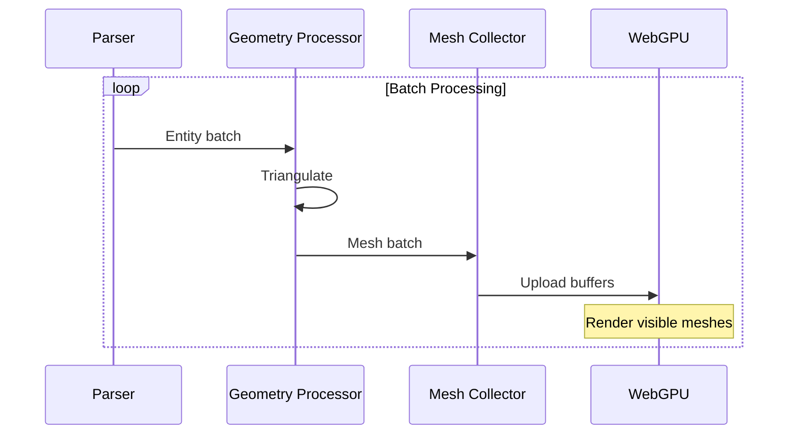
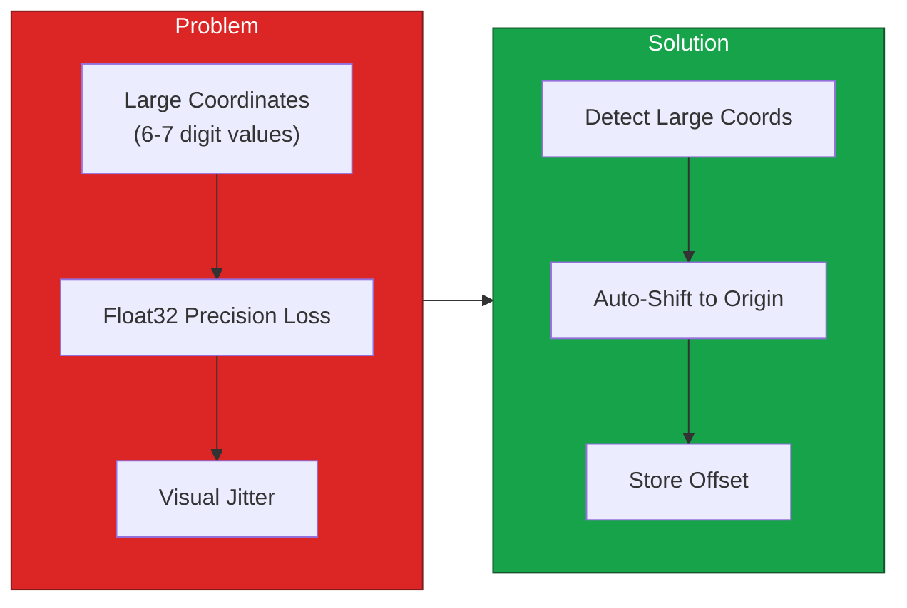
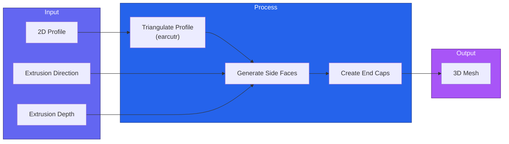
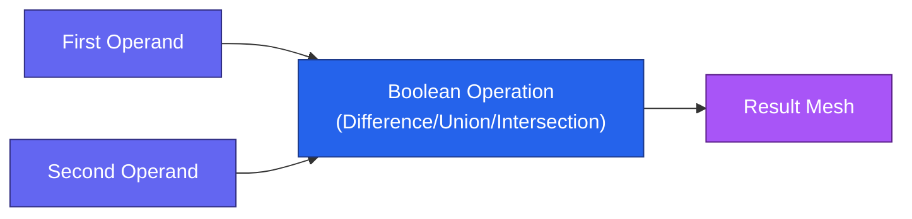

# Geometry Processing

Guide to geometry extraction and processing in IFClite.

## Overview

IFClite processes IFC geometry through a streaming pipeline:



## Geometry Quality Modes

| Mode | Curve Segments | Use Case |
|------|---------------|----------|
| `FAST` | 8 | Quick preview, mobile devices |
| `BALANCED` | 16 | Default, good quality/performance |
| `HIGH` | 32 | Maximum quality, detailed models |

```typescript
import { GeometryProcessor } from '@ifc-lite/geometry';

const geometry = new GeometryProcessor();
await geometry.init();

// Process with default quality
const result = await geometry.process(new Uint8Array(buffer));

// Note: Quality settings are configured in the WASM module
// For custom quality, rebuild with different curve subdivision settings
```

## Mesh Data Structure



### Accessing Mesh Data

```typescript
import { GeometryProcessor } from '@ifc-lite/geometry';

const geometry = new GeometryProcessor();
await geometry.init();

const result = await geometry.process(new Uint8Array(buffer));

// Get all meshes
for (const mesh of result.meshes) {
  console.log(`Entity #${mesh.expressId}:`);
  console.log(`  Vertices: ${mesh.positions.length / 3}`);
  console.log(`  Triangles: ${mesh.indices.length / 3}`);
  console.log(`  Color: rgba(${mesh.color.join(', ')})`);
}

// Find mesh by entity ID
const wallMesh = result.meshes.find(m => m.expressId === wallId);

// Calculate bounds from meshes
const bounds = calculateBounds(result.meshes);
console.log(`Model bounds:`, bounds);
```

## Streaming Geometry

Process geometry incrementally for large files:



### Streaming Example

```typescript
import { GeometryProcessor } from '@ifc-lite/geometry';
import { Renderer } from '@ifc-lite/renderer';

const geometry = new GeometryProcessor();
await geometry.init();

const renderer = new Renderer(canvas);
await renderer.init();

// Stream geometry progressively
for await (const event of geometry.processStreaming(new Uint8Array(buffer))) {
  switch (event.type) {
    case 'start':
      console.log('Starting geometry extraction');
      break;

    case 'batch':
      // Upload meshes to GPU as they arrive
      renderer.addMeshes(event.meshes, true);  // isStreaming = true

      // Render current state
      renderer.render();
      console.log(`Progress: ${event.progress}%`);
      break;

    case 'complete':
      // Finalize rendering
      renderer.fitToView();
      console.log(`Complete: ${event.totalMeshes} meshes`);
      break;
  }
}
```

## Coordinate Handling

IFC files often use large georeferenced coordinates that cause precision issues:



### Auto Origin Shift

The geometry processor automatically handles large coordinates:

```typescript
import { GeometryProcessor } from '@ifc-lite/geometry';

const geometry = new GeometryProcessor();
await geometry.init();

const result = await geometry.process(new Uint8Array(buffer));

// Access the computed shift from coordinate info
const coordInfo = geometry.getCoordinateInfo();
if (coordInfo?.shift) {
  console.log(`Origin shifted by:`, coordInfo.shift);
  // { x: 487234.5, y: 5234891.2, z: 0 }
}

// Convert local coordinates back to world
function toWorldCoords(localPos: Vector3, shift: Vector3): Vector3 {
  return {
    x: localPos.x + shift.x,
    y: localPos.y + shift.y,
    z: localPos.z + shift.z
  };
}
```

## Geometry Processors

### Extrusion Processor

Handles `IfcExtrudedAreaSolid` entities:



### Brep Processor

Handles `IfcFacetedBrep` entities:

```typescript
// Brep processing is straightforward - faces are already triangulated
// in most cases, or need simple fan triangulation

const brepMesh = processBrep({
  faces: brepEntity.faces,
  vertices: brepEntity.vertices
});
```

### Boolean Operations

Handles `IfcBooleanClippingResult`:



## Custom Geometry Processing

Extend geometry processing for custom needs:

```typescript
import { GeometryProcessor, ProcessorRegistry } from '@ifc-lite/geometry';

// Create custom processor
class CustomProfileProcessor extends GeometryProcessor {
  canProcess(entity: Entity): boolean {
    return entity.type === 'IFCARBITRARYCLOSEDPROFILEDEF';
  }

  process(entity: Entity): Mesh {
    // Custom triangulation logic
    const points = this.extractPoints(entity);
    const triangles = this.triangulate(points);
    return this.buildMesh(triangles);
  }
}

// Register processor
ProcessorRegistry.register(new CustomProfileProcessor());
```

## Instancing

IFC often uses mapped representations for repeated elements. The renderer handles instancing automatically:

```typescript
import { GeometryProcessor } from '@ifc-lite/geometry';
import { Renderer } from '@ifc-lite/renderer';

const geometry = new GeometryProcessor();
await geometry.init();

const result = await geometry.process(new Uint8Array(buffer));

// Load geometry - renderer automatically batches by color
// and can use instancing for repeated elements
renderer.loadGeometry(result);

// For advanced instancing control:
renderer.convertToInstanced(result.meshes);
```

## Performance Optimization

### Memory-Efficient Processing

Use streaming for large files:

```typescript
import { GeometryProcessor } from '@ifc-lite/geometry';

const geometry = new GeometryProcessor();
await geometry.init();

// Stream geometry in batches
for await (const event of geometry.processStreaming(new Uint8Array(buffer), undefined, 50)) {
  if (event.type === 'batch') {
    renderer.addMeshes(event.meshes, true);
    console.log(`Progress: ${event.progress}%`);
  }
}
```

### Filtering Geometry

To only render specific entity types, filter the meshes after processing:

```typescript
import { IfcParser } from '@ifc-lite/parser';
import { GeometryProcessor } from '@ifc-lite/geometry';

const parser = new IfcParser();
const store = await parser.parseColumnar(buffer);

// Get expressIds for types you want
const wantedIds = new Set([
  ...(store.entityIndex.byType.get('IFCWALL') ?? []),
  ...(store.entityIndex.byType.get('IFCDOOR') ?? []),
  ...(store.entityIndex.byType.get('IFCWINDOW') ?? [])
]);

// Process all geometry
const geometry = new GeometryProcessor();
await geometry.init();
const result = await geometry.process(new Uint8Array(buffer));

// Filter meshes
const filteredMeshes = result.meshes.filter(m => wantedIds.has(m.expressId));
renderer.loadGeometry({ meshes: filteredMeshes });
```

## Geometry Statistics

```typescript
import { GeometryProcessor } from '@ifc-lite/geometry';

const geometry = new GeometryProcessor();
await geometry.init();

const result = await geometry.process(new Uint8Array(buffer));

// Calculate statistics from meshes
let totalTriangles = 0;
let totalVertices = 0;

for (const mesh of result.meshes) {
  totalTriangles += mesh.indices.length / 3;
  totalVertices += mesh.positions.length / 3;
}

console.log('Geometry Statistics:');
console.log(`  Total meshes: ${result.meshes.length}`);
console.log(`  Total triangles: ${totalTriangles}`);
console.log(`  Total vertices: ${totalVertices}`);
```

## Next Steps

- [Rendering Guide](rendering.md) - Display geometry with WebGPU
- [Parsing Guide](parsing.md) - Parse options and streaming
- [API Reference](../api/typescript.md) - Complete API docs
