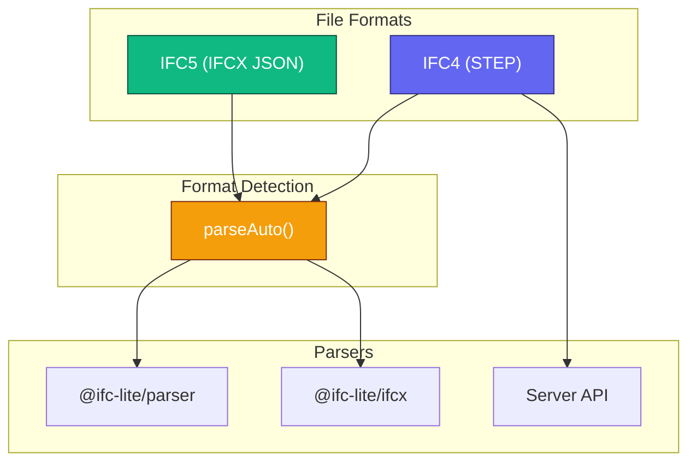
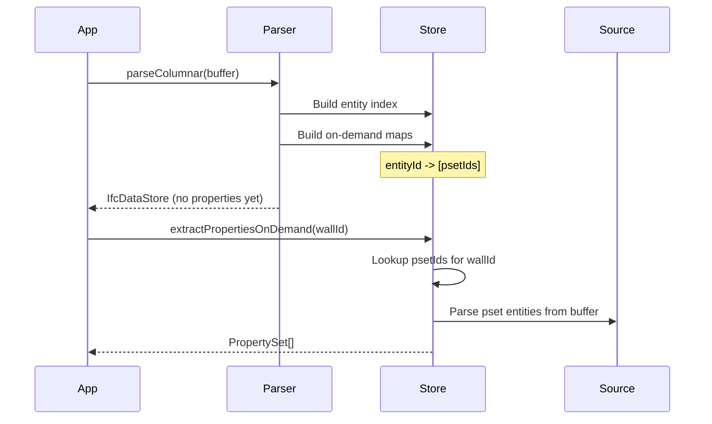

# Parsing IFC Files

Complete guide to parsing IFC files with IFClite, covering both IFC4 (STEP) and IFC5 (IFCX) formats.

## Overview

IFClite supports two parsing paradigms and two file formats:

| Aspect | Options |
|--------|---------|
| **Processing** | Client-side (WASM) or Server-side (Rust) |
| **Format** | IFC4 (STEP) or IFC5 (IFCX JSON) |
| **Mode** | Synchronous, columnar, or streaming |



## Client-Side Parsing

### Basic Parsing

```typescript
import { IfcParser } from '@ifc-lite/parser';

const parser = new IfcParser();
const buffer = await fetch('model.ifc').then(r => r.arrayBuffer());

// Standard parse (returns entities as objects)
const result = await parser.parse(buffer);

// Columnar parse (returns IfcDataStore - recommended)
const store = await parser.parseColumnar(buffer);
```

### Columnar Parsing (Recommended)

The columnar parser returns an `IfcDataStore` with memory-efficient data structures:

```typescript
const store = await parser.parseColumnar(buffer, {
  onProgress: ({ phase, percent }) => {
    console.log(`${phase}: ${percent}%`);
  }
});

// Access entities by type
const wallIds = store.entityIndex.byType.get('IFCWALL') ?? [];
const doorIds = store.entityIndex.byType.get('IFCDOOR') ?? [];

// Access entity by ID
const entityRef = store.entityIndex.byId.get(123);

// Metadata
console.log(`Schema: ${store.schemaVersion}`);  // IFC2X3, IFC4, IFC4X3
console.log(`Entities: ${store.entityCount}`);
console.log(`Parse time: ${store.parseTime}ms`);
```

### Browser Worker Mode

For non-blocking parsing in the browser:

```typescript
import { WorkerParser } from '@ifc-lite/parser/browser';

const parser = new WorkerParser();

const store = await parser.parseColumnar(buffer, {
  onProgress: ({ phase, percent }) => {
    // Updates from worker thread
    updateProgressUI(phase, percent);
  }
});

// Clean up when done
parser.terminate();
```

### Streaming Geometry

For large files, stream geometry progressively using `GeometryProcessor.processStreaming()`:

```typescript
import { GeometryProcessor } from '@ifc-lite/geometry';

const parser = new IfcParser();
const geometry = new GeometryProcessor();
await geometry.init();

// Parse first (fast, metadata only)
const store = await parser.parseColumnar(buffer);

// Stream geometry progressively
for await (const event of geometry.processStreaming(new Uint8Array(buffer))) {
  switch (event.type) {
    case 'start':
      console.log(`Starting geometry extraction`);
      break;
    case 'batch':
      // Add meshes to renderer as they arrive
      renderer.addMeshes(event.meshes, true);  // isStreaming = true
      progressBar.value = event.progress;
      break;
    case 'complete':
      console.log(`Done: ${event.totalMeshes} meshes`);
      renderer.fitToView();
      break;
  }
}
```

## On-Demand Property Extraction

Properties and quantities are extracted lazily for better performance with large files:

```typescript
import {
  extractPropertiesOnDemand,
  extractQuantitiesOnDemand,
  extractEntityAttributesOnDemand
} from '@ifc-lite/parser';

// Parse without pre-loading properties
const store = await parser.parseColumnar(buffer);

// Extract properties only when needed
const wallId = wallIds[0];
const psets = extractPropertiesOnDemand(store, wallId);

for (const pset of psets) {
  console.log(`Property Set: ${pset.name}`);
  for (const prop of pset.properties) {
    console.log(`  ${prop.name}: ${prop.value}`);
  }
}

// Extract quantities
const qsets = extractQuantitiesOnDemand(store, wallId);
for (const qset of qsets) {
  console.log(`Quantity Set: ${qset.name}`);
  for (const qty of qset.quantities) {
    console.log(`  ${qty.name}: ${qty.value} ${qty.type}`);
  }
}

// Extract IFC attributes
const attrs = extractEntityAttributesOnDemand(store, wallId);
console.log(`Name: ${attrs.name}`);
console.log(`GlobalId: ${attrs.globalId}`);
console.log(`Description: ${attrs.description}`);
```

### How On-Demand Works



## IFC5 (IFCX) Parsing

IFClite natively supports the new IFC5 JSON-based format with ECS composition and USD geometry.

### Format Detection

```typescript
import { parseAuto } from '@ifc-lite/parser';
import { detectFormat } from '@ifc-lite/ifcx';

// Auto-detect and parse
const result = await parseAuto(buffer);

if (result.format === 'ifcx') {
  // IFC5 file
  const { entities, meshes, spatialHierarchy } = result;
} else {
  // IFC4 STEP file
  const { store } = result;
}

// Or detect format manually
const format = detectFormat(buffer);  // 'ifc', 'ifcx', or 'unknown'
```

### Direct IFCX Parsing

```typescript
import { parseIfcx } from '@ifc-lite/ifcx';

const result = await parseIfcx(buffer, {
  onProgress: ({ phase, percent }) => {
    console.log(`${phase}: ${percent}%`);
  }
});

// IFC5 uses ECS (Entity-Component-System) composition
console.log(`Entities: ${result.entityCount}`);
console.log(`Meshes: ${result.meshes.length}`);

// Pre-tessellated USD geometry
for (const mesh of result.meshes) {
  console.log(`Entity #${mesh.express_id}: ${mesh.ifc_type}`);
  // mesh.positions, mesh.normals, mesh.indices ready for GPU
}

// Same data structures as IFC4
console.log(`Schema: ${result.schemaVersion}`);  // 'IFC5'
console.log(`Parse time: ${result.parseTime}ms`);
```

### IFC5 Features

| Feature | Description |
|---------|-------------|
| **ECS Composition** | Entities composed from components (attributes) |
| **USD Geometry** | Pre-tessellated meshes (no WASM triangulation needed) |
| **Layer Semantics** | Multiple nodes at same path merge (later overrides) |
| **Namespace Attributes** | Properties prefixed with namespace (e.g., `bsi::ifc::prop::`) |
| **JSON Format** | Human-readable, streamable |

### IFC5 Data Model

```typescript
// Entities include metadata
result.entities.forEach((entity, id) => {
  console.log(`Entity #${id}: ${entity.type_name}`);
  console.log(`  GlobalId: ${entity.global_id}`);
  console.log(`  Name: ${entity.name}`);
  console.log(`  Has geometry: ${entity.has_geometry}`);
});

// Property sets grouped by namespace
result.propertySets.forEach((pset, id) => {
  console.log(`PropertySet: ${pset.pset_name}`);
  for (const prop of pset.properties) {
    console.log(`  ${prop.property_name}: ${prop.property_value}`);
  }
});

// Spatial hierarchy
const hierarchy = result.spatialHierarchy;
console.log(`Project: ${hierarchy.project.name}`);

// Element-to-storey lookup
const storeyId = hierarchy.element_to_storey.get(wallId);
```

## Server-Side Parsing

For production deployments, use the server for parallel processing and caching:

```typescript
import { IfcServerClient } from '@ifc-lite/server-client';

const client = new IfcServerClient({
  baseUrl: 'http://localhost:3001'
});

// Parquet format (15x smaller than JSON)
const result = await client.parseParquet(file);

// Streaming for large files
for await (const event of client.parseParquetStream(file)) {
  if (event.type === 'batch') {
    renderer.addMeshes(event.meshes);
  }
}
```

See the [Server Guide](server.md) for complete server documentation.

## Parse Options

```typescript
interface ParseOptions {
  // Progress callback
  onProgress?: (progress: Progress) => void;

  // Geometry quality: 'FAST' | 'BALANCED' | 'HIGH'
  geometryQuality?: GeometryQuality;

  // Skip geometry processing
  skipGeometry?: boolean;

  // Coordinate handling
  autoOriginShift?: boolean;
  customOrigin?: { x: number; y: number; z: number };

  // Entity filtering
  includeTypes?: string[];
  excludeTypes?: string[];

  // WASM acceleration (optional)
  wasmApi?: WasmApi;
}

const store = await parser.parseColumnar(buffer, {
  geometryQuality: 'BALANCED',
  autoOriginShift: true,
  excludeTypes: ['IFCSPACE', 'IFCOPENINGELEMENT'],
  onProgress: ({ phase, percent }) => console.log(`${phase}: ${percent}%`)
});
```

## IfcDataStore Structure

```typescript
interface IfcDataStore {
  // Metadata
  fileSize: number;
  schemaVersion: 'IFC2X3' | 'IFC4' | 'IFC4X3';
  entityCount: number;
  parseTime: number;

  // Raw source (for on-demand parsing)
  source: Uint8Array;

  // Entity index
  entityIndex: {
    byId: Map<number, EntityRef>;      // expressId -> EntityRef
    byType: Map<string, number[]>;     // type -> [expressId, ...]
  };

  // Columnar tables
  strings: StringTable;                 // Deduplicated strings
  entities: EntityTable;                // Entity metadata
  properties: PropertyTable;            // Pre-computed (or empty for on-demand)
  quantities: QuantityTable;            // Pre-computed (or empty for on-demand)
  relationships: RelationshipGraph;     // Relationship edges

  // Spatial structures
  spatialHierarchy?: SpatialHierarchy;
  spatialIndex?: SpatialIndex;

  // On-demand maps
  onDemandPropertyMap?: Map<number, number[]>;   // entityId -> [psetId, ...]
  onDemandQuantityMap?: Map<number, number[]>;   // entityId -> [qsetId, ...]
}
```

## Spatial Hierarchy

```typescript
const hierarchy = store.spatialHierarchy;

// Project structure
console.log(`Project: ${hierarchy.project.name}`);

// Navigate storeys
for (const child of hierarchy.project.children) {
  if (child.type === 'IFCBUILDINGSTOREY') {
    const storey = child;
    console.log(`Storey: ${storey.name}`);

    // Get elements on this storey
    const elements = hierarchy.byStorey.get(storey.id) ?? [];
    console.log(`  Elements: ${elements.length}`);

    // Get storey elevation
    const elevation = hierarchy.storeyElevations.get(storey.id);
    console.log(`  Elevation: ${elevation}m`);
  }
}

// Find storey for an element
const storeyId = hierarchy.elementToStorey.get(wallId);
```

## Schema Support

| Schema | Entities | Status |
|--------|----------|--------|
| IFC2X3 | 653 | :material-check: Supported |
| IFC4 | 776 | :material-check: Full Support |
| IFC4X3 | 876 | :material-check: Supported |
| IFC5 (IFCX) | - | :material-check: Beta |

### Schema Registry

Access runtime schema metadata:

```typescript
import {
  SCHEMA_REGISTRY,
  getEntityMetadata,
  getAllAttributesForEntity,
  isKnownEntity
} from '@ifc-lite/parser';

// Check if entity type is known
if (isKnownEntity('IFCWALL')) {
  const meta = getEntityMetadata('IFCWALL');
  console.log(`Parent: ${meta.parent}`);         // 'IFCBUILDINGELEMENT'
  console.log(`Abstract: ${meta.isAbstract}`);   // false

  // Get all attributes including inherited
  const attrs = getAllAttributesForEntity('IFCWALL');
  for (const attr of attrs) {
    console.log(`${attr.name}: ${attr.type}`);
  }
}
```

## Advanced Extractors

### Materials

```typescript
import {
  extractMaterials,
  getMaterialForElement,
  getMaterialNameForElement
} from '@ifc-lite/parser';

const materials = extractMaterials(store);

// Get material for an element
const material = getMaterialForElement(wallId, materials);
if (material) {
  console.log(`Material: ${material.name}`);

  // For layered materials (walls)
  if (material.layers) {
    for (const layer of material.layers) {
      console.log(`  Layer: ${layer.material} (${layer.thickness}mm)`);
    }
  }
}
```

### Georeferencing

```typescript
import {
  extractGeoreferencing,
  transformToWorld,
  transformToLocal
} from '@ifc-lite/parser';

const georef = extractGeoreferencing(store);

if (georef) {
  console.log(`CRS: ${georef.targetCRS?.name}`);
  console.log(`Eastings: ${georef.mapConversion?.eastings}`);
  console.log(`Northings: ${georef.mapConversion?.northings}`);

  // Transform local coordinate to world
  const local = { x: 10, y: 20, z: 0 };
  const world = transformToWorld(local, georef);
  console.log(`World: ${world.x}, ${world.y}, ${world.z}`);
}
```

### Classifications

```typescript
import {
  extractClassifications,
  getClassificationsForElement,
  groupElementsByClassification
} from '@ifc-lite/parser';

const classifications = extractClassifications(store);

// Get classifications for an element
const codes = getClassificationsForElement(wallId, classifications);
for (const code of codes) {
  console.log(`${code.system}: ${code.identification} - ${code.name}`);
  // e.g., "Uniclass 2015: Pr_60_10_32 - External walls"
}

// Group elements by classification
const groups = groupElementsByClassification(classifications);
groups.forEach((elementIds, code) => {
  console.log(`${code}: ${elementIds.length} elements`);
});
```

## Error Handling

```typescript
import { IfcParser, ParseError, TokenError, SchemaError } from '@ifc-lite/parser';

try {
  const store = await parser.parseColumnar(buffer);
} catch (error) {
  if (error instanceof TokenError) {
    // Malformed STEP syntax
    console.error(`Token error at line ${error.line}: ${error.message}`);
  } else if (error instanceof SchemaError) {
    // Unknown or unsupported schema
    console.error(`Schema error: ${error.message}`);
  } else if (error instanceof ParseError) {
    // General parse error
    console.error(`Parse error: ${error.message}`);
  } else {
    throw error;
  }
}
```

## Performance Comparison

| Mode | Use Case | Memory | Speed |
|------|----------|--------|-------|
| `parse()` | Small files, full object access | High | Moderate |
| `parseColumnar()` | Most use cases | Low | Fast |
| `parseStreaming()` | Large files (>50MB) | Very Low | Progressive |
| Server | Production, caching | Server-side | Fastest (cached) |

### Performance Tips

1. **Use columnar parsing** - `parseColumnar()` for best memory efficiency
2. **Use on-demand properties** - Don't pre-load all properties
3. **Use workers** - Import from `@ifc-lite/parser/browser` for non-blocking
4. **Use server for large files** - Parallel processing and caching
5. **Filter entity types** - Exclude IFCSPACE, IFCOPENINGELEMENT if not needed

## Next Steps

- [Server Guide](server.md) - Server-based parsing with caching
- [Geometry Guide](geometry.md) - Process geometry
- [Query Guide](querying.md) - Query parsed data
- [API Reference](../api/typescript.md) - Complete API docs
