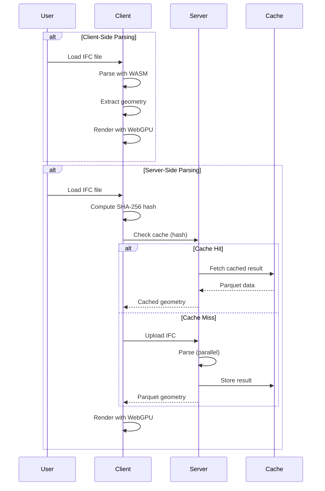

# Quick Start

Get up and running with IFClite in under 5 minutes. Choose your path based on your use case.

## Choose Your Approach

| | Client-Side | Server + Client |
|---|-------------|-----------------|
| **Setup** | `npm install @ifc-lite/parser` | Start server + install client SDK |
| **Processing** | Browser (WASM) | Server (native Rust) |
| **Caching** | IndexedDB (local) | Shared across team |
| **Best for** | Offline, privacy, simple apps | Teams, large files, production |

## Option 1: Client-Side Parsing

Process IFC files entirely in the browser using WebAssembly.

### 1. Create a New Project

```bash
npx create-ifc-lite my-viewer --template react
cd my-viewer
npm install
npm run dev
```

Open `http://localhost:3000` and drag an IFC file onto the viewer.

### 2. Or Add to Existing Project

```bash
npm install @ifc-lite/parser @ifc-lite/geometry @ifc-lite/renderer
```

```typescript
// main.ts
import { IfcParser } from '@ifc-lite/parser';
import { Renderer } from '@ifc-lite/renderer';

async function main() {
  // Get the canvas element
  const canvas = document.getElementById('viewer') as HTMLCanvasElement;

  // Initialize the renderer
  const renderer = new Renderer(canvas);
  await renderer.init();

  // Load an IFC file
  const response = await fetch('model.ifc');
  const buffer = await response.arrayBuffer();

  // Parse the IFC file (columnar mode for best performance)
  const parser = new IfcParser();
  const store = await parser.parseColumnar(buffer, {
    onProgress: ({ phase, percent }) => {
      console.log(`${phase}: ${percent}%`);
    }
  });

  console.log(`Parsed ${store.entityCount} entities`);
  console.log(`Schema: ${store.schemaVersion}`);

  // Get walls
  const wallIds = store.entityIndex.byType.get('IFCWALL') ?? [];
  console.log(`Found ${wallIds.length} walls`);
}

main();
```

## Option 2: Server + Client

Process IFC files on a high-performance Rust server with intelligent caching.

### 1. Start the Server

```bash
# Using Docker
docker run -p 3001:8080 ghcr.io/louistrue/ifc-lite-server

# Or using native binary
npx @ifc-lite/server-bin
```

### 2. Connect from Client

```bash
npm install @ifc-lite/server-client @ifc-lite/renderer
```

```typescript
import { IfcServerClient } from '@ifc-lite/server-client';
import { Renderer } from '@ifc-lite/renderer';

async function main() {
  const canvas = document.getElementById('viewer') as HTMLCanvasElement;
  const renderer = new Renderer(canvas);
  await renderer.init();

  // Connect to server
  const client = new IfcServerClient({
    baseUrl: 'http://localhost:3001'
  });

  // Load file (input element or drag-drop)
  const fileInput = document.getElementById('file-input') as HTMLInputElement;
  const file = fileInput?.files?.[0];
  if (!file) return;

  // Parse with Parquet format (15x smaller than JSON)
  const result = await client.parseParquet(file);

  console.log(`Parsed ${result.meshes.length} meshes`);
  console.log(`Cache key: ${result.cache_key}`);

  // On repeat loads, the server will return cached data instantly
  // (client computes file hash and checks cache before uploading)
}

main();
```

### 3. Stream Large Files

For files over 50MB, use streaming for progressive rendering:

```typescript
// Stream geometry batches
for await (const event of client.parseStream(file)) {
  switch (event.type) {
    case 'start':
      console.log(`Processing ~${event.total_estimate} entities`);
      break;

    case 'batch':
      // Add meshes to renderer as they arrive
      await renderer.addMeshes(event.meshes);
      console.log(`Batch ${event.batch_number}: ${event.mesh_count} meshes`);
      break;

    case 'complete':
      console.log(`Done in ${event.stats.total_time_ms}ms`);
      renderer.fitToView();
      break;
  }
}
```

## Understanding the Data

### Entity Index

The parser returns an `IfcDataStore` with columnar data structures:

```typescript
const store = await parser.parseColumnar(buffer);

// Access entities by type
const wallIds = store.entityIndex.byType.get('IFCWALL') ?? [];
const doorIds = store.entityIndex.byType.get('IFCDOOR') ?? [];
const windowIds = store.entityIndex.byType.get('IFCWINDOW') ?? [];

// Access entity by ID
const entityRef = store.entityIndex.byId.get(123);
if (entityRef) {
  console.log(`Entity #${entityRef.expressId}: ${entityRef.type}`);
}

// Get spatial hierarchy
const hierarchy = store.spatialHierarchy;
console.log(`Project: ${hierarchy.project.name}`);

// List storeys
for (const storey of hierarchy.project.children) {
  if (storey.type === 'IFCBUILDINGSTOREY') {
    const elements = hierarchy.byStorey.get(storey.id) ?? [];
    console.log(`${storey.name}: ${elements.length} elements`);
  }
}
```

### On-Demand Properties

Properties are extracted lazily for better performance:

```typescript
import {
  extractPropertiesOnDemand,
  extractQuantitiesOnDemand
} from '@ifc-lite/parser';

// Get properties for a specific entity
const wallId = wallIds[0];
const psets = extractPropertiesOnDemand(store, wallId);

for (const pset of psets) {
  console.log(`Property Set: ${pset.name}`);
  for (const prop of pset.properties) {
    console.log(`  ${prop.name}: ${prop.value}`);
  }
}

// Get quantities
const qsets = extractQuantitiesOnDemand(store, wallId);
for (const qset of qsets) {
  console.log(`Quantity Set: ${qset.name}`);
  for (const qty of qset.quantities) {
    console.log(`  ${qty.name}: ${qty.value} (${qty.type})`);
  }
}
```

## Working with IFC5 (IFCX)

IFClite natively supports the new IFC5 JSON-based format:

```typescript
import { parseAuto } from '@ifc-lite/parser';
import { parseIfcx, detectFormat } from '@ifc-lite/ifcx';

// Auto-detect format
const result = await parseAuto(buffer);

if (result.format === 'ifcx') {
  // IFC5 file
  const { entities, meshes, spatialHierarchy } = result;
  console.log('IFC5 with', meshes.length, 'pre-tessellated meshes');
} else {
  // IFC4 STEP file
  const { store } = result;
  console.log('IFC4 with', store.entityCount, 'entities');
}

// Or parse IFCX directly
const format = detectFormat(buffer);
if (format === 'ifcx') {
  const ifcxResult = await parseIfcx(buffer, {
    onProgress: ({ phase, percent }) => console.log(`${phase}: ${percent}%`)
  });

  // IFC5 uses ECS composition - entities have components
  console.log(`Entities: ${ifcxResult.entityCount}`);
  console.log(`Meshes: ${ifcxResult.meshes.length}`);

  // Pre-tessellated USD geometry
  for (const mesh of ifcxResult.meshes) {
    console.log(`Mesh for entity #${mesh.express_id}: ${mesh.ifc_type}`);
  }
}
```

## Rendering

### Basic Rendering

```typescript
import { Renderer } from '@ifc-lite/renderer';

const canvas = document.getElementById('viewer') as HTMLCanvasElement;
const renderer = new Renderer(canvas);
await renderer.init();

// Add meshes from server response
renderer.addMeshes(result.meshes);

// Or add meshes from geometry processor
// renderer.addMesh(mesh);

// Fit camera to model
renderer.fitToView();

// Start render loop
function animate() {
  renderer.render();
  requestAnimationFrame(animate);
}
animate();
```

### Selection and Picking

```typescript
// GPU picking
canvas.addEventListener('click', async (e) => {
  const rect = canvas.getBoundingClientRect();
  const x = e.clientX - rect.left;
  const y = e.clientY - rect.top;

  const expressId = await renderer.pick(x, y);
  if (expressId !== null) {
    console.log(`Selected entity #${expressId}`);

    // Highlight selection
    renderer.setSelection(new Set([expressId]));

    // Get properties
    const props = extractPropertiesOnDemand(store, expressId);
    displayProperties(props);
  }
});
```

### Visibility Control

```typescript
// Hide specific entities
renderer.setHiddenIds(new Set([123, 456, 789]));

// Isolate (show only these)
renderer.setIsolatedIds(new Set([123]));

// Clear isolation (show all)
renderer.setIsolatedIds(null);
```

## Data Flow Diagram



## Error Handling

```typescript
import { IfcParser, ParseError } from '@ifc-lite/parser';

try {
  const store = await parser.parseColumnar(buffer);
} catch (error) {
  if (error instanceof ParseError) {
    console.error('Parse error:', error.message);
    console.error('At line:', error.line);
  } else {
    throw error;
  }
}

// Server client errors
import { IfcServerClient } from '@ifc-lite/server-client';

try {
  const result = await client.parseParquet(file);
} catch (error) {
  if (error.message.includes('timeout')) {
    console.error('Server timeout - try streaming for large files');
  } else if (error.message.includes('413')) {
    console.error('File too large - increase MAX_FILE_SIZE_MB on server');
  }
}
```

## Performance Tips

### Client-Side

1. **Use columnar parsing** - `parseColumnar()` is faster than `parse()`
2. **Use Web Workers** - Import from `@ifc-lite/parser/browser` for non-blocking parsing
3. **Track progress** - Use `onProgress` callback with `parseColumnar()` for loading feedback

### Server-Side

1. **Enable caching** - Same file = instant response on repeat loads
2. **Use Parquet format** - 15x smaller payloads than JSON
3. **Stream large files** - Two options for files >50MB:
    - `parseStream()` - Async iterator pattern, JSON batches
    - `parseParquetStream()` - Callback pattern, Parquet format (recommended for best compression)
4. **Check cache first** - Client SDK automatically checks before upload

## Next Steps

- [Server Guide](server.md) - Deep dive into server architecture
- [Parsing Guide](parsing.md) - Advanced parsing options
- [Geometry Guide](geometry.md) - Geometry processing details
- [Rendering Guide](rendering.md) - WebGPU rendering features
- [Query Guide](querying.md) - Query entities and properties
