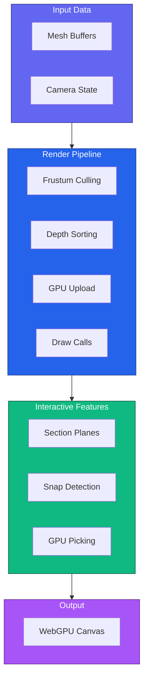
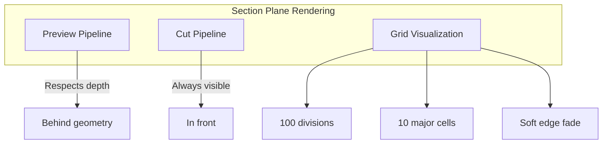

# Rendering

Guide to the WebGPU rendering pipeline in IFClite, including section planes, snap detection, and GPU picking.

## Overview

IFClite uses WebGPU for modern, high-performance 3D rendering:



## Basic Setup

```typescript
import { Renderer } from '@ifc-lite/renderer';

// Initialize renderer
const canvas = document.getElementById('viewer') as HTMLCanvasElement;
const renderer = new Renderer(canvas);

// Initialize WebGPU
await renderer.init();

// Add meshes (from parser or server)
renderer.addMeshes(meshes);

// Fit camera to model
renderer.fitToView();

// Start render loop
function animate() {
  renderer.render();
  requestAnimationFrame(animate);
}
animate();
```

## Renderer Configuration

```typescript
interface RendererOptions {
  // Anti-aliasing
  antialias?: boolean;
  sampleCount?: 1 | 4;

  // Background color
  backgroundColor?: [number, number, number, number];

  // Performance
  powerPreference?: 'low-power' | 'high-performance';

  // Features
  enablePicking?: boolean;
  enableSectionPlanes?: boolean;
}

const renderer = new Renderer(canvas, {
  antialias: true,
  sampleCount: 4,
  backgroundColor: [0.95, 0.95, 0.95, 1.0],
  powerPreference: 'high-performance',
  enablePicking: true,
  enableSectionPlanes: true
});
```

## Camera Controls

### Configuration

```typescript
interface CameraOptions {
  // Initial position
  position?: [number, number, number];
  target?: [number, number, number];
  up?: [number, number, number];

  // Projection
  fov?: number;
  near?: number;
  far?: number;

  // Controls
  orbitSpeed?: number;
  panSpeed?: number;
  zoomSpeed?: number;

  // Constraints
  minDistance?: number;
  maxDistance?: number;
}

renderer.setCamera({
  position: [10, 10, 10],
  target: [0, 0, 0],
  fov: 45,
  orbitSpeed: 0.5,
  minDistance: 1,
  maxDistance: 1000
});
```

### Camera Operations

```typescript
// Fit camera to view all geometry
renderer.fitToView();

// Fit to specific entities
renderer.fitToEntities([wall.expressId, door.expressId]);

// Set view preset
renderer.setViewPreset('front');  // front, back, left, right, top, bottom, iso

// Animate camera
renderer.animateTo({
  position: [20, 15, 20],
  target: [0, 0, 5],
  duration: 500
});
```

## Section Planes

Interactive model slicing with semantic axis names.

### Section Plane Types

| Axis | Direction | Color | Use Case |
|------|-----------|-------|----------|
| `down` | Y-axis | Light Blue | Floor plans |
| `front` | Z-axis | Green | Elevation views |
| `side` | X-axis | Orange | Cross sections |

### Creating Section Planes

```typescript
// Add a section plane
const sectionPlane = {
  axis: 'down' as const,    // 'down', 'front', or 'side'
  position: 50,              // 0-100 percentage of model bounds
  enabled: true,             // Active cutting (vs preview)
  flipped: false             // Show opposite side
};

// Set in render options
renderer.render({
  sectionPlane: sectionPlane
});
```

### Section Plane Controls

```typescript
// Update plane position
sectionPlane.position = 75;  // Move to 75% of model height

// Toggle between preview and cut modes
sectionPlane.enabled = false;  // Preview mode (transparent)
sectionPlane.enabled = true;   // Cut mode (active clipping)

// Flip to show opposite side
sectionPlane.flipped = true;

// Storey-based range override
sectionPlane.min = storeyElevation;
sectionPlane.max = storeyElevation + storeyHeight;
```

### Section Plane Visualization



### Section Plane Example

```typescript
// Interactive section plane control
let sectionPlane = {
  axis: 'down' as const,
  position: 50,
  enabled: true,
  flipped: false
};

// Slider control
slider.addEventListener('input', (e) => {
  sectionPlane.position = parseFloat(e.target.value);
});

// Axis toggle
axisButtons.forEach(btn => {
  btn.addEventListener('click', () => {
    sectionPlane.axis = btn.dataset.axis as 'down' | 'front' | 'side';
  });
});

// Flip toggle
flipBtn.addEventListener('click', () => {
  sectionPlane.flipped = !sectionPlane.flipped;
});

// Render with section plane
function animate() {
  renderer.render({ sectionPlane });
  requestAnimationFrame(animate);
}
```

## Snap Detection

Advanced "magnetic" edge snapping for precision measurement and interaction.

### Snap Types

| Type | Description | Priority |
|------|-------------|----------|
| `vertex` | Snap to mesh vertices | Highest |
| `edge` | Snap to edge lines | High |
| `face` | Snap to face surfaces | Medium |
| `face_center` | Snap to face centroids | Medium |

### Basic Snap Detection

```typescript
// Raycast with snap detection
canvas.addEventListener('mousemove', (e) => {
  const rect = canvas.getBoundingClientRect();
  const x = e.clientX - rect.left;
  const y = e.clientY - rect.top;

  const result = renderer.raycastScene(x, y, {
    snapOptions: {
      snapToVertices: true,
      snapToEdges: true,
      snapToFaces: true,
      snapRadius: 0.1,           // 10cm world units
      screenSnapRadius: 20       // 20 pixels
    }
  });

  if (result?.snap) {
    // Draw snap indicator at snap position
    drawSnapIndicator(result.snap.position, result.snap.type);
    console.log(`Snapped to ${result.snap.type} on entity #${result.snap.expressId}`);
  }
});
```

### Magnetic Edge Snapping

"Stick and slide" behavior for precision edge measurement:

```typescript
let edgeLock = {
  edge: null,
  meshExpressId: null,
  lockStrength: 0
};

canvas.addEventListener('mousemove', (e) => {
  const rect = canvas.getBoundingClientRect();
  const x = e.clientX - rect.left;
  const y = e.clientY - rect.top;

  // Use magnetic snapping
  const result = renderer.raycastSceneMagnetic(x, y, edgeLock, {
    snapOptions: {
      snapToVertices: true,
      snapToEdges: true,
      snapRadius: 0.1,
      screenSnapRadius: 20
    }
  });

  if (result.edgeLock.shouldLock) {
    // Lock to this edge
    edgeLock = {
      edge: result.edgeLock.edge,
      meshExpressId: result.edgeLock.meshExpressId,
      lockStrength: result.edgeLock.lockStrength
    };
  } else if (result.edgeLock.shouldRelease) {
    // Release the lock
    edgeLock = { edge: null, meshExpressId: null, lockStrength: 0 };
  }

  if (result.snapTarget) {
    const snap = result.snapTarget;

    // Corner detection (vertex at edge intersection)
    if (result.edgeLock.isCorner) {
      console.log(`Corner with ${result.edgeLock.cornerValence} edges`);
    }

    // Position along edge (0-1)
    console.log(`Edge position: ${result.edgeLock.edgeT}`);
  }
});
```

### Magnetic Snap Configuration

```typescript
const magneticConfig = {
  // Attraction radius multipliers
  EDGE_ATTRACTION_MULTIPLIER: 3.0,     // 3x base snap radius
  CORNER_ATTRACTION_MULTIPLIER: 2.0,   // 2x edge radius

  // Confidence boosts
  CORNER_CONFIDENCE_BOOST: 0.15,

  // Lock escape thresholds
  EDGE_ESCAPE_MULTIPLIER: 2.5,         // Movement to escape edge lock
  CORNER_ESCAPE_MULTIPLIER: 3.5,       // Movement to escape corner lock

  // Lock strength
  LOCK_STRENGTH_GROWTH: 0.05,          // Per frame growth
  MAX_LOCK_STRENGTH: 1.5,

  // Corner detection
  MIN_CORNER_VALENCE: 2,               // Minimum edges at vertex
  CORNER_THRESHOLD: 0.08               // % of edge length
};
```

### Snap Target Structure

```typescript
interface SnapTarget {
  type: 'vertex' | 'edge' | 'face' | 'face_center';
  position: { x: number; y: number; z: number };
  normal?: { x: number; y: number; z: number };
  expressId: number;
  confidence: number;  // 0-1, higher is better
  metadata?: {
    vertices?: Vec3[];     // For edges/faces
    edgeIndex?: number;
    faceIndex?: number;
  };
}
```

## GPU Picking

Depth-aware object selection supporting 100K+ meshes.

### Basic Picking

```typescript
canvas.addEventListener('click', async (e) => {
  const rect = canvas.getBoundingClientRect();
  const x = e.clientX - rect.left;
  const y = e.clientY - rect.top;

  const expressId = await renderer.pick(x, y);

  if (expressId !== null) {
    console.log(`Selected entity #${expressId}`);

    // Highlight selection
    renderer.setSelection(new Set([expressId]));

    // Get entity data
    const props = extractPropertiesOnDemand(store, expressId);
    displayProperties(props);
  } else {
    renderer.clearSelection();
  }
});
```

### Multi-Selection

```typescript
// Select multiple entities
renderer.setSelection(new Set([id1, id2, id3]));

// Get current selection
const selected = renderer.getSelection();

// Clear selection
renderer.clearSelection();
```

### Raycasting

```typescript
// Full raycast with intersection details
const result = renderer.raycastScene(x, y);

if (result) {
  const { intersection } = result;

  console.log(`Hit point: ${intersection.point.x}, ${intersection.point.y}, ${intersection.point.z}`);
  console.log(`Normal: ${intersection.normal.x}, ${intersection.normal.y}, ${intersection.normal.z}`);
  console.log(`Distance: ${intersection.distance}`);
  console.log(`Entity: #${intersection.expressId}`);
  console.log(`Triangle: ${intersection.triangleIndex}`);
}
```

## Visibility Control

```typescript
// Hide specific entities
renderer.setHiddenIds(new Set([entity1.expressId, entity2.expressId]));

// Isolate (show only these)
renderer.setIsolatedIds(new Set([wallId, doorId]));

// Clear isolation (show all)
renderer.setIsolatedIds(null);

// Hide by entity type (combine with parser data)
const spaceIds = store.entityIndex.byType.get('IFCSPACE') ?? [];
renderer.setHiddenIds(new Set(spaceIds));
```

## Render Options

```typescript
interface RenderOptions {
  // Clear color
  clearColor?: [number, number, number, number];

  // Performance
  enableDepthTest?: boolean;
  enableFrustumCulling?: boolean;
  spatialIndex?: SpatialIndex;

  // Visibility filtering
  hiddenIds?: Set<number>;           // Hide these meshes
  isolatedIds?: Set<number> | null;  // Only show these (null = show all)

  // Selection
  selectedId?: number | null;        // Single selection
  selectedIds?: Set<number>;         // Multi-selection

  // Section planes
  sectionPlane?: SectionPlane;

  // Streaming mode
  isStreaming?: boolean;             // Skip expensive ops during load
}

renderer.render({
  clearColor: [0.9, 0.9, 0.9, 1.0],
  enableFrustumCulling: true,
  hiddenIds: new Set([123, 456]),
  selectedIds: new Set([789]),
  sectionPlane: {
    axis: 'down',
    position: 50,
    enabled: true
  }
});
```

## Materials and Colors

```typescript
// Set entity color
renderer.setColor(entityId, [1, 0, 0, 1]); // Red

// Set color by type
renderer.setColorByType('IFCWALL', [0.8, 0.8, 0.8, 1]);
renderer.setColorByType('IFCDOOR', [0.6, 0.4, 0.2, 1]);
renderer.setColorByType('IFCWINDOW', [0.7, 0.9, 1.0, 0.5]);

// Reset to IFC materials
renderer.resetColors();

// Color by property
renderer.colorByProperty('Pset_WallCommon', 'FireRating', {
  '30': [0.2, 0.8, 0.2, 1],  // Green for 30 min
  '60': [1.0, 0.8, 0.0, 1],  // Yellow for 60 min
  '90': [1.0, 0.0, 0.0, 1],  // Red for 90 min
});
```

## Performance Optimization

### Frustum Culling

```typescript
// Enable frustum culling (default: on)
renderer.setFrustumCulling(true);

// Get culling statistics
const stats = renderer.getCullingStats();
console.log(`Visible: ${stats.visible} / ${stats.total} meshes`);
```

### BVH Acceleration

The renderer uses a Bounding Volume Hierarchy for fast raycasting:

```typescript
// BVH is built automatically when meshes are added
// For large models, ray intersection is O(log n) instead of O(n)

// Clear caches when geometry changes
renderer.clearCaches();
```

### Instance Batching

```typescript
// Automatically batch repeated geometry
renderer.setBatching(true);

// Check instancing stats
const instanceStats = renderer.getInstanceStats();
console.log(`Unique meshes: ${instanceStats.uniqueMeshes}`);
console.log(`Total instances: ${instanceStats.totalInstances}`);
```

### Zero-Copy GPU Upload

Direct WASM-to-GPU buffer streaming for 60-70% less RAM:

```typescript
// Zero-copy is automatic when using server responses
// or WASM geometry processing

// For manual control:
renderer.addMeshZeroCopy(wasmMemoryHandle, gpuGeometryData);
```

## Rendering Statistics

```typescript
// Enable stats display
renderer.showStats(true);

// Get stats programmatically
const stats = renderer.getStats();
console.log(`FPS: ${stats.fps}`);
console.log(`Draw calls: ${stats.drawCalls}`);
console.log(`Triangles: ${stats.triangles}`);
console.log(`GPU memory: ${stats.gpuMemoryMB} MB`);
```

## Complete Example

```typescript
import { Renderer } from '@ifc-lite/renderer';
import { IfcServerClient } from '@ifc-lite/server-client';

async function createViewer() {
  const canvas = document.getElementById('viewer') as HTMLCanvasElement;
  const renderer = new Renderer(canvas, {
    antialias: true,
    enablePicking: true,
    enableSectionPlanes: true
  });
  await renderer.init();

  // Load from server
  const client = new IfcServerClient({ baseUrl: 'http://localhost:3001' });
  const result = await client.parseParquet(file);

  // Add meshes
  renderer.addMeshes(result.meshes);
  renderer.fitToView();

  // Section plane state
  let sectionPlane = null;

  // Selection state
  let selectedId = null;

  // Edge lock state for magnetic snapping
  let edgeLock = { edge: null, meshExpressId: null, lockStrength: 0 };

  // Click handler with picking
  canvas.addEventListener('click', async (e) => {
    const rect = canvas.getBoundingClientRect();
    const id = await renderer.pick(e.clientX - rect.left, e.clientY - rect.top);

    if (id !== null) {
      selectedId = id;
      renderer.setSelection(new Set([id]));
    } else {
      selectedId = null;
      renderer.clearSelection();
    }
  });

  // Mousemove handler with magnetic snapping
  canvas.addEventListener('mousemove', (e) => {
    const rect = canvas.getBoundingClientRect();
    const x = e.clientX - rect.left;
    const y = e.clientY - rect.top;

    const result = renderer.raycastSceneMagnetic(x, y, edgeLock, {
      snapOptions: { snapToVertices: true, snapToEdges: true }
    });

    if (result.edgeLock.shouldLock) {
      edgeLock = result.edgeLock;
    } else if (result.edgeLock.shouldRelease) {
      edgeLock = { edge: null, meshExpressId: null, lockStrength: 0 };
    }

    if (result.snapTarget) {
      showSnapIndicator(result.snapTarget);
    }
  });

  // Render loop
  function animate() {
    renderer.render({
      sectionPlane,
      selectedIds: selectedId ? new Set([selectedId]) : undefined
    });
    requestAnimationFrame(animate);
  }
  animate();

  return { renderer, setSectionPlane: (p) => { sectionPlane = p; } };
}
```

## Next Steps

- [Geometry Guide](geometry.md) - Geometry processing
- [Query Guide](querying.md) - Query entity data
- [Server Guide](server.md) - Server-based rendering
- [API Reference](../api/typescript.md) - Complete API docs
