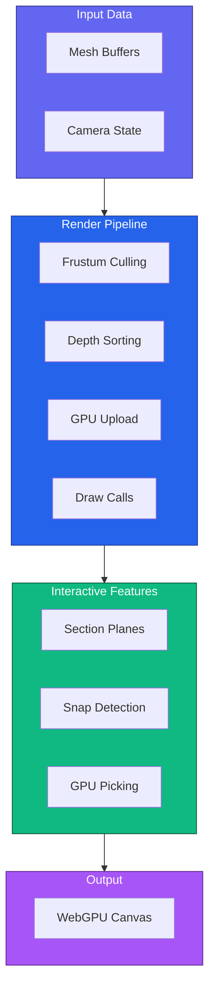
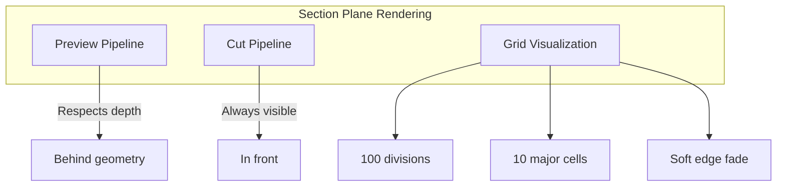

# Rendering

Guide to the WebGPU rendering pipeline in IFClite, including section planes, snap detection, and GPU picking.

## Overview

IFClite uses WebGPU for modern, high-performance 3D rendering:



## Basic Setup

```typescript
import { Renderer } from '@ifc-lite/renderer';

// Initialize renderer
const canvas = document.getElementById('viewer') as HTMLCanvasElement;
const renderer = new Renderer(canvas);

// Initialize WebGPU
await renderer.init();

// Add meshes (from parser or server)
renderer.addMeshes(meshes);

// Fit camera to model
renderer.fitToView();

// Start render loop
function animate() {
  renderer.render();
  requestAnimationFrame(animate);
}
animate();
```

## Renderer Configuration

```typescript
interface RendererOptions {
  // Anti-aliasing
  antialias?: boolean;
  sampleCount?: 1 | 4;

  // Background color
  backgroundColor?: [number, number, number, number];

  // Performance
  powerPreference?: 'low-power' | 'high-performance';

  // Features
  enablePicking?: boolean;
  enableSectionPlanes?: boolean;
}

const renderer = new Renderer(canvas, {
  antialias: true,
  sampleCount: 4,
  backgroundColor: [0.95, 0.95, 0.95, 1.0],
  powerPreference: 'high-performance',
  enablePicking: true,
  enableSectionPlanes: true
});
```

## Camera Controls

### Configuration

```typescript
interface CameraOptions {
  // Initial position
  position?: [number, number, number];
  target?: [number, number, number];
  up?: [number, number, number];

  // Projection
  fov?: number;
  near?: number;
  far?: number;

  // Controls
  orbitSpeed?: number;
  panSpeed?: number;
  zoomSpeed?: number;

  // Constraints
  minDistance?: number;
  maxDistance?: number;
}

// Access camera directly
const camera = renderer.getCamera();

camera.setPosition(10, 10, 10);
camera.setTarget(0, 0, 0);
```

### Camera Operations

```typescript
const camera = renderer.getCamera();

// Fit camera to view all geometry
renderer.fitToView();

// Fit to specific bounds
camera.fitToBounds(
  { x: 0, y: 0, z: 0 },      // min
  { x: 10, y: 5, z: 10 }     // max
);

// Animated fit to bounds
await camera.frameBounds(
  { x: 0, y: 0, z: 0 },
  { x: 10, y: 5, z: 10 },
  300  // duration in ms
);

// Set view preset (with model bounds)
camera.setPresetView('front', modelBounds);  // 'front', 'back', 'left', 'right', 'top', 'bottom'

// Animated camera movement
await camera.animateTo(
  { x: 20, y: 15, z: 20 },   // position
  { x: 0, y: 0, z: 5 },      // target
  500                         // duration
);

// Interactive controls
camera.orbit(deltaX, deltaY);   // Rotate around target
camera.pan(deltaX, deltaY);     // Move camera sideways
camera.zoom(delta);             // Zoom in/out
```

## Section Planes

Interactive model slicing with semantic axis names.

### Section Plane Types

| Axis | Direction | Color | Use Case |
|------|-----------|-------|----------|
| `down` | Y-axis | Light Blue | Floor plans |
| `front` | Z-axis | Green | Elevation views |
| `side` | X-axis | Orange | Cross sections |

### Creating Section Planes

```typescript
// Add a section plane
const sectionPlane = {
  axis: 'down' as const,    // 'down', 'front', or 'side'
  position: 50,              // 0-100 percentage of model bounds
  enabled: true,             // Active cutting (vs preview)
  flipped: false             // Show opposite side
};

// Set in render options
renderer.render({
  sectionPlane: sectionPlane
});
```

### Section Plane Controls

```typescript
// Update plane position
sectionPlane.position = 75;  // Move to 75% of model height

// Toggle between preview and cut modes
sectionPlane.enabled = false;  // Preview mode (transparent)
sectionPlane.enabled = true;   // Cut mode (active clipping)

// Flip to show opposite side
sectionPlane.flipped = true;

// Storey-based range override
sectionPlane.min = storeyElevation;
sectionPlane.max = storeyElevation + storeyHeight;
```

### Section Plane Visualization



### Section Plane Example

```typescript
// Interactive section plane control
let sectionPlane = {
  axis: 'down' as const,
  position: 50,
  enabled: true,
  flipped: false
};

// Slider control
slider.addEventListener('input', (e) => {
  sectionPlane.position = parseFloat(e.target.value);
});

// Axis toggle
axisButtons.forEach(btn => {
  btn.addEventListener('click', () => {
    sectionPlane.axis = btn.dataset.axis as 'down' | 'front' | 'side';
  });
});

// Flip toggle
flipBtn.addEventListener('click', () => {
  sectionPlane.flipped = !sectionPlane.flipped;
});

// Render with section plane
function animate() {
  renderer.render({ sectionPlane });
  requestAnimationFrame(animate);
}
```

## Snap Detection

Advanced "magnetic" edge snapping for precision measurement and interaction.

### Snap Types

| Type | Description | Priority |
|------|-------------|----------|
| `vertex` | Snap to mesh vertices | Highest |
| `edge` | Snap to edge lines | High |
| `face` | Snap to face surfaces | Medium |
| `face_center` | Snap to face centroids | Medium |

### Basic Snap Detection

```typescript
// Raycast with snap detection
canvas.addEventListener('mousemove', (e) => {
  const rect = canvas.getBoundingClientRect();
  const x = e.clientX - rect.left;
  const y = e.clientY - rect.top;

  const result = renderer.raycastScene(x, y, {
    snapOptions: {
      snapToVertices: true,
      snapToEdges: true,
      snapToFaces: true,
      snapRadius: 0.1,           // 10cm world units
      screenSnapRadius: 20       // 20 pixels
    }
  });

  if (result?.snap) {
    // Draw snap indicator at snap position
    drawSnapIndicator(result.snap.position, result.snap.type);
    console.log(`Snapped to ${result.snap.type} on entity #${result.snap.expressId}`);
  }
});
```

### Magnetic Edge Snapping

"Stick and slide" behavior for precision edge measurement:

```typescript
let edgeLock = {
  edge: null,
  meshExpressId: null,
  lockStrength: 0
};

canvas.addEventListener('mousemove', (e) => {
  const rect = canvas.getBoundingClientRect();
  const x = e.clientX - rect.left;
  const y = e.clientY - rect.top;

  // Use magnetic snapping
  const result = renderer.raycastSceneMagnetic(x, y, edgeLock, {
    snapOptions: {
      snapToVertices: true,
      snapToEdges: true,
      snapRadius: 0.1,
      screenSnapRadius: 20
    }
  });

  if (result.edgeLock.shouldLock) {
    // Lock to this edge
    edgeLock = {
      edge: result.edgeLock.edge,
      meshExpressId: result.edgeLock.meshExpressId,
      lockStrength: result.edgeLock.lockStrength
    };
  } else if (result.edgeLock.shouldRelease) {
    // Release the lock
    edgeLock = { edge: null, meshExpressId: null, lockStrength: 0 };
  }

  if (result.snapTarget) {
    const snap = result.snapTarget;

    // Corner detection (vertex at edge intersection)
    if (result.edgeLock.isCorner) {
      console.log(`Corner with ${result.edgeLock.cornerValence} edges`);
    }

    // Position along edge (0-1)
    console.log(`Edge position: ${result.edgeLock.edgeT}`);
  }
});
```

### Magnetic Snap Configuration

```typescript
const magneticConfig = {
  // Attraction radius multipliers
  EDGE_ATTRACTION_MULTIPLIER: 3.0,     // 3x base snap radius
  CORNER_ATTRACTION_MULTIPLIER: 2.0,   // 2x edge radius

  // Confidence boosts
  CORNER_CONFIDENCE_BOOST: 0.15,

  // Lock escape thresholds
  EDGE_ESCAPE_MULTIPLIER: 2.5,         // Movement to escape edge lock
  CORNER_ESCAPE_MULTIPLIER: 3.5,       // Movement to escape corner lock

  // Lock strength
  LOCK_STRENGTH_GROWTH: 0.05,          // Per frame growth
  MAX_LOCK_STRENGTH: 1.5,

  // Corner detection
  MIN_CORNER_VALENCE: 2,               // Minimum edges at vertex
  CORNER_THRESHOLD: 0.08               // % of edge length
};
```

### Snap Target Structure

```typescript
interface SnapTarget {
  type: 'vertex' | 'edge' | 'face' | 'face_center';
  position: { x: number; y: number; z: number };
  normal?: { x: number; y: number; z: number };
  expressId: number;
  confidence: number;  // 0-1, higher is better
  metadata?: {
    vertices?: Vec3[];     // For edges/faces
    edgeIndex?: number;
    faceIndex?: number;
  };
}
```

## GPU Picking

Depth-aware object selection supporting 100K+ meshes.

### Basic Picking

```typescript
import { extractPropertiesOnDemand } from '@ifc-lite/parser';

// Track selection state
let selectedIds = new Set<number>();

canvas.addEventListener('click', async (e) => {
  const rect = canvas.getBoundingClientRect();
  const x = e.clientX - rect.left;
  const y = e.clientY - rect.top;

  const expressId = await renderer.pick(x, y);

  if (expressId !== null) {
    console.log(`Selected entity #${expressId}`);
    selectedIds = new Set([expressId]);

    // Get entity data using on-demand extraction
    const props = extractPropertiesOnDemand(store, expressId);
    displayProperties(props);
  } else {
    selectedIds.clear();
  }

  // Re-render with selection highlighting
  renderer.render({ selectedIds });
});
```

### Multi-Selection

```typescript
// Track selection state
let selectedIds = new Set<number>();

// Add to selection (Ctrl+click)
function addToSelection(expressId: number) {
  selectedIds.add(expressId);
  renderer.render({ selectedIds });
}

// Clear selection
function clearSelection() {
  selectedIds.clear();
  renderer.render({ selectedIds });
}

// Select multiple entities
selectedIds = new Set([id1, id2, id3]);
renderer.render({ selectedIds });
```

### Raycasting

```typescript
// Full raycast with intersection details
const result = renderer.raycastScene(x, y);

if (result) {
  const { intersection } = result;

  console.log(`Hit point: ${intersection.point.x}, ${intersection.point.y}, ${intersection.point.z}`);
  console.log(`Normal: ${intersection.normal.x}, ${intersection.normal.y}, ${intersection.normal.z}`);
  console.log(`Distance: ${intersection.distance}`);
  console.log(`Entity: #${intersection.expressId}`);
  console.log(`Triangle: ${intersection.triangleIndex}`);
}
```

## Visibility Control

Visibility is controlled through `render()` options:

```typescript
// Track visibility state
let hiddenIds = new Set<number>();
let isolatedIds: Set<number> | null = null;

// Hide specific entities
hiddenIds = new Set([entity1.expressId, entity2.expressId]);
renderer.render({ hiddenIds });

// Isolate (show only these)
isolatedIds = new Set([wallId, doorId]);
renderer.render({ isolatedIds });

// Clear isolation (show all)
isolatedIds = null;
renderer.render({ isolatedIds });

// Hide by entity type (combine with parser data)
const spaceIds = store.entityIndex.byType.get('IFCSPACE') ?? [];
hiddenIds = new Set(spaceIds);
renderer.render({ hiddenIds });

// Combined visibility + selection
renderer.render({
  hiddenIds,
  isolatedIds,
  selectedIds
});
```

## Render Options

```typescript
interface RenderOptions {
  // Clear color
  clearColor?: [number, number, number, number];

  // Performance
  enableDepthTest?: boolean;
  enableFrustumCulling?: boolean;
  spatialIndex?: SpatialIndex;

  // Visibility filtering
  hiddenIds?: Set<number>;           // Hide these meshes
  isolatedIds?: Set<number> | null;  // Only show these (null = show all)

  // Selection
  selectedId?: number | null;        // Single selection
  selectedIds?: Set<number>;         // Multi-selection

  // Section planes
  sectionPlane?: SectionPlane;

  // Streaming mode
  isStreaming?: boolean;             // Skip expensive ops during load
}

renderer.render({
  clearColor: [0.9, 0.9, 0.9, 1.0],
  enableFrustumCulling: true,
  hiddenIds: new Set([123, 456]),
  selectedIds: new Set([789]),
  sectionPlane: {
    axis: 'down',
    position: 50,
    enabled: true
  }
});
```

## Materials and Colors

IFClite uses colors from the IFC file. Mesh colors are determined during geometry processing based on IFC styles and material definitions.

```typescript
// Colors are set when loading geometry
// Each mesh has a color property: [r, g, b, a] (0-1 range)
const geometryResult = await geometry.process(new Uint8Array(buffer));

// Meshes include colors from IFC materials/styles
for (const mesh of geometryResult.meshes) {
  console.log(`Entity #${mesh.expressId} color:`, mesh.color);
}
```

!!! note "Custom Colors"
    Dynamic color changes per-entity are not currently supported in the public API.
    Colors are baked into geometry at load time. For advanced use cases,
    see the viewer app source code for how batch rendering handles colors.

## Performance Optimization

### Frustum Culling

Frustum culling is enabled by passing a spatial index to render options:

```typescript
import { buildSpatialIndex } from '@ifc-lite/spatial';

// Build spatial index from meshes
const spatialIndex = buildSpatialIndex(geometryResult.meshes);

// Enable frustum culling in render
renderer.render({
  enableFrustumCulling: true,
  spatialIndex
});
```

## Spatial Indexing API

The `@ifc-lite/spatial` package provides spatial indexing utilities for efficient geometry queries and frustum culling.

### buildSpatialIndex

Builds a BVH (Bounding Volume Hierarchy) spatial index from geometry meshes for fast spatial queries.

```typescript
import { buildSpatialIndex, type SpatialIndex } from '@ifc-lite/spatial';
import type { MeshData } from '@ifc-lite/geometry';

/**
 * Builds a spatial index from an array of mesh data
 * @param meshes - Array of MeshData objects from GeometryProcessor
 * @returns BVH spatial index that implements SpatialIndex interface
 */
function buildSpatialIndex(meshes: MeshData[]): SpatialIndex;
```

**Parameters:**
- `meshes: MeshData[]` - Array of mesh data objects, typically from `GeometryProcessor.process()` result

**Returns:**
- `SpatialIndex` - A BVH spatial index with methods for AABB queries, raycasting, and frustum queries

**Usage Example:**

```typescript
import { GeometryProcessor } from '@ifc-lite/geometry';
import { buildSpatialIndex } from '@ifc-lite/spatial';
import { Renderer } from '@ifc-lite/renderer';

const geometry = new GeometryProcessor();
await geometry.init();

// Process geometry
const geometryResult = await geometry.process(new Uint8Array(buffer));

// Build spatial index for frustum culling
const spatialIndex = buildSpatialIndex(geometryResult.meshes);

// Load geometry into renderer
const renderer = new Renderer(canvas);
await renderer.init();
renderer.loadGeometry(geometryResult);

// Render with frustum culling enabled
renderer.render({
  enableFrustumCulling: true,
  spatialIndex
});
```

### SpatialIndex Interface

The spatial index provides efficient spatial queries:

```typescript
interface SpatialIndex {
  /**
   * Query AABB - returns expressIds of meshes that intersect the query bounds
   * @param bounds - Axis-aligned bounding box to query
   * @returns Array of expressIds for meshes intersecting the bounds
   */
  queryAABB(bounds: AABB): number[];

  /**
   * Raycast - returns expressIds of meshes hit by ray
   * @param origin - Ray origin point [x, y, z]
   * @param direction - Ray direction vector [x, y, z] (normalized)
   * @returns Array of expressIds for meshes hit by the ray
   */
  raycast(origin: [number, number, number], direction: [number, number, number]): number[];

  /**
   * Query frustum - returns expressIds of meshes visible in frustum
   * @param frustum - Camera frustum planes
   * @returns Array of expressIds for meshes visible in the frustum
   */
  queryFrustum(frustum: Frustum): number[];
}
```

### Exported Types

```typescript
// AABB (Axis-Aligned Bounding Box)
interface AABB {
  min: [number, number, number];
  max: [number, number, number];
}

// Frustum planes
interface Frustum {
  planes: Plane[];
}

interface Plane {
  normal: [number, number, number];
  distance: number;
}
```

### BVH Acceleration

The renderer uses a Bounding Volume Hierarchy for fast raycasting:

```typescript
// BVH is built automatically for CPU raycasting
// For large models (100K+ meshes), ray intersection is O(log n)

// Clear BVH cache when geometry changes significantly
renderer.invalidateBVHCache();
renderer.clearCaches();
```

### Color Batching

Meshes are automatically grouped by color for efficient rendering:

```typescript
// Batching happens internally in loadGeometry() and addMeshes()
// Multiple meshes with the same color = single draw call

// For streaming, use isStreaming flag to throttle batch rebuilding
renderer.addMeshes(meshes, true);  // isStreaming = true
```

### Zero-Copy GPU Upload

For advanced use cases, the renderer supports zero-copy GPU upload from WASM memory:

```typescript
import { ZeroCopyGpuUploader, createZeroCopyUploader } from '@ifc-lite/renderer';

// Create uploader with GPU device
const device = renderer.getGPUDevice();
const uploader = createZeroCopyUploader(device, wasmApi);

// Upload geometry directly from WASM memory to GPU
const result = uploader.uploadGeometry(gpuGeometryData);
```

!!! note "Advanced Feature"
    Zero-copy upload is an advanced optimization. For most use cases,
    `loadGeometry()` and `addMeshes()` provide excellent performance.

## Complete Example

```typescript
import { Renderer } from '@ifc-lite/renderer';
import { IfcServerClient } from '@ifc-lite/server-client';

async function createViewer() {
  const canvas = document.getElementById('viewer') as HTMLCanvasElement;
  const renderer = new Renderer(canvas);
  await renderer.init();

  // Load from server
  const client = new IfcServerClient({ baseUrl: 'http://localhost:3001' });
  const result = await client.parseParquet(file);

  // Add meshes
  renderer.addMeshes(result.meshes);
  renderer.fitToView();

  // Visibility and selection state
  let selectedIds = new Set<number>();
  let hiddenIds = new Set<number>();
  let sectionPlane: { axis: 'down' | 'front' | 'side'; position: number; enabled: boolean } | undefined;

  // Edge lock state for magnetic snapping
  let edgeLock = { edge: null, meshExpressId: null, lockStrength: 0 };

  // Click handler with picking
  canvas.addEventListener('click', async (e) => {
    const rect = canvas.getBoundingClientRect();
    const id = await renderer.pick(e.clientX - rect.left, e.clientY - rect.top);

    if (id !== null) {
      selectedIds = new Set([id]);
    } else {
      selectedIds.clear();
    }

    // Re-render with updated selection
    renderer.render({ selectedIds, hiddenIds, sectionPlane });
  });

  // Mousemove handler with magnetic snapping
  canvas.addEventListener('mousemove', (e) => {
    const rect = canvas.getBoundingClientRect();
    const x = e.clientX - rect.left;
    const y = e.clientY - rect.top;

    const result = renderer.raycastSceneMagnetic(x, y, edgeLock, {
      snapOptions: { snapToVertices: true, snapToEdges: true }
    });

    if (result.edgeLock.shouldLock) {
      edgeLock = result.edgeLock;
    } else if (result.edgeLock.shouldRelease) {
      edgeLock = { edge: null, meshExpressId: null, lockStrength: 0 };
    }

    if (result.snapTarget) {
      showSnapIndicator(result.snapTarget);
    }
  });

  // Render loop
  function animate() {
    renderer.render({
      sectionPlane,
      selectedIds,
      hiddenIds
    });
    requestAnimationFrame(animate);
  }
  animate();

  return { 
    renderer, 
    setSectionPlane: (p: typeof sectionPlane) => { sectionPlane = p; },
    hide: (ids: number[]) => { ids.forEach(id => hiddenIds.add(id)); },
    show: (ids: number[]) => { ids.forEach(id => hiddenIds.delete(id)); }
  };
}
```

## Next Steps

- [Geometry Guide](geometry.md) - Geometry processing
- [Query Guide](querying.md) - Query entity data
- [Server Guide](server.md) - Server-based rendering
- [API Reference](../api/typescript.md) - Complete API docs
