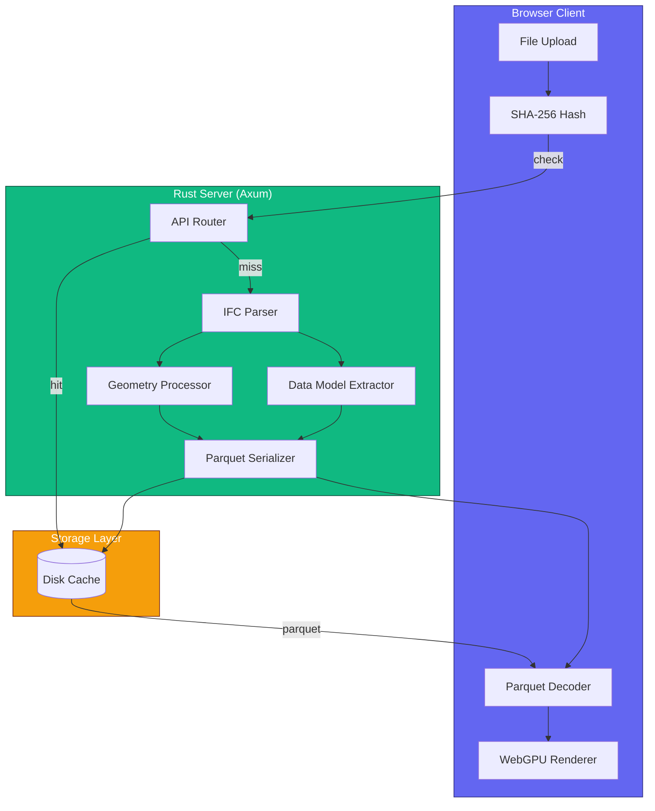
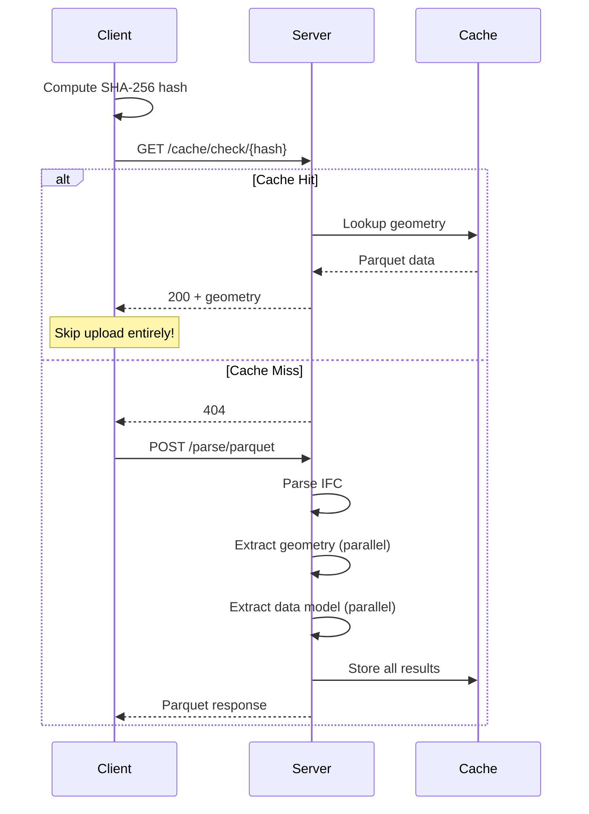
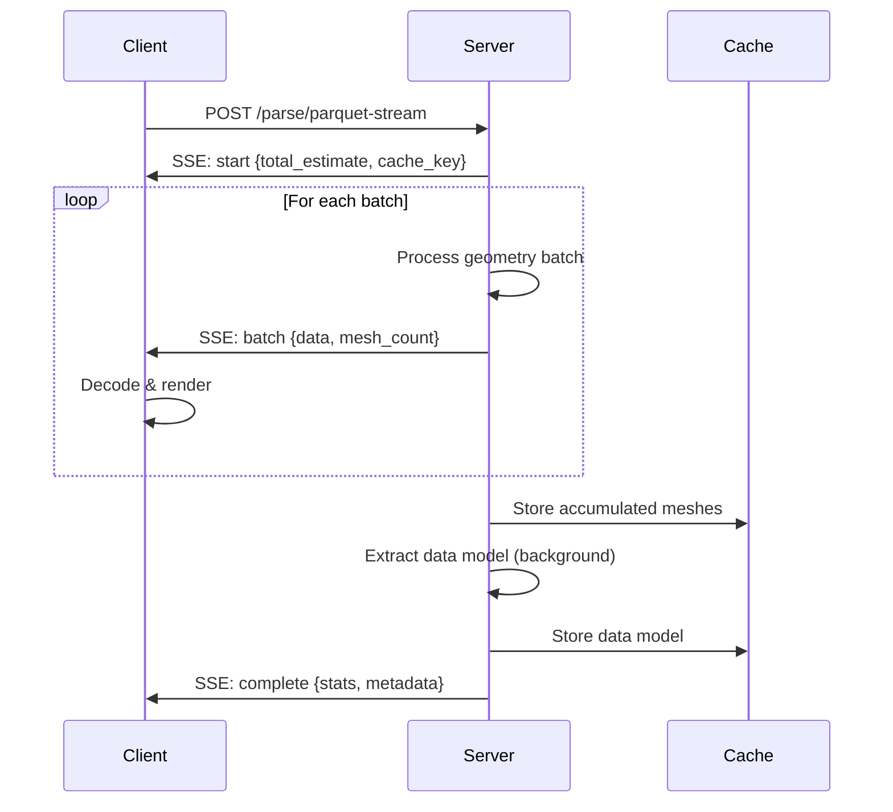

# Server Guide

This guide covers the IFClite server architecture for production deployments with intelligent caching, parallel processing, and streaming.

## Overview

The IFClite server processes IFC files on a high-performance Rust backend, providing:

- **Content-Addressable Caching** - Same file = instant response (skip upload entirely)
- **Parallel Processing** - Multi-core geometry extraction with Rayon
- **Parquet Format** - 15-50x smaller payloads than JSON
- **SSE Streaming** - Progressive geometry for immediate rendering
- **Full Data Model** - Properties, quantities, and spatial hierarchy computed upfront

## When to Use Server vs Client

| Scenario | Recommendation |
|----------|----------------|
| Single file, one-time view | Client-only (`@ifc-lite/parser`) |
| Team sharing same files | Server with caching |
| Large models (100+ MB) | Server with streaming |
| Repeat access to same files | Server with caching |
| Offline/embedded apps | Client-only |
| Privacy-sensitive data | Client-only |

## Architecture



## Quick Start

### 1. Start the Server

<!-- markdownlint-disable MD046 -->
=== "Docker (Recommended)"

    ```bash
    docker run -p 3001:8080 \
      -v ifc-cache:/app/.cache \
      ghcr.io/louistrue/ifc-lite-server
    ```

=== "Native Binary"

    ```bash
    npx @ifc-lite/server-bin
    ```

=== "From Source"

    ```bash
    cd apps/server
    cargo run --release
    ```
<!-- markdownlint-enable MD046 -->

### 2. Connect from Client

```typescript
import { IfcServerClient } from '@ifc-lite/server-client';

const client = new IfcServerClient({
  baseUrl: 'http://localhost:3001'
});

// Health check
const health = await client.health();
console.log('Server status:', health.status);
```

### 3. Parse a File

```typescript
// Parquet format (15x smaller than JSON)
const result = await client.parseParquet(file);

console.log(`Meshes: ${result.meshes.length}`);
console.log(`Cache key: ${result.cache_key}`);
console.log(`From cache: ${result.stats.from_cache}`);
```

## API Endpoints

### Parse Endpoints

| Endpoint | Method | Description |
|----------|--------|-------------|
| `/api/v1/parse` | POST | Full parse, JSON response |
| `/api/v1/parse/parquet` | POST | Full parse, Parquet response (15x smaller) |
| `/api/v1/parse/parquet/optimized` | POST | Optimized Parquet (50x smaller) |
| `/api/v1/parse/stream` | POST | Streaming JSON (SSE) |
| `/api/v1/parse/parquet-stream` | POST | Streaming Parquet (SSE) |
| `/api/v1/parse/metadata` | POST | Quick metadata only (no geometry) |

### Cache Endpoints

| Endpoint | Method | Description |
|----------|--------|-------------|
| `/api/v1/cache/check/{hash}` | GET | Check if file is cached (200 or 404) |
| `/api/v1/cache/geometry/{hash}` | GET | Fetch cached geometry (no upload) |
| `/api/v1/cache/{key}` | GET | Retrieve cached JSON result |
| `/api/v1/parse/data-model/{key}` | GET | Fetch cached data model |

### Utility Endpoints

| Endpoint | Method | Description |
|----------|--------|-------------|
| `/` | GET | API information |
| `/api/v1/health` | GET | Health check |

## Client SDK

### IfcServerClient

```typescript
import { IfcServerClient } from '@ifc-lite/server-client';

const client = new IfcServerClient({
  baseUrl: 'http://localhost:3001',
  timeout: 300000  // 5 minutes (default)
});
```

### Parse Methods

#### parseParquet (Recommended)

Best for most use cases - 15x smaller payloads than JSON.

```typescript
const result = await client.parseParquet(file);

// Result contains:
// - cache_key: string
// - meshes: MeshData[]
// - metadata: ModelMetadata
// - stats: ProcessingStats
// - parquet_stats: { payload_size, decode_time_ms }
// - data_model?: ArrayBuffer (properties, quantities, hierarchy)
```

#### parseParquetOptimized

50x smaller payloads using integer quantization (0.1mm precision).

```typescript
const result = await client.parseParquetOptimized(file);

// Same as parseParquet but with:
// - Integer vertex quantization (0.1mm precision)
// - Byte colors (0-255 instead of 0-1)
// - Mesh deduplication (instancing)
```

#### parseParquetStream

Progressive rendering for large files (>50MB).

```typescript
const streamResult = await client.parseParquetStream(file, (batch) => {
  // Called for each geometry batch
  renderer.addMeshes(batch.meshes);
});

// Or use async iterator
for await (const event of client.parseStream(file)) {
  switch (event.type) {
    case 'start':
      console.log(`Processing ~${event.total_estimate} entities`);
      break;
    case 'batch':
      renderer.addMeshes(event.meshes);
      break;
    case 'progress':
      console.log(`${event.processed}/${event.total}`);
      break;
    case 'complete':
      console.log(`Done in ${event.stats.total_time_ms}ms`);
      break;
  }
}
```

#### getMetadata

Quick metadata extraction without geometry processing.

```typescript
const metadata = await client.getMetadata(file);

// Returns:
// - schema_version: 'IFC2X3' | 'IFC4' | 'IFC4X3'
// - entity_count: number
// - geometry_entity_count: number
// - coordinate_info: { origin_shift, is_geo_referenced }
```

### Cache Methods

#### Checking Cache Before Upload

The SDK automatically checks cache before uploading, but you can do it manually:

```typescript
// Compute file hash
const hash = await client.computeFileHash(file);

// Check if cached
const cached = await client.getCached(hash);
if (cached) {
  console.log('File already processed!');
  return cached;
}

// Upload if not cached
const result = await client.parseParquet(file);
```

#### Fetching Data Model

Properties and spatial hierarchy are computed in parallel and cached:

```typescript
const result = await client.parseParquet(file);

// Data model might still be processing
// Use polling to wait for it
const dataModel = await client.fetchDataModel(result.cache_key);

if (dataModel) {
  const decoded = await decodeDataModel(dataModel);
  console.log(`Entities: ${decoded.entities.size}`);
  console.log(`Property sets: ${decoded.propertySets.size}`);
}
```

### Utility Methods

```typescript
// Health check
const health = await client.health();

// Compress file before upload (optional, saves bandwidth)
const compressed = await client.compressGzip(file);

// Check Parquet decoder availability
const available = await client.isParquetSupported();
```

## Data Model

The server computes a complete data model including:

### Entities

```typescript
interface EntityMetadata {
  entity_id: number;
  type_name: string;
  global_id?: string;
  name?: string;
  description?: string;
  object_type?: string;
  has_geometry: boolean;
}
```

### Properties

```typescript
interface PropertySet {
  pset_id: number;
  pset_name: string;
  properties: Property[];
}

interface Property {
  property_name: string;
  property_value: string;
  property_type: string;
}
```

### Quantities

```typescript
interface QuantitySet {
  qset_id: number;
  qset_name: string;
  method_of_measurement?: string;
  quantities: Quantity[];
}

interface Quantity {
  quantity_name: string;
  quantity_value: number;
  quantity_type: string;  // 'Area', 'Volume', 'Length', etc.
}
```

### Spatial Hierarchy

```typescript
interface SpatialHierarchy {
  nodes: SpatialNode[];
  project_id: number;
  element_to_storey: Map<number, number>;
  element_to_building: Map<number, number>;
  element_to_site: Map<number, number>;
  element_to_space: Map<number, number>;
}

interface SpatialNode {
  id: number;
  name: string;
  type: string;
  children: SpatialNode[];
  elevation?: number;
}
```

## Parquet Format

The server uses Apache Parquet for efficient binary serialization.

### Standard Format (15x Smaller)

```text
[mesh_table][vertex_table][index_table]
```

- **Mesh Table**: express_id, ifc_type, vertex/index offsets, RGBA color
- **Vertex Table**: x, y, z (Float32), nx, ny, nz (Float32)
- **Index Table**: i0, i1, i2 (Uint32 triangle indices)

### Optimized Format (50x Smaller)

```text
[instance_table][mesh_table][material_table][vertex_table][index_table]
```

- **Instance Table**: entity_id, ifc_type, mesh_index, material_index
- **Mesh Table**: Deduplicated unique geometries
- **Material Table**: Deduplicated RGBA colors (Uint8)
- **Vertex Table**: Quantized integers (0.1mm precision)
- **Index Table**: Triangle indices

### Decoding on Client

```typescript
import {
  decodeParquetGeometry,
  decodeOptimizedParquetGeometry,
  decodeDataModel
} from '@ifc-lite/server-client';

// Standard Parquet
const meshes = await decodeParquetGeometry(parquetBuffer);

// Optimized Parquet (with vertex dequantization)
const meshes = await decodeOptimizedParquetGeometry(parquetBuffer, 10000);

// Data model
const dataModel = await decodeDataModel(dataModelBuffer);
```

## Caching Strategy

### Content-Addressable Keys

Cache keys are derived from file content:

```
{SHA256}-parquet-v2         # Geometry
{SHA256}-parquet-metadata-v2  # Metadata header
{SHA256}-datamodel-v2        # Properties & hierarchy
```

### Cache Flow



### Cache Benefits

| Scenario | Without Cache | With Cache |
|----------|--------------|------------|
| 50 MB file, first load | ~800ms | ~800ms |
| 50 MB file, repeat load | ~800ms | **~50ms** |
| 169 MB file, first load | ~7s | ~7s |
| 169 MB file, repeat load | ~7s | **~100ms** |
| Skip upload | No | **Yes** |

## Server Configuration

### Environment Variables

| Variable | Default | Description |
|----------|---------|-------------|
| `PORT` | 8080 | Server port |
| `RUST_LOG` | info | Log level (error, warn, info, debug, trace) |
| `MAX_FILE_SIZE_MB` | 500 | Maximum upload size in MB |
| `WORKER_THREADS` | CPU cores | Parallel processing threads |
| `CACHE_DIR` | ./.cache | Cache directory path |
| `REQUEST_TIMEOUT_SECS` | 300 | Request timeout in seconds |
| `INITIAL_BATCH_SIZE` | 100 | Streaming initial batch size |
| `MAX_BATCH_SIZE` | 1000 | Streaming maximum batch size |
| `CACHE_MAX_AGE_DAYS` | 7 | Cache retention in days |

### Docker Compose

```yaml
version: '3.8'

services:
  ifc-lite-server:
    image: ghcr.io/louistrue/ifc-lite-server:latest
    ports:
      - "3001:8080"
    environment:
      - RUST_LOG=info
      - MAX_FILE_SIZE_MB=500
      - WORKER_THREADS=8
      - CACHE_MAX_AGE_DAYS=30
    volumes:
      - ifc-cache:/app/.cache

volumes:
  ifc-cache:
```

!!! tip "Adding Health Checks"
    For orchestration systems requiring health checks, the server exposes
    `GET /api/v1/health`. If your runtime image includes `curl` or `wget`:

    ```yaml
    healthcheck:
      test: ["CMD-SHELL", "curl -f http://localhost:8080/api/v1/health || exit 1"]
      interval: 30s
      timeout: 10s
      retries: 3
    ```

### Production Deployment

For production, consider:

1. **Reverse Proxy** - Use nginx or Traefik for SSL termination
2. **Persistent Cache** - Mount a volume for the cache directory
3. **Resource Limits** - Set memory/CPU limits based on expected file sizes
4. **Monitoring** - Enable debug logging for troubleshooting

```bash
# Railway deployment
railway up

# Fly.io deployment
fly deploy

# Kubernetes
kubectl apply -f k8s/deployment.yaml
```

## Streaming

### Dynamic Batch Sizing

The server uses dynamic batch sizing for optimal streaming:

- **Initial batch**: 100 entities (fast first frame)
- **Growth**: Increases based on processing speed
- **Maximum**: 1000 entities per batch

### Streaming Flow



### Client-Side Streaming

```typescript
// Using callback
await client.parseParquetStream(file, async (batch) => {
  const meshes = await decodeParquetGeometry(batch.data);
  renderer.addMeshes(meshes);
});

// Using async iterator
for await (const event of client.parseStream(file)) {
  if (event.type === 'batch') {
    renderer.addMeshes(event.meshes);
  }
}
```

## Performance Optimization

### Server-Side

1. **Parallel Processing** - Geometry and data model extracted concurrently
2. **Rayon Thread Pool** - Utilizes all CPU cores
3. **Streaming Caching** - Meshes accumulated during stream, cached at end
4. **Lazy Data Model** - Client polls for data model while rendering geometry

### Client-Side

1. **Hash Check First** - Skip upload if file is cached
2. **Parquet Decoding** - WASM-based decoder for fast parsing
3. **Progressive Rendering** - Render batches as they arrive
4. **Background Polling** - Fetch data model while geometry renders

### Network

1. **Gzip Compression** - Optional client-side compression before upload
2. **Parquet Format** - 15-50x smaller than JSON
3. **SSE Streaming** - No polling overhead

## Error Handling

### Server Errors

```typescript
try {
  const result = await client.parseParquet(file);
} catch (error) {
  if (error.status === 413) {
    console.error('File too large - increase MAX_FILE_SIZE_MB');
  } else if (error.status === 408) {
    console.error('Timeout - try streaming for large files');
  } else if (error.status === 500) {
    console.error('Server error:', error.message);
  }
}
```

### Streaming Errors

```typescript
for await (const event of client.parseStream(file)) {
  if (event.type === 'error') {
    console.error('Stream error:', event.message);
    break;
  }
}
```

### Connection Errors

```typescript
try {
  await client.health();
} catch (error) {
  if (error.message.includes('ECONNREFUSED')) {
    console.error('Server not running');
  } else if (error.message.includes('timeout')) {
    console.error('Server not responding');
  }
}
```

## Next Steps

- [Parsing Guide](parsing.md) - Client-side parsing details
- [Rendering Guide](rendering.md) - WebGPU rendering features
- [API Reference](../api/typescript.md) - Complete API documentation
- [Architecture](../architecture/overview.md) - System design details
