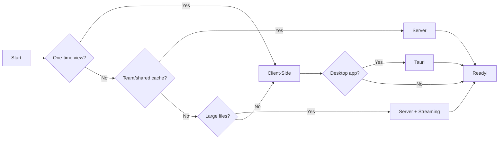

# IFClite Documentation

<div class="grid cards" markdown>

-   :material-rocket-launch:{ .lg .middle } __Get Started Quickly__

    ---

    Create a new project with `create-ifc-lite` or parse your first IFC file in under 5 minutes.

    [:octicons-arrow-right-24: Quick Start](guide/quickstart.md)

-   :material-server:{ .lg .middle } __Server or Client?__

    ---

    Choose between client-side WASM parsing or server-based processing with caching.

    [:octicons-arrow-right-24: Server Guide](guide/server.md)

-   :material-cog:{ .lg .middle } __Architecture__

    ---

    Understand the system design, data flow, and server/client paradigms.

    [:octicons-arrow-right-24: Architecture](architecture/overview.md)

-   :material-api:{ .lg .middle } __API Reference__

    ---

    Complete API documentation for all 12 TypeScript packages.

    [:octicons-arrow-right-24: API Reference](api/typescript.md)

</div>

## What is IFClite?

**IFClite** is a high-performance IFC (Industry Foundation Classes) platform that runs in browsers, on servers, and as native desktop applications.

- **Two Paradigms** - Client-side WASM or server-based processing with caching
- **Full IFC Support** - IFC4X3 (876 entities) + native IFC5 (IFCX) JSON format
- **Fast Rendering** - WebGPU with first triangles in 300-500ms
- **Tiny Bundle** - ~260 KB gzipped, 40% smaller than alternatives

## Choose Your Path



## System Overview

IFClite supports two processing paradigms:

=== "Client-Side (WASM)"

    Process IFC files entirely in the browser using WebAssembly. Best for offline use, privacy-sensitive data, and simple deployments.

    ```mermaid
    flowchart LR
        IFC[IFC File] --> WASM[WASM Parser]
        WASM --> Tables[Columnar Tables]
        WASM --> Geometry[Geometry Buffers]
        Tables --> Query[Query API]
        Geometry --> Renderer[WebGPU Renderer]
    ```

=== "Server-Side (Rust)"

    Process IFC files on a high-performance Rust server with parallel processing and intelligent caching. Best for team collaboration, large files, and production deployments.

    ```mermaid
    flowchart LR
        Upload[Upload IFC] --> Cache[(Cache)]
        Cache -->|hit| Viewer[Viewer]
        Upload -->|miss| Parse[Parse]
        Parse --> Cache
    ```

## Quick Examples

=== "Create New Project"

    ```bash
    # Create a new project (recommended)
    npx create-ifc-lite my-app
    cd my-app && npm install && npm run parse

    # Or create a React viewer
    npx create-ifc-lite my-viewer --template react
    cd my-viewer && npm install && npm run dev

    # Or create a server backend
    npx create-ifc-lite my-backend --template server
    cd my-backend && npm run server:start
    ```

=== "Client-Side Parsing"

    ```typescript
    import { IfcParser } from '@ifc-lite/parser';
    import { GeometryProcessor } from '@ifc-lite/geometry';
    import { Renderer } from '@ifc-lite/renderer';

    // Initialize renderer and geometry processor
    const renderer = new Renderer(canvas);
    await renderer.init();
    const geometry = new GeometryProcessor();
    await geometry.init();

    // Parse IFC file in browser
    const parser = new IfcParser();
    const store = await parser.parseColumnar(buffer, {
      onProgress: ({ phase, percent }) => console.log(`${phase}: ${percent}%`)
    });

    // Query entities
    const walls = store.entityIndex.byType.get('IFCWALL') ?? [];
    console.log(`Found ${walls.length} walls`);

    // Process and render geometry
    const geometryResult = await geometry.process(new Uint8Array(buffer));
    renderer.loadGeometry(geometryResult);
    renderer.fitToView();
    renderer.render();
    ```

=== "Server + Client"

    ```typescript
    import { IfcServerClient } from '@ifc-lite/server-client';

    // Connect to server
    const client = new IfcServerClient({ baseUrl: 'https://your-server.com' });

    // Parse with intelligent caching (skips upload if cached)
    const result = await client.parseParquet(file);

    // Or stream for large files
    for await (const event of client.parseStream(file)) {
      if (event.type === 'batch') {
        renderer.addMeshes(event.meshes);
      }
    }
    ```

=== "IFC5 (IFCX) Format"

    ```typescript
    import { parseAuto } from '@ifc-lite/parser';

    // Auto-detect IFC4 (STEP) or IFC5 (IFCX JSON)
    const result = await parseAuto(buffer);

    if (result.format === 'ifcx') {
      // IFC5 with ECS composition and USD geometry
      console.log('IFC5 file with', result.meshes.length, 'meshes');
    } else {
      // IFC4 STEP format
      console.log('IFC4 file with', result.store.entityCount, 'entities');
    }
    ```

## Packages

**TypeScript:** `@ifc-lite/parser` · `@ifc-lite/geometry` · `@ifc-lite/renderer` · `@ifc-lite/server-client` · `@ifc-lite/cache` · `@ifc-lite/query` · `@ifc-lite/export`

**Rust:** `ifc-lite-core` · `ifc-lite-geometry` · `ifc-lite-wasm` · `ifc-lite-server`

**CLI:** `npx create-ifc-lite` to scaffold a new project

## Browser Support

Chrome 113+ · Edge 113+ · Firefox 127+ · Safari 18+ (all with WebGPU)

## Next Steps

<div class="grid cards" markdown>

-   [:material-download: __Installation__](guide/installation.md)

    Multiple ways to install: npm, Cargo, Docker, or create-ifc-lite

-   [:material-play: __Quick Start__](guide/quickstart.md)

    Parse your first IFC file with client or server

-   [:material-server: __Server Guide__](guide/server.md)

    Set up server-based processing with caching

-   [:material-school: __Tutorials__](tutorials/building-viewer.md)

    Build a complete IFC viewer from scratch

-   [:material-file-document: __Parsing Guide__](guide/parsing.md)

    Deep dive into parsing modes and IFC5 support

-   [:material-github: __Source Code__](https://github.com/louistrue/ifc-lite)

    View on GitHub

</div>
