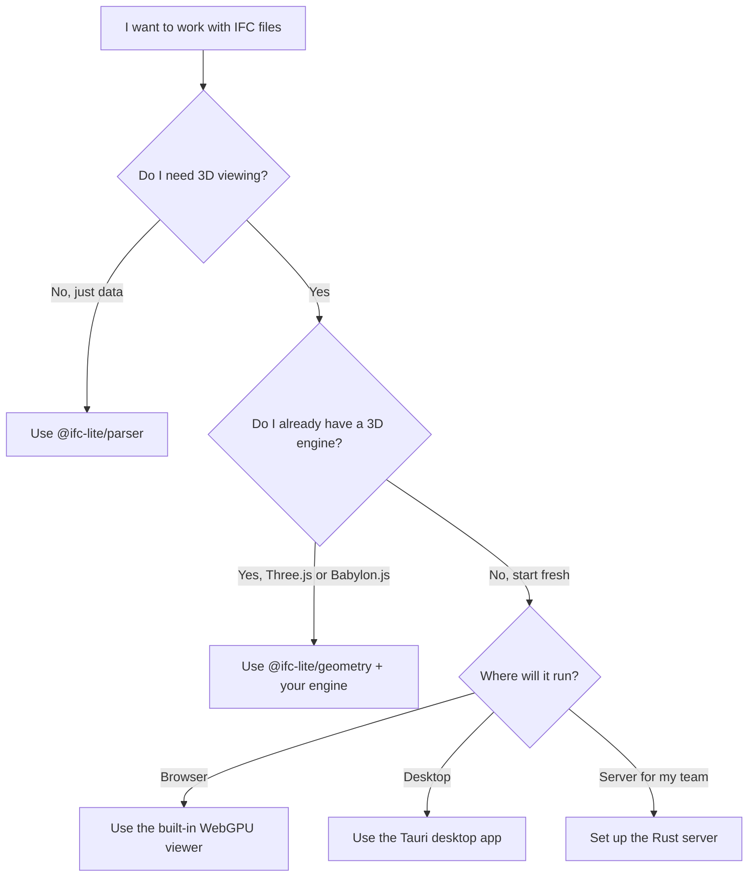

# IFClite Documentation

<div class="grid cards" markdown>

-   :material-rocket-launch:{ .lg .middle } __Get Started__

    ---

    Create a project with `create-ifc-lite` or parse your first IFC file in under 5 minutes.

    [:octicons-arrow-right-24: Quick Start](guide/quickstart.md)

-   :material-cube-outline:{ .lg .middle } __Three.js & Babylon.js__

    ---

    Use IFClite with Three.js or Babylon.js. WebGL, no WebGPU required.

    [:octicons-arrow-right-24: Three.js](tutorials/threejs-integration.md) · [:octicons-arrow-right-24: Babylon.js](tutorials/babylonjs-integration.md)

-   :material-server:{ .lg .middle } __Server Setup__

    ---

    Rust server with caching and parallel processing for teams and large files.

    [:octicons-arrow-right-24: Server Guide](guide/server.md)

-   :material-monitor:{ .lg .middle } __Desktop App__

    ---

    Native Tauri app for offline use, large files, and multi-threaded performance.

    [:octicons-arrow-right-24: Desktop Guide](guide/desktop.md)

</div>

## What is IFClite?

**IFClite** is an open-source toolkit for working with IFC (Industry Foundation Classes) files. It runs in the browser, on a server, or as a native desktop app.

**What you can do with it:**

- **View 3D models** in the browser with a WebGPU renderer
- **Use your own 3D engine** - parse IFC geometry and render it with Three.js, Babylon.js, or any WebGL engine
- **Extract data** like properties, quantities, relationships, and spatial structure
- **Validate models** against IDS (Information Delivery Specification) rules
- **Generate 2D drawings** like floor plans, sections, and elevations from 3D models
- **Collaborate** with BCF support for issues, viewpoints, and comments
- **Export** to glTF, IFC, or Parquet
- **Work with multiple models** at once with federated selection and visibility

Supports **IFC4 / IFC4X3** (876 entities) and **IFC5 (IFCX)** JSON format. ~260 KB gzipped.

## Choose Your Setup

Not sure how to use IFClite? This diagram helps you pick:



| Setup | Best for | Getting started |
|-------|----------|-----------------|
| **Browser (WebGPU)** | Viewing and inspecting models, client-side only | [Quick Start](guide/quickstart.md) |
| **Three.js** | Adding IFC to an existing Three.js app (WebGL) | [Three.js Tutorial](tutorials/threejs-integration.md) |
| **Babylon.js** | Adding IFC to an existing Babylon.js app (WebGL) | [Babylon.js Tutorial](tutorials/babylonjs-integration.md) |
| **Server** | Teams, large files (100 MB+), caching for repeat access | [Server Guide](guide/server.md) |
| **Desktop (Tauri)** | Offline use, very large files (500 MB+), multi-threading | [Desktop Guide](guide/desktop.md) |

## Quick Examples

=== "Parse an IFC file"

    ```bash
    npx create-ifc-lite my-app
    cd my-app && npm install && npm run parse
    ```

    Or in your own code:

    ```typescript
    import { IfcParser } from '@ifc-lite/parser';

    const parser = new IfcParser();
    const result = await parser.parse(buffer);
    console.log(`Found ${result.entityCount} entities`);
    ```

=== "3D viewer (WebGPU)"

    ```bash
    npx create-ifc-lite my-viewer --template react
    cd my-viewer && npm install && npm run dev
    ```

    Or set it up manually:

    ```typescript
    import { IfcParser } from '@ifc-lite/parser';
    import { GeometryProcessor } from '@ifc-lite/geometry';
    import { Renderer } from '@ifc-lite/renderer';

    const renderer = new Renderer(canvas);
    await renderer.init();
    const geometry = new GeometryProcessor();
    await geometry.init();

    const parser = new IfcParser();
    const store = await parser.parseColumnar(buffer);
    const geometryResult = await geometry.process(new Uint8Array(buffer));

    renderer.loadGeometry(geometryResult);
    renderer.fitToView();
    renderer.render();
    ```

=== "Three.js / Babylon.js"

    ```bash
    npx create-ifc-lite my-viewer --template threejs     # Three.js
    npx create-ifc-lite my-viewer --template babylonjs    # Babylon.js
    ```

    These templates include a working viewer. See the full tutorials:

    - [Three.js Integration](tutorials/threejs-integration.md)
    - [Babylon.js Integration](tutorials/babylonjs-integration.md)

=== "Server backend"

    ```bash
    npx create-ifc-lite my-backend --template server
    cd my-backend && npm run server:start
    ```

    ```typescript
    import { IfcServerClient } from '@ifc-lite/server-client';

    const client = new IfcServerClient({ baseUrl: 'https://your-server.com' });

    // Caches automatically, skips upload if the file was processed before
    const result = await client.parseParquet(file);

    // Or stream geometry for large files
    for await (const event of client.parseStream(file)) {
      if (event.type === 'batch') {
        renderer.addMeshes(event.meshes);
      }
    }
    ```

## What Do I Install?

You don't need all packages. Here's what to grab for common tasks:

| I want to... | Packages |
|--------------|----------|
| Parse an IFC file | `@ifc-lite/parser` |
| View a 3D model (WebGPU) | + `@ifc-lite/geometry` + `@ifc-lite/renderer` |
| Use Three.js or Babylon.js | + `@ifc-lite/geometry` (you handle the rendering) |
| Query properties and types | + `@ifc-lite/query` |
| Validate against IDS rules | + `@ifc-lite/ids` |
| Generate 2D drawings | + `@ifc-lite/drawing-2d` |
| Export to glTF / IFC / Parquet | + `@ifc-lite/export` |
| Connect to a server backend | + `@ifc-lite/server-client` |

> Full list: [TypeScript API Reference](api/typescript.md) (25 packages) · [Rust API Reference](api/rust.md) (4 crates)

## Browser Support

Chrome 113+ · Edge 113+ · Firefox 127+ · Safari 18+ (all with WebGPU)

Three.js and Babylon.js integrations work with WebGL and don't require WebGPU. See [Browser Requirements](guide/browser-requirements.md) for details.

## Next Steps

<div class="grid cards" markdown>

-   [:material-download: __Installation__](guide/installation.md)

    npm, Cargo, Docker, or create-ifc-lite

-   [:material-play: __Quick Start__](guide/quickstart.md)

    Parse your first IFC file

-   [:material-cube-outline: __Three.js Tutorial__](tutorials/threejs-integration.md)

    Build an IFC viewer with Three.js

-   [:material-server: __Server Guide__](guide/server.md)

    Set up server-based processing

-   [:material-monitor: __Desktop App__](guide/desktop.md)

    Native app for large files

-   [:material-school: __Build a Viewer__](tutorials/building-viewer.md)

    Step-by-step viewer tutorial

-   [:material-layers-triple: __Federation__](guide/federation.md)

    Load multiple models at once

-   [:material-cog: __Architecture__](architecture/overview.md)

    How IFClite works under the hood

</div>
