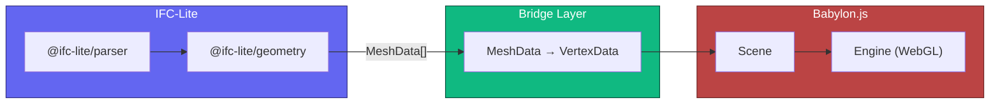

# Babylon.js Integration

Use `@ifc-lite/geometry` with Babylon.js instead of the built-in WebGPU renderer.

## Why Babylon.js?

The built-in `@ifc-lite/renderer` uses WebGPU for maximum performance, but you may want Babylon.js when:

- **WebGPU is unavailable** — Babylon.js Engine works with WebGL (wider browser support)
- **Existing Babylon.js ecosystem** — integrate with your existing 3D scene, GUI, physics, XR
- **Built-in camera controls** — `ArcRotateCamera` handles orbit/pan/zoom with no extras
- **PBR & post-processing** — Babylon.js ships with a full PBR pipeline, SSAO, bloom, and more

!!! tip "Three.js or Babylon.js?"
    Both engines receive the same `MeshData` typed arrays from `@ifc-lite/geometry` — the bridge code is the only difference. Choose whichever engine your team already uses. See also the [Three.js Integration](threejs-integration.md) tutorial.

## Architecture



The key insight: `@ifc-lite/geometry` outputs plain typed arrays that are **engine-agnostic**:

```typescript
interface MeshData {
  expressId: number;
  ifcType?: string;             // "IfcWall", "IfcDoor", etc.
  positions: Float32Array;      // [x,y,z, x,y,z, ...]
  normals: Float32Array;        // [nx,ny,nz, ...]
  indices: Uint32Array;         // Triangle indices
  color: [number, number, number, number]; // RGBA (0-1)
}
```

You only need `@ifc-lite/geometry` (and its dependency `@ifc-lite/wasm`) — skip `@ifc-lite/renderer` entirely.

## Quick Start

### Scaffold a project

```bash
npx create-ifc-lite my-viewer --template babylonjs
cd my-viewer
npm install
npm run dev
```

### Or install manually

```bash
npm install @ifc-lite/geometry @babylonjs/core
```

### Convert MeshData to Babylon.js

```typescript
import {
  Mesh, VertexData, StandardMaterial, Color3,
} from '@babylonjs/core';
import type { Scene } from '@babylonjs/core';
import type { MeshData } from '@ifc-lite/geometry';

function meshDataToBabylon(meshData: MeshData, scene: Scene): Mesh {
  const mesh = new Mesh('entity-' + meshData.expressId, scene);

  const vertexData = new VertexData();
  vertexData.positions = meshData.positions;
  vertexData.normals = meshData.normals;
  vertexData.indices = meshData.indices;
  vertexData.applyToMesh(mesh);

  const [r, g, b, a] = meshData.color;
  const material = new StandardMaterial('mat-' + meshData.expressId, scene);
  material.diffuseColor = new Color3(r, g, b);
  material.specularColor = new Color3(0.15, 0.15, 0.15);
  if (a < 1) {
    material.alpha = a;
    material.backFaceCulling = false;
  }

  mesh.material = material;
  mesh.metadata = { expressId: meshData.expressId };
  return mesh;
}
```

### Load and Display

```typescript
import { GeometryProcessor } from '@ifc-lite/geometry';

const processor = new GeometryProcessor();
await processor.init();

const buffer = new Uint8Array(await file.arrayBuffer());
const result = await processor.process(buffer);

for (const mesh of result.meshes) {
  meshDataToBabylon(mesh, scene);
}
```

## Streaming (Progressive Display)

For large files, use streaming to show geometry as it loads:

```typescript
for await (const event of processor.processStreaming(buffer)) {
  switch (event.type) {
    case 'batch':
      for (const mesh of event.meshes) {
        meshDataToBabylon(mesh, scene);
      }
      break;

    case 'complete':
      console.log(`Loaded ${event.totalMeshes} meshes`);
      break;
  }
}
```

## Batching for Performance

Individual meshes per entity give you picking granularity but many draw calls. For large models, merge geometry with vertex colors:

```typescript
function batchWithVertexColors(
  meshes: MeshData[],
  scene: Scene,
): Mesh {
  // Calculate totals
  let totalVertices = 0, totalIndices = 0;
  for (const m of meshes) {
    totalVertices += m.positions.length / 3;
    totalIndices += m.indices.length;
  }

  const positions = new Float32Array(totalVertices * 3);
  const normals = new Float32Array(totalVertices * 3);
  const colors = new Float32Array(totalVertices * 4); // RGBA per vertex
  const indices = new Uint32Array(totalIndices);

  let vOffset = 0, iOffset = 0;
  for (const m of meshes) {
    const vertCount = m.positions.length / 3;
    positions.set(m.positions, vOffset * 3);
    normals.set(m.normals, vOffset * 3);

    // Write vertex colors
    const [r, g, b] = m.color;
    for (let v = 0; v < vertCount; v++) {
      const base = (vOffset + v) * 4;
      colors[base] = r;
      colors[base + 1] = g;
      colors[base + 2] = b;
      colors[base + 3] = 1;
    }

    // Offset indices
    for (let i = 0; i < m.indices.length; i++) {
      indices[iOffset + i] = m.indices[i] + vOffset;
    }

    vOffset += vertCount;
    iOffset += m.indices.length;
  }

  const mesh = new Mesh('batched', scene);
  const vertexData = new VertexData();
  vertexData.positions = positions;
  vertexData.normals = normals;
  vertexData.colors = colors;
  vertexData.indices = indices;
  vertexData.applyToMesh(mesh);

  // White diffuse so vertex colors show through
  const material = new StandardMaterial('batched-mat', scene);
  material.diffuseColor = new Color3(1, 1, 1);
  material.specularColor = new Color3(0.15, 0.15, 0.15);
  mesh.material = material;

  return mesh;
}
```

## Scene Setup

### Engine and Scene

```typescript
import {
  Engine, Scene, ArcRotateCamera,
  HemisphericLight, DirectionalLight,
  Vector3, Color4,
} from '@babylonjs/core';

const canvas = document.getElementById('viewer') as HTMLCanvasElement;

const engine = new Engine(canvas, true);
const scene = new Scene(engine);
scene.clearColor = new Color4(0.1, 0.1, 0.18, 1);

// ArcRotateCamera handles orbit/pan/zoom with no extra library
const camera = new ArcRotateCamera(
  'camera',
  -Math.PI / 4,   // horizontal angle
  Math.PI / 3,    // vertical angle (~60 deg)
  50,             // distance from target
  Vector3.Zero(), // target
  scene,
);
camera.attachControl(canvas, true);
camera.minZ = 0.1;
camera.maxZ = 10000;

// Lighting
const hemiLight = new HemisphericLight('hemi', new Vector3(0, 1, 0), scene);
hemiLight.intensity = 0.6;

const dirLight = new DirectionalLight(
  'dir', new Vector3(-1, -2, -1).normalize(), scene,
);
dirLight.intensity = 0.8;
dirLight.position = new Vector3(50, 80, 50);

// Resize
window.addEventListener('resize', () => engine.resize());

// Render loop
engine.runRenderLoop(() => scene.render());
```

### Fit Camera to Model

```typescript
function fitCameraToScene(camera: ArcRotateCamera, scene: Scene) {
  let minX = Infinity, minY = Infinity, minZ = Infinity;
  let maxX = -Infinity, maxY = -Infinity, maxZ = -Infinity;

  for (const mesh of scene.meshes) {
    mesh.computeWorldMatrix(true);
    const bounds = mesh.getBoundingInfo().boundingBox;
    const bMin = bounds.minimumWorld;
    const bMax = bounds.maximumWorld;
    if (bMin.x < minX) minX = bMin.x;
    if (bMin.y < minY) minY = bMin.y;
    if (bMin.z < minZ) minZ = bMin.z;
    if (bMax.x > maxX) maxX = bMax.x;
    if (bMax.y > maxY) maxY = bMax.y;
    if (bMax.z > maxZ) maxZ = bMax.z;
  }

  const center = new Vector3(
    (minX + maxX) / 2, (minY + maxY) / 2, (minZ + maxZ) / 2,
  );
  const maxDim = Math.max(maxX - minX, maxY - minY, maxZ - minZ);

  camera.target = center;
  camera.radius = maxDim * 1.5;
  camera.minZ = maxDim * 0.001;
  camera.maxZ = maxDim * 100;
}
```

## Entity Picking

### Click to Select

Babylon.js provides built-in `scene.pick()` — no separate raycaster needed:

```typescript
canvas.addEventListener('click', (event) => {
  const rect = canvas.getBoundingClientRect();
  const x = event.clientX - rect.left;
  const y = event.clientY - rect.top;

  const pickResult = scene.pick(x, y);

  if (pickResult.hit && pickResult.pickedMesh) {
    const expressId = pickResult.pickedMesh.metadata?.expressId;
    console.log('Selected entity:', expressId);
  }
});
```

### Highlight on Hover

```typescript
let hoveredMesh: Mesh | null = null;
const highlightColor = new Color3(0.31, 0.27, 0.90); // #4f46e5

canvas.addEventListener('pointermove', (event) => {
  // Reset previous
  if (hoveredMesh?.material) {
    const mat = hoveredMesh.material as StandardMaterial;
    mat.emissiveColor = Color3.Black();
  }

  const rect = canvas.getBoundingClientRect();
  const pickResult = scene.pick(
    event.clientX - rect.left,
    event.clientY - rect.top,
  );

  if (pickResult.hit && pickResult.pickedMesh) {
    hoveredMesh = pickResult.pickedMesh as Mesh;
    const mat = hoveredMesh.material as StandardMaterial;
    mat.emissiveColor = highlightColor;
  } else {
    hoveredMesh = null;
  }
});
```

### Picking with Batched Meshes

When geometry is merged into a single mesh, use `faceId` and a triangle range map to identify the original entity:

```typescript
type TriangleRange = { expressId: number; start: number; count: number };

function findEntityByFace(
  ranges: TriangleRange[],
  faceId: number,
): number | null {
  // Binary search — ranges are sorted by start
  let lo = 0, hi = ranges.length - 1;
  while (lo <= hi) {
    const mid = (lo + hi) >>> 1;
    const r = ranges[mid];
    if (faceId < r.start) { hi = mid - 1; }
    else if (faceId >= r.start + r.count) { lo = mid + 1; }
    else { return r.expressId; }
  }
  return null;
}

// Usage with scene.pick()
const pickResult = scene.pick(x, y);
if (pickResult.hit && pickResult.faceId >= 0) {
  const ranges = triangleMaps.get(pickResult.pickedMesh as Mesh);
  if (ranges) {
    const expressId = findEntityByFace(ranges, pickResult.faceId);
    console.log('Selected entity:', expressId);
  }
}
```

## Coordinate Handling

IFC files may use large georeferenced coordinates. The geometry processor handles this automatically:

```typescript
const result = await processor.process(buffer);

if (result.coordinateInfo.hasLargeCoordinates) {
  const shift = result.coordinateInfo.originShift;
  console.log(`Coordinates shifted by (${shift.x}, ${shift.y}, ${shift.z})`);

  // If you need world coordinates for geolocation:
  function toWorld(local: Vector3): Vector3 {
    return new Vector3(
      local.x - shift.x,
      local.y - shift.y,
      local.z - shift.z,
    );
  }
}
```

## Performance Tips

| Strategy | When to use | Benefit |
|----------|------------|---------|
| **Individual meshes** | Small models, need picking | Simple, per-entity control |
| **Vertex-color batching** | Medium–large models | 1–2 draw calls for entire model |
| **`mesh.freezeWorldMatrix()`** | Static models | Skip per-frame matrix recalc |
| **`material.freeze()`** | Static materials | Skip per-frame shader dirty checks |
| **`scene.skipPointerMovePicking`** | Custom hover logic | Skip Babylon's built-in move picking |
| **Frustum culling** | Large scenes | Only render visible geometry |

### Babylon.js-specific optimisations

```typescript
// After loading is complete, freeze everything that won't move
for (const mesh of scene.meshes) {
  mesh.freezeWorldMatrix();
}
for (const mat of scene.materials) {
  mat.freeze();
}

// Disable Babylon's per-frame pointer-move picking when you handle hover yourself
scene.skipPointerMovePicking = true;

// Use preserveDrawingBuffer: false to avoid GPU→CPU readback each frame
const engine = new Engine(canvas, true, {
  preserveDrawingBuffer: false,
  stencil: false,
});
```

## Vite Configuration

The WASM module needs these headers for `SharedArrayBuffer`:

```typescript
// vite.config.ts
import { defineConfig } from 'vite';

export default defineConfig({
  optimizeDeps: {
    exclude: ['@ifc-lite/wasm'],
  },
  server: {
    headers: {
      'Cross-Origin-Opener-Policy': 'same-origin',
      'Cross-Origin-Embedder-Policy': 'require-corp',
    },
  },
});
```

## Full Example

See [`examples/babylonjs-viewer/`](https://github.com/louistrue/ifc-lite/tree/main/examples/babylonjs-viewer) for a complete, runnable example with streaming geometry, vertex-color batching, entity picking, property panel, and spatial tree navigation.

## Comparison: Three.js vs Babylon.js Bridge

Both engines receive the same `MeshData` typed arrays. Here's how the bridge code differs:

| Concept | Three.js | Babylon.js |
|---------|----------|------------|
| Geometry container | `BufferGeometry` + `BufferAttribute` | `VertexData` + `applyToMesh()` |
| Material | `MeshStandardMaterial` | `StandardMaterial` |
| Vertex colors | `setAttribute('color', ...)` + `vertexColors: true` | `vertexData.colors` (used automatically) |
| Grouping | `THREE.Group` | `TransformNode` |
| Camera + orbit | `PerspectiveCamera` + `OrbitControls` addon | `ArcRotateCamera` (built-in) |
| Picking | `Raycaster` + `intersectObjects()` | `scene.pick(x, y)` |
| Render loop | `requestAnimationFrame` + `renderer.render()` | `engine.runRenderLoop()` |

## Next Steps

- [Three.js Integration](threejs-integration.md) — Same workflow with Three.js / R3F
- [Building a Viewer](building-viewer.md) — Full viewer with WebGPU
- [Geometry Processing](../guide/geometry.md) — Geometry API details
- [API Reference](../api/typescript.md) — Complete API docs
