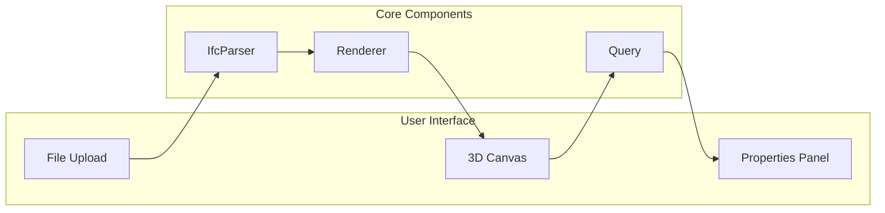

# Building a Viewer

Step-by-step tutorial for building a complete IFC viewer.

## Overview

In this tutorial, you'll build a fully functional IFC viewer with:

- File loading
- 3D rendering
- Navigation controls
- Entity selection
- Property display



## Project Setup

### 1. Create Project

```bash
# Create new project
mkdir my-ifc-viewer
cd my-ifc-viewer

# Initialize with Vite + TypeScript
npm create vite@latest . -- --template vanilla-ts

# Install dependencies
npm install @ifc-lite/parser @ifc-lite/renderer @ifc-lite/query
```

### 2. Project Structure

```
my-ifc-viewer/
├── src/
│   ├── main.ts           # Entry point
│   ├── viewer.ts         # Viewer class
│   ├── ui.ts             # UI components
│   └── style.css         # Styles
├── public/
│   └── ifc_lite_wasm.wasm
├── index.html
└── package.json
```

### 3. HTML Setup

```html
<!DOCTYPE html>
<html lang="en">
<head>
  <meta charset="UTF-8">
  <meta name="viewport" content="width=device-width, initial-scale=1.0">
  <title>IFC Viewer</title>
  <link rel="stylesheet" href="/src/style.css">
</head>
<body>
  <div id="app">
    <header>
      <input type="file" id="file-input" accept=".ifc">
      <span id="status">Ready</span>
    </header>
    <main>
      <canvas id="viewer"></canvas>
      <aside id="properties"></aside>
    </main>
  </div>
  <script type="module" src="/src/main.ts"></script>
</body>
</html>
```

### 4. Base Styles

```css
/* src/style.css */
* {
  box-sizing: border-box;
  margin: 0;
  padding: 0;
}

body {
  font-family: system-ui, sans-serif;
  background: #1a1a1a;
  color: #fff;
}

#app {
  display: flex;
  flex-direction: column;
  height: 100vh;
}

header {
  padding: 1rem;
  background: #2a2a2a;
  display: flex;
  gap: 1rem;
  align-items: center;
}

main {
  flex: 1;
  display: flex;
  overflow: hidden;
}

#viewer {
  flex: 1;
}

#properties {
  width: 300px;
  background: #2a2a2a;
  padding: 1rem;
  overflow-y: auto;
}
```

## Building the Viewer

### Step 1: Viewer Class

Create the main viewer class:

```typescript
// src/viewer.ts
import { IfcParser, type IfcDataStore, extractPropertiesOnDemand } from '@ifc-lite/parser';
import { GeometryProcessor, type GeometryResult } from '@ifc-lite/geometry';
import { Renderer } from '@ifc-lite/renderer';

export class IfcViewer {
  private parser: IfcParser;
  private geometry: GeometryProcessor;
  private renderer: Renderer;
  private dataStore: IfcDataStore | null = null;
  private buffer: Uint8Array | null = null;
  private animationId: number | null = null;

  constructor(private canvas: HTMLCanvasElement) {
    this.parser = new IfcParser();
    this.geometry = new GeometryProcessor();
    this.renderer = new Renderer(canvas);
  }

  async init(): Promise<void> {
    await this.renderer.init();
    await this.geometry.init();
    this.setupControls();
  }

  async loadFile(file: File): Promise<{ entityCount: number }> {
    const arrayBuffer = await file.arrayBuffer();
    this.buffer = new Uint8Array(arrayBuffer);

    // Parse data model (entities, properties, relationships)
    this.dataStore = await this.parser.parseColumnar(arrayBuffer, {
      onProgress: ({ phase, percent }) => {
        this.onProgress?.(`${phase}: ${percent}%`);
      }
    });

    // Process geometry
    const geometryResult = await this.geometry.process(this.buffer);

    // Load into renderer
    this.renderer.loadGeometry(geometryResult);
    this.renderer.fitToView();
    
    // Start render loop
    this.startRenderLoop();

    return { entityCount: this.dataStore.entityCount };
  }

  private startRenderLoop(): void {
    const animate = () => {
      this.renderer.render();
      this.animationId = requestAnimationFrame(animate);
    };
    animate();
  }

  private setupControls(): void {
    // Click to select
    this.canvas.addEventListener('click', async (e) => {
      const rect = this.canvas.getBoundingClientRect();
      const x = e.clientX - rect.left;
      const y = e.clientY - rect.top;

      const expressId = await this.renderer.pick(x, y);
      if (expressId !== null) {
        this.onSelect?.(expressId);
      } else {
        this.onSelect?.(null);
      }
    });
  }

  // Callbacks
  onProgress?: (message: string) => void;
  onSelect?: (expressId: number | null) => void;

  // Public methods
  getDataStore(): IfcDataStore | null {
    return this.dataStore;
  }

  getEntity(expressId: number): any | null {
    if (!this.dataStore) return null;
    return this.dataStore.entityIndex.byId.get(expressId) ?? null;
  }

  getProperties(expressId: number): Record<string, Record<string, any>> | null {
    if (!this.dataStore || !this.buffer) return null;
    return extractPropertiesOnDemand(this.dataStore, expressId, this.buffer);
  }

  getModelBounds(): { min: { x: number; y: number; z: number }; max: { x: number; y: number; z: number } } | null {
    // Get bounds from renderer's scene
    const scene = this.renderer.getScene();
    return scene.getBounds();
  }

  dispose(): void {
    if (this.animationId !== null) {
      cancelAnimationFrame(this.animationId);
    }
  }
}
```

### Step 2: UI Components

```typescript
// src/ui.ts
export function updateStatus(message: string): void {
  const status = document.getElementById('status');
  if (status) status.textContent = message;
}

export function updateProgress(percent: number): void {
  updateStatus(`Loading: ${percent.toFixed(0)}%`);
}

export function renderProperties(
  container: HTMLElement,
  expressId: number,
  entity: any,
  propertySets: Record<string, Record<string, any>>
): void {
  container.innerHTML = '';

  // Entity info
  const header = document.createElement('div');
  header.className = 'prop-section';
  header.innerHTML = `
    <h3>Entity #${expressId}</h3>
    <p><strong>Type:</strong> ${entity.type}</p>
    <p><strong>Name:</strong> ${entity.name || 'N/A'}</p>
    <p><strong>GlobalId:</strong> ${entity.globalId}</p>
  `;
  container.appendChild(header);

  // Property sets
  for (const [psetName, props] of Object.entries(propertySets)) {
    const section = document.createElement('div');
    section.className = 'prop-section';

    const title = document.createElement('h4');
    title.textContent = psetName;
    section.appendChild(title);

    const table = document.createElement('table');
    for (const [propName, value] of Object.entries(props)) {
      const row = document.createElement('tr');
      row.innerHTML = `
        <td>${propName}</td>
        <td>${formatValue(value)}</td>
      `;
      table.appendChild(row);
    }
    section.appendChild(table);
    container.appendChild(section);
  }
}

function formatValue(value: any): string {
  if (value === null || value === undefined) return 'N/A';
  if (typeof value === 'boolean') return value ? 'Yes' : 'No';
  if (typeof value === 'number') return value.toFixed(2);
  return String(value);
}
```

### Step 3: Main Entry Point

```typescript
// src/main.ts
import { IfcViewer } from './viewer';
import { updateStatus, updateProgress, renderProperties } from './ui';
import './style.css';

async function main() {
  // Get elements
  const canvas = document.getElementById('viewer') as HTMLCanvasElement;
  const fileInput = document.getElementById('file-input') as HTMLInputElement;
  const propertiesPanel = document.getElementById('properties') as HTMLElement;

  // Create viewer
  const viewer = new IfcViewer(canvas);

  // Set up callbacks
  viewer.onProgress = updateProgress;
  viewer.onSelect = (expressId) => {
    if (expressId) {
      const entity = viewer.getEntity(expressId);
      const props = viewer.getProperties(expressId);
      if (entity) {
        renderProperties(propertiesPanel, expressId, entity, props || {});
      }
    } else {
      propertiesPanel.innerHTML = '<p>Click an element to view properties</p>';
    }
  };

  // Initialize
  try {
    await viewer.init();
    updateStatus('Ready - Drop an IFC file');
  } catch (error) {
    updateStatus('WebGPU not supported');
    console.error(error);
    return;
  }

  // File input handler
  fileInput.addEventListener('change', async () => {
    const file = fileInput.files?.[0];
    if (!file) return;

    updateStatus(`Loading ${file.name}...`);

    try {
      const result = await viewer.loadFile(file);
      updateStatus(`Loaded ${result.entityCount} entities`);
    } catch (error) {
      updateStatus('Error loading file');
      console.error(error);
    }
  });
}

main();
```

### Step 4: Additional Styles

```css
/* Add to style.css */
.prop-section {
  margin-bottom: 1rem;
  padding-bottom: 1rem;
  border-bottom: 1px solid #444;
}

.prop-section h3 {
  color: #4f46e5;
  margin-bottom: 0.5rem;
}

.prop-section h4 {
  color: #888;
  font-size: 0.9rem;
  margin-bottom: 0.5rem;
}

.prop-section p {
  margin: 0.25rem 0;
  font-size: 0.9rem;
}

.prop-section table {
  width: 100%;
  font-size: 0.85rem;
}

.prop-section td {
  padding: 0.25rem 0;
}

.prop-section td:first-child {
  color: #888;
  width: 40%;
}

#file-input {
  padding: 0.5rem;
  background: #4f46e5;
  border: none;
  border-radius: 4px;
  color: white;
  cursor: pointer;
}

#status {
  color: #888;
}
```

## Adding Features

### Keyboard Shortcuts

```typescript
// Add to viewer.ts
private selectedId: number | null = null;
private hiddenIds = new Set<number>();
private isolatedIds: Set<number> | null = null;
private selectedIds = new Set<number>();

private setupKeyboardShortcuts(): void {
  document.addEventListener('keydown', (e) => {
    switch (e.key) {
      case 'f':
        this.renderer.fitToView();
        break;
      case 'h':
        if (this.selectedId) {
          this.hiddenIds.add(this.selectedId);
          this.render();
        }
        break;
      case 'i':
        if (this.selectedId) {
          this.isolatedIds = new Set([this.selectedId]);
          this.render();
        }
        break;
      case 'Escape':
        this.isolatedIds = null;
        this.selectedIds.clear();
        this.render();
        break;
    }
  });
}

private render(): void {
  this.renderer.render({
    hiddenIds: this.hiddenIds,
    isolatedIds: this.isolatedIds,
    selectedIds: this.selectedIds
  });
}
```

### View Presets

```typescript
// Add toolbar buttons
const presets = ['front', 'back', 'left', 'right', 'top'] as const;

presets.forEach(preset => {
  const button = document.createElement('button');
  button.textContent = preset;
  button.onclick = () => {
    const camera = viewer.renderer.getCamera();
    camera.setPresetView(preset, viewer.getModelBounds());
  };
  toolbar.appendChild(button);
});
```

### Query Integration

```typescript
import { IfcQuery } from '@ifc-lite/query';

// After loading
const query = new IfcQuery(result);

// Find all walls
const walls = query.walls().toArray();
console.log(`Found ${walls.length} walls`);

// Isolate external walls (show only these)
const externalWalls = query
  .walls()
  .whereProperty('Pset_WallCommon', 'IsExternal', '=', true)
  .toArray();

const isolatedIds = new Set(externalWalls.map(w => w.expressId));
renderer.render({ isolatedIds });
```

## Running the Viewer

```bash
# Start development server
npm run dev

# Build for production
npm run build
```

## Next Steps

- [Custom Queries](custom-queries.md) - Advanced querying
- [Extending the Parser](extending-parser.md) - Custom processing
- [API Reference](../api/typescript.md) - Full API docs
