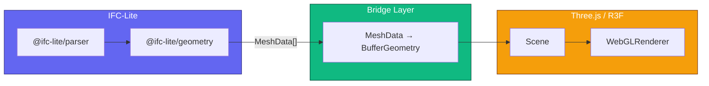

# Three.js / React-Three-Fiber Integration

Use `@ifc-lite/geometry` with Three.js or react-three-fiber instead of the built-in WebGPU renderer.

## Why Three.js?

The built-in `@ifc-lite/renderer` uses WebGPU for maximum performance, but you may want Three.js when:

- **WebGPU is unavailable** — Three.js works with WebGL (wider browser support)
- **Existing Three.js ecosystem** — integrate with your existing 3D scene, post-processing, controls
- **react-three-fiber** — declarative 3D with React
- **Custom rendering** — shadow maps, custom shaders, physics, XR

!!! tip "Prefer Babylon.js?"
    The same `MeshData` typed arrays work with any engine. See the [Babylon.js Integration](babylonjs-integration.md) tutorial for the Babylon.js equivalent.

## Architecture



The key insight: `@ifc-lite/geometry` outputs plain typed arrays that are **engine-agnostic**:

```typescript
interface MeshData {
  expressId: number;
  ifcType?: string;             // "IfcWall", "IfcDoor", etc.
  positions: Float32Array;      // [x,y,z, x,y,z, ...]
  normals: Float32Array;        // [nx,ny,nz, ...]
  indices: Uint32Array;         // Triangle indices
  color: [number, number, number, number]; // RGBA (0-1)
}
```

You only need `@ifc-lite/geometry` (and its dependency `@ifc-lite/wasm`) — skip `@ifc-lite/renderer` entirely.

## Quick Start

### Scaffold a project

```bash
npx create-ifc-lite my-viewer --template threejs
cd my-viewer
npm install
npm run dev
```

### Or install manually

```bash
npm install @ifc-lite/geometry three
npm install -D @types/three
```

### Convert MeshData to Three.js

```typescript
import * as THREE from 'three';
import type { MeshData } from '@ifc-lite/geometry';

function meshDataToThree(mesh: MeshData): THREE.Mesh {
  const geometry = new THREE.BufferGeometry();

  geometry.setAttribute(
    'position',
    new THREE.BufferAttribute(mesh.positions, 3),
  );
  geometry.setAttribute(
    'normal',
    new THREE.BufferAttribute(mesh.normals, 3),
  );
  geometry.setIndex(new THREE.BufferAttribute(mesh.indices, 1));

  const [r, g, b, a] = mesh.color;
  const material = new THREE.MeshStandardMaterial({
    color: new THREE.Color(r, g, b),
    transparent: a < 1,
    opacity: a,
    side: a < 1 ? THREE.DoubleSide : THREE.FrontSide,
    depthWrite: a >= 1,
  });

  const threeMesh = new THREE.Mesh(geometry, material);
  threeMesh.userData.expressId = mesh.expressId;
  return threeMesh;
}
```

### Load and Display

```typescript
import { GeometryProcessor } from '@ifc-lite/geometry';

const processor = new GeometryProcessor();
await processor.init();

const buffer = new Uint8Array(await file.arrayBuffer());
const result = await processor.process(buffer);

for (const mesh of result.meshes) {
  scene.add(meshDataToThree(mesh));
}
```

## Streaming (Progressive Display)

For large files, use streaming to show geometry as it loads:

```typescript
for await (const event of processor.processStreaming(buffer)) {
  switch (event.type) {
    case 'batch':
      for (const mesh of event.meshes) {
        scene.add(meshDataToThree(mesh));
      }
      renderer.render(scene, camera); // Show progress
      break;

    case 'complete':
      console.log(`Loaded ${event.totalMeshes} meshes`);
      break;
  }
}
```

## Batching for Performance

Individual meshes per entity give you picking granularity but many draw calls. For large models, batch by color:

```typescript
function batchMeshesByColor(
  meshes: MeshData[],
): THREE.Mesh[] {
  // Group by color
  const buckets = new Map<string, MeshData[]>();
  for (const m of meshes) {
    const key = m.color.join(',');
    if (!buckets.has(key)) buckets.set(key, []);
    buckets.get(key)!.push(m);
  }

  const result: THREE.Mesh[] = [];

  for (const [, group] of buckets) {
    // Merge geometry
    let totalPos = 0, totalIdx = 0;
    for (const m of group) {
      totalPos += m.positions.length;
      totalIdx += m.indices.length;
    }

    const positions = new Float32Array(totalPos);
    const normals = new Float32Array(totalPos);
    const indices = new Uint32Array(totalIdx);

    let pOff = 0, iOff = 0, vOff = 0;
    for (const m of group) {
      positions.set(m.positions, pOff);
      normals.set(m.normals, pOff);
      for (let i = 0; i < m.indices.length; i++) {
        indices[iOff + i] = m.indices[i] + vOff;
      }
      pOff += m.positions.length;
      iOff += m.indices.length;
      vOff += m.positions.length / 3;
    }

    const geo = new THREE.BufferGeometry();
    geo.setAttribute('position', new THREE.BufferAttribute(positions, 3));
    geo.setAttribute('normal', new THREE.BufferAttribute(normals, 3));
    geo.setIndex(new THREE.BufferAttribute(indices, 1));

    const [r, g, b, a] = group[0].color;
    const mat = new THREE.MeshStandardMaterial({
      color: new THREE.Color(r, g, b),
      transparent: a < 1,
      opacity: a,
      depthWrite: a >= 1,
    });

    result.push(new THREE.Mesh(geo, mat));
  }

  return result;
}
```

## React-Three-Fiber (R3F)

### Install

```bash
npm install @ifc-lite/geometry three @react-three/fiber @react-three/drei
```

### IFC Component

```tsx
import { useEffect, useState, useMemo } from 'react';
import { Canvas } from '@react-three/fiber';
import { OrbitControls } from '@react-three/drei';
import * as THREE from 'three';
import { GeometryProcessor, type MeshData } from '@ifc-lite/geometry';

function IfcMesh({ mesh }: { mesh: MeshData }) {
  const geometry = useMemo(() => {
    const geo = new THREE.BufferGeometry();
    geo.setAttribute('position', new THREE.BufferAttribute(mesh.positions, 3));
    geo.setAttribute('normal', new THREE.BufferAttribute(mesh.normals, 3));
    geo.setIndex(new THREE.BufferAttribute(mesh.indices, 1));
    return geo;
  }, [mesh]);

  const [r, g, b, a] = mesh.color;

  return (
    <mesh geometry={geometry}>
      <meshStandardMaterial
        color={new THREE.Color(r, g, b)}
        transparent={a < 1}
        opacity={a}
        side={a < 1 ? THREE.DoubleSide : THREE.FrontSide}
      />
    </mesh>
  );
}

function IfcModel({ url }: { url: string }) {
  const [meshes, setMeshes] = useState<MeshData[]>([]);

  useEffect(() => {
    let cancelled = false;

    async function load() {
      const res = await fetch(url);
      const buffer = new Uint8Array(await res.arrayBuffer());

      const processor = new GeometryProcessor();
      await processor.init();
      const result = await processor.process(buffer);

      if (!cancelled) setMeshes(result.meshes);
    }

    load();
    return () => { cancelled = true; };
  }, [url]);

  return (
    <group>
      {meshes.map((mesh) => (
        <IfcMesh key={mesh.expressId} mesh={mesh} />
      ))}
    </group>
  );
}

export default function App() {
  return (
    <Canvas camera={{ position: [20, 15, 20], fov: 50 }}>
      <ambientLight intensity={0.6} />
      <directionalLight position={[50, 80, 50]} intensity={0.8} />
      <IfcModel url="/model.ifc" />
      <OrbitControls />
    </Canvas>
  );
}
```

## Entity Picking

### Raycasting

```typescript
const raycaster = new THREE.Raycaster();
const pointer = new THREE.Vector2();

canvas.addEventListener('click', (event) => {
  const rect = canvas.getBoundingClientRect();
  pointer.x = ((event.clientX - rect.left) / rect.width) * 2 - 1;
  pointer.y = -((event.clientY - rect.top) / rect.height) * 2 + 1;

  raycaster.setFromCamera(pointer, camera);
  const intersects = raycaster.intersectObjects(scene.children, true);

  if (intersects.length > 0) {
    const hit = intersects[0].object;
    const expressId = hit.userData.expressId;
    console.log('Selected entity:', expressId);
  }
});
```

### Highlight on Hover

```typescript
let hoveredMesh: THREE.Mesh | null = null;
const highlightColor = new THREE.Color(0x4f46e5);

canvas.addEventListener('pointermove', (event) => {
  const rect = canvas.getBoundingClientRect();
  pointer.x = ((event.clientX - rect.left) / rect.width) * 2 - 1;
  pointer.y = -((event.clientY - rect.top) / rect.height) * 2 + 1;

  // Reset previous
  if (hoveredMesh) {
    const orig = hoveredMesh.userData.originalColor;
    (hoveredMesh.material as THREE.MeshStandardMaterial).emissive.copy(orig);
  }

  raycaster.setFromCamera(pointer, camera);
  const intersects = raycaster.intersectObjects(scene.children, true);

  if (intersects.length > 0) {
    hoveredMesh = intersects[0].object as THREE.Mesh;
    const mat = hoveredMesh.material as THREE.MeshStandardMaterial;
    if (!hoveredMesh.userData.originalColor) {
      hoveredMesh.userData.originalColor = mat.emissive.clone();
    }
    mat.emissive.copy(highlightColor);
  } else {
    hoveredMesh = null;
  }
});
```

## Coordinate Handling

IFC files may use large georeferenced coordinates. The geometry processor handles this automatically:

```typescript
const result = await processor.process(buffer);

if (result.coordinateInfo.hasLargeCoordinates) {
  const shift = result.coordinateInfo.originShift;
  console.log(`Coordinates shifted by (${shift.x}, ${shift.y}, ${shift.z})`);

  // If you need world coordinates for geolocation:
  function toWorld(local: THREE.Vector3): THREE.Vector3 {
    return new THREE.Vector3(
      local.x - shift.x,
      local.y - shift.y,
      local.z - shift.z,
    );
  }
}
```

## Performance Tips

| Strategy | When to use | Benefit |
|----------|------------|---------|
| **Individual meshes** | Small models, need picking | Simple, per-entity control |
| **Color batching** | Medium models (1k-10k entities) | Fewer draw calls |
| **THREE.InstancedMesh** | Repeated elements (columns, furniture) | GPU instancing |
| **LOD** | Large models | Reduce triangle count at distance |
| **Frustum culling** | Large scenes | Only render visible geometry |

### Using InstancedMesh for Repeated Elements

```typescript
import { GeometryProcessor, type InstancedGeometry } from '@ifc-lite/geometry';

const processor = new GeometryProcessor();
await processor.init();

const buffer = new Uint8Array(await file.arrayBuffer());

for await (const event of processor.processInstancedStreaming(buffer)) {
  if (event.type === 'batch') {
    for (const instanced of event.geometries) {
      const geo = new THREE.BufferGeometry();
      geo.setAttribute('position', new THREE.BufferAttribute(instanced.positions, 3));
      geo.setAttribute('normal', new THREE.BufferAttribute(instanced.normals, 3));
      geo.setIndex(new THREE.BufferAttribute(instanced.indices, 1));

      const mat = new THREE.MeshStandardMaterial();
      const mesh = new THREE.InstancedMesh(geo, mat, instanced.instance_count);

      for (let i = 0; i < instanced.instance_count; i++) {
        const inst = instanced.get_instance(i);
        if (!inst) continue;

        const matrix = new THREE.Matrix4().fromArray(inst.transform);
        mesh.setMatrixAt(i, matrix);

        const [r, g, b] = inst.color;
        mesh.setColorAt(i, new THREE.Color(r, g, b));
      }

      mesh.instanceMatrix.needsUpdate = true;
      if (mesh.instanceColor) mesh.instanceColor.needsUpdate = true;

      scene.add(mesh);
    }
  }
}
```

## Vite Configuration

The WASM module needs these headers for `SharedArrayBuffer`:

```typescript
// vite.config.ts
import { defineConfig } from 'vite';

export default defineConfig({
  optimizeDeps: {
    exclude: ['@ifc-lite/wasm'],
  },
  server: {
    headers: {
      'Cross-Origin-Opener-Policy': 'same-origin',
      'Cross-Origin-Embedder-Policy': 'require-corp',
    },
  },
});
```

## Full Example

See [`examples/threejs-viewer/`](https://github.com/louistrue/ifc-lite/tree/main/examples/threejs-viewer) for a complete, runnable example.

## Next Steps

- [Babylon.js Integration](babylonjs-integration.md) — Same workflow with Babylon.js
- [Building a Viewer](building-viewer.md) — Full viewer with WebGPU
- [Geometry Processing](../guide/geometry.md) — Geometry API details
- [API Reference](../api/typescript.md) — Complete API docs
