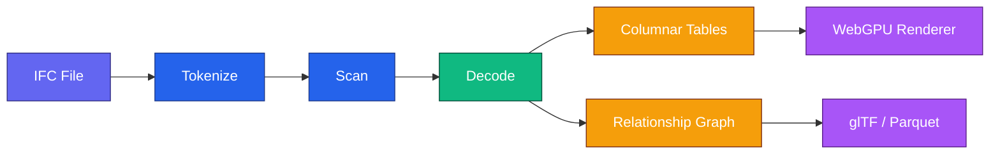
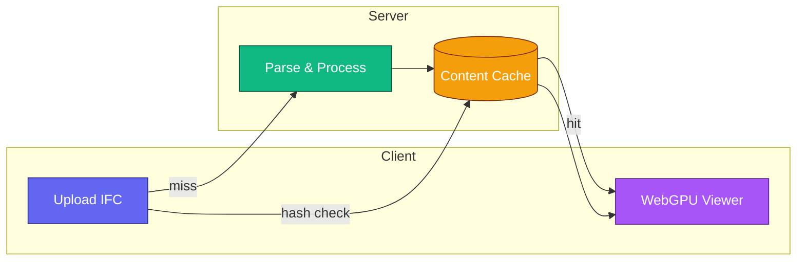

<table align="center">
<tr>
<td valign="top">
<h1>

</h1>
<code>Fast</code> · <code>Lightweight</code> · <code>Columnar</code> · <code>Browser-native</code>
</td>
<td width="120" align="center" valign="middle">

</td>
</tr>
</table>

<p align="center">
  <a href="https://www.ifclite.com/"></a>
</p>

<p align="center">
  <a href="https://github.com/louistrue/ifc-lite/actions"></a>
  <a href="https://github.com/louistrue/ifc-lite/blob/main/LICENSE"></a>
  <a href="https://www.npmjs.com/package/@ifc-lite/parser"></a>
  <a href="https://crates.io/crates/ifc-lite-core"></a>
</p>

<p align="center">
  <a href="#features">Features</a> ·
  <a href="#quick-start">Quick Start</a> ·
  <a href="#architecture">Architecture</a> ·
  <a href="#server-paradigm">Server</a> ·
  <a href="#performance">Performance</a> ·
  <a href="#contributing">Contributing</a>
</p>

---

## Overview

**IFClite** parses, processes, and renders IFC files in the browser using **Rust + WebAssembly** and **WebGPU**. Smaller and faster than the alternatives.

<p align="center">
  <strong>~650 KB WASM (~260 KB gzipped)</strong> &nbsp;•&nbsp; <strong>2.6x faster</strong> &nbsp;•&nbsp; <strong>100% IFC4X3 schema (876 entities)</strong>
</p>

## Features

| Feature | Description |
|---------|-------------|
| **Clean DX** | Columnar data structures, TypedArrays, consistent API. Built from scratch for clarity |
| **STEP/IFC Parsing** | Zero-copy tokenization with full IFC4X3 schema support (876 entities) |
| **Streaming Pipeline** | Progressive geometry processing. First triangles in 300-500ms |
| **WebGPU Rendering** | Modern GPU-accelerated 3D with depth testing and frustum culling |
| **Zero-Copy GPU** | Direct WASM memory to GPU buffers, 60-70% less RAM |

## Quick Start

### Option 1: Create a New Project (Recommended)

Get started instantly without cloning the repo:

```bash
npx create-ifc-lite my-ifc-app
cd my-ifc-app
npm install && npm run parse
```

Or create a React viewer:

```bash
npx create-ifc-lite my-viewer --template react
cd my-viewer
npm install && npm run dev
```

### Option 2: Install Packages Directly

Add IFClite to your existing project:

```bash
npm install @ifc-lite/parser
```

```typescript
import { IfcParser } from '@ifc-lite/parser';

const parser = new IfcParser();
const result = parser.parse(ifcBuffer);

console.log(`Found ${result.entities.length} entities`);
```

For full 3D rendering, add geometry and renderer packages:

```bash
npm install @ifc-lite/parser @ifc-lite/geometry @ifc-lite/renderer
```

### Option 3: Rust/Cargo

For Rust projects:

```bash
cargo add ifc-lite-core
```

```rust
use ifc_lite_core::parse_ifc;

let result = parse_ifc(&ifc_bytes)?;
println!("Parsed {} entities", result.entities.len());
```

### Option 4: Clone the Repo (Contributors)

For contributing or running the full demo app:

```bash
git clone https://github.com/louistrue/ifc-lite.git
cd ifc-lite
pnpm install && pnpm dev
```

Open http://localhost:5173 and load an IFC file.

> **Note:** Requires Node.js 18+ and pnpm 8+. No Rust toolchain needed - WASM is pre-built.
> 
> **📖 Full Guide**: See [Installation](docs/guide/installation.md) for detailed setup options including troubleshooting.

### Basic Usage

```typescript
import { IfcParser } from '@ifc-lite/parser';
import { Renderer } from '@ifc-lite/renderer';

// Parse IFC file
const parser = new IfcParser();
const result = parser.parse(ifcArrayBuffer);

// Access entities
const walls = result.entities.filter(e => e.type === 'IFCWALL');
console.log(`Found ${walls.length} walls`);

// Render geometry (requires @ifc-lite/renderer)
const renderer = new Renderer(canvas);
await renderer.loadGeometry(result.geometry);
renderer.render();
```

## Documentation

| Resource | Description |
|----------|-------------|
| [**Quick Start**](docs/guide/quickstart.md) | Parse your first IFC file in 5 minutes |
| [**Installation**](docs/guide/installation.md) | Detailed setup for npm, Cargo, and from source |
| [**User Guide**](https://louistrue.github.io/ifc-lite/) | Complete guides: parsing, geometry, rendering, querying |
| [**Tutorials**](docs/tutorials/building-viewer.md) | Build a viewer, custom queries, extend the parser |
| [**Architecture**](docs/architecture/overview.md) | System design with detailed diagrams |
| [**API Reference**](docs/api/typescript.md) | TypeScript, Rust, and WASM API docs |
| [**Contributing**](docs/contributing/setup.md) | Development setup and testing guide |

## Architecture



IFC files flow through three processing layers. See the [Architecture Documentation](docs/architecture/overview.md) for detailed diagrams including data flow, memory model, and threading.

> **Deep Dive**: [Data Flow](docs/architecture/data-flow.md) ·
> [Parsing Pipeline](docs/architecture/parsing-pipeline.md) ·
> [Geometry Pipeline](docs/architecture/geometry-pipeline.md) ·
> [Rendering Pipeline](docs/architecture/rendering-pipeline.md)

## Server Paradigm

For production deployments, IFClite provides a **Rust server** that handles CPU-intensive processing, enabling instant loading for repeat visits and efficient handling of large models.



### Key Features

| Feature | Description |
|---------|-------------|
| **Content-Addressable Cache** | SHA-256 hash of file content as cache key. Client checks cache before upload |
| **Parallel Geometry Processing** | Rayon thread pool processes entities concurrently |
| **Columnar Formats** | Apache Parquet for geometry (15-50x smaller than JSON) |
| **Progressive Streaming** | SSE batches enable rendering while server processes |
| **Lazy Data Model** | Properties/relationships computed in background, fetched on-demand |

### Data Flow

1. **Cache-First**: Client computes SHA-256 hash locally, checks server cache
2. **Cache Hit**: Geometry served directly from cache (skips upload entirely)
3. **Cache Miss**: File uploaded, processed in parallel, cached, then served
4. **Streaming**: Geometry batches streamed via SSE for progressive rendering

### When to Use

| Scenario | Recommendation |
|----------|----------------|
| Single file, one-time view | Client-only (`@ifc-lite/parser`) |
| Repeat access, team sharing | Server with caching |
| Large models (100+ MB) | Server with streaming |
| Offline/embedded apps | Client-only with local cache |

```bash
# Run the server locally
cd apps/server && cargo run --release

# Or with Docker
docker run -p 3001:3001 ghcr.io/louistrue/ifc-lite-server
```

## Project Structure

```
ifc-lite/
├── rust/                      # Rust/WASM backend
│   ├── core/                  # IFC/STEP parsing (~2,000 LOC)
│   ├── geometry/              # Geometry processing (~2,500 LOC)
│   └── wasm-bindings/         # JavaScript API (~800 LOC)
│
├── packages/                  # TypeScript packages
│   ├── parser/                # High-level IFC parser
│   ├── geometry/              # Geometry bridge (WASM)
│   ├── renderer/              # WebGPU rendering
│   ├── cache/                 # Binary cache format
│   ├── server-client/         # Server SDK (caching, streaming)
│   ├── query/                 # Query system
│   ├── data/                  # Columnar data structures
│   ├── spatial/               # Spatial indexing
│   ├── export/                # Export formats
│   └── codegen/               # Schema generator
│
├── apps/
│   ├── viewer/                # React web application
│   └── server/                # Rust HTTP server (Axum)
│
└── docs/                      # Documentation (MkDocs)
```

## Performance

### Bundle Size Comparison

| Library | WASM Size | Gzipped |
|---------|-----------|---------|
| **IFClite** | **0.65 MB** | **0.26 MB** |
| web-ifc | 1.1 MB | 0.4 MB |
| IfcOpenShell | 15 MB | - |

### Parse Performance

| Model Size | IFClite | Notes |
|------------|----------|-------|
| 10 MB | ~100-200ms | Small models |
| 50 MB | ~600-700ms | Typical models |
| 100+ MB | ~1.5-2s | Complex geometry |

*Based on [benchmark results](tests/benchmark/benchmark-results.json) across 67 IFC files.*

### Zero-Copy GPU Pipeline

- **Zero-copy WASM to WebGPU**: Direct memory access from WASM linear memory to GPU buffers
- **60-70% reduction** in peak RAM usage
- **74% faster** parse time with optimized data flow
- **40-50% faster** geometry-to-GPU pipeline

### Geometry Processing

- **5x faster** overall than web-ifc (median 2.18x, up to 104x on some files)
- Streaming pipeline with batched processing (100 meshes/batch)
- First triangles visible in **300-500ms**

*See [full benchmark data](tests/benchmark/benchmark-results.json) for per-file comparisons.*

## Browser Requirements

| Browser | Minimum Version | WebGPU |
|---------|----------------|--------|
| Chrome | 113+ | ✅ |
| Edge | 113+ | ✅ |
| Firefox | 127+ | ✅ |
| Safari | 18+ | ✅ |

> **More Info**: See [Browser Requirements](docs/guide/browser-requirements.md) for WebGPU feature detection and fallbacks.

## Development (Contributors)

For contributing to IFClite itself:

```bash
git clone https://github.com/louistrue/ifc-lite.git
cd ifc-lite
pnpm install

pnpm dev          # Start viewer in dev mode
pnpm build        # Build all packages
pnpm test         # Run tests

# Add a changeset when making changes
pnpm changeset    # Describe your changes (required for releases)

# Rust/WASM development (optional - WASM is pre-built)
cd rust && cargo build --release --target wasm32-unknown-unknown
bash scripts/build-wasm.sh  # Rebuild WASM after Rust changes
```

## Packages

| Package | Description | Status | Docs |
|---------|-------------|--------|------|
| `create-ifc-lite` | Project scaffolding CLI | ✅ Stable | [API](docs/api/typescript.md#create-ifc-lite) |
| `@ifc-lite/parser` | STEP tokenizer & entity extraction | ✅ Stable | [API](docs/api/typescript.md#parser) |
| `@ifc-lite/geometry` | Geometry processing bridge | ✅ Stable | [API](docs/api/typescript.md#geometry) |
| `@ifc-lite/renderer` | WebGPU rendering pipeline | ✅ Stable | [API](docs/api/typescript.md#renderer) |
| `@ifc-lite/cache` | Binary cache for instant loading | ✅ Stable | [API](docs/api/typescript.md#cache) |
| `@ifc-lite/query` | Fluent & SQL query system | 🚧 Beta | [API](docs/api/typescript.md#query) |
| `@ifc-lite/data` | Columnar data structures | ✅ Stable | [API](docs/api/typescript.md#data) |
| `@ifc-lite/spatial` | Spatial indexing & culling | 🚧 Beta | [API](docs/api/typescript.md#spatial) |
| `@ifc-lite/export` | Export (glTF, Parquet, etc.) | 🚧 Beta | [API](docs/api/typescript.md#export) |
| `@ifc-lite/server-client` | Server SDK with caching & streaming | ✅ Stable | [API](docs/api/typescript.md#server-client) |

## Rust Crates

| Crate | Description | Status | Docs |
|-------|-------------|--------|------|
| `ifc-lite-core` | STEP/IFC parsing | ✅ Stable | [docs.rs](https://docs.rs/ifc-lite-core) |
| `ifc-lite-geometry` | Mesh triangulation | ✅ Stable | [docs.rs](https://docs.rs/ifc-lite-geometry) |
| `ifc-lite-wasm` | WASM bindings | ✅ Stable | [docs.rs](https://docs.rs/ifc-lite-wasm) |
| `ifc-lite-server` | HTTP server with parallel processing | ✅ Stable | [API](#server-paradigm) |

## Community Projects

Projects built by the community using IFClite (not officially maintained):

| Project | Author | Description |
|---------|--------|-------------|
| [bimifc.de](https://bimifc.de/) | [@holg](https://github.com/holg) | Pure Rust/Bevy IFC viewer, no TypeScript needed |

*Built something with IFClite? Open a PR to add it here!*

## Contributing

We welcome contributions!

| Resource | Description |
|----------|-------------|
| [**Development Setup**](docs/contributing/setup.md) | Prerequisites, installation, and project structure |
| [**Testing Guide**](docs/contributing/testing.md) | Running tests, writing tests, CI |
| [**Release Process**](RELEASE.md) | Versioning and publishing workflow |

```bash
# Fork and clone
git clone https://github.com/YOUR_USERNAME/ifc-lite.git

# Create a branch
git checkout -b feature/my-feature

# Make changes and test
pnpm test

# Add a changeset to describe your changes
pnpm changeset

# Submit a pull request (include the changeset file)
```

## License

This project is licensed under the [Mozilla Public License 2.0](LICENSE).

## Acknowledgments

- Built with [nom](https://github.com/rust-bakery/nom) for parsing
- [earcutr](https://github.com/nickel-org/earcutr) for polygon triangulation
- [nalgebra](https://nalgebra.org/) for linear algebra
- [wasm-bindgen](https://rustwasm.github.io/wasm-bindgen/) for Rust/JS interop

---

<p align="center">
  Made with ❤️ for the AEC industry
</p>
